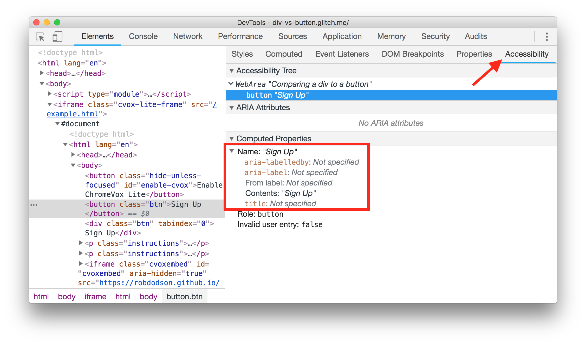
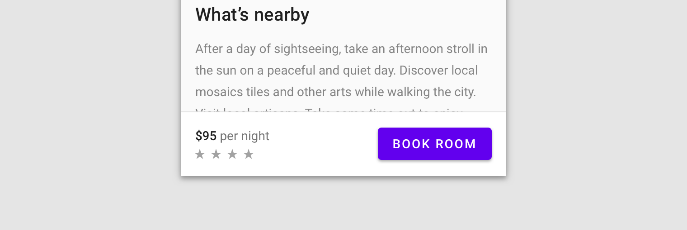
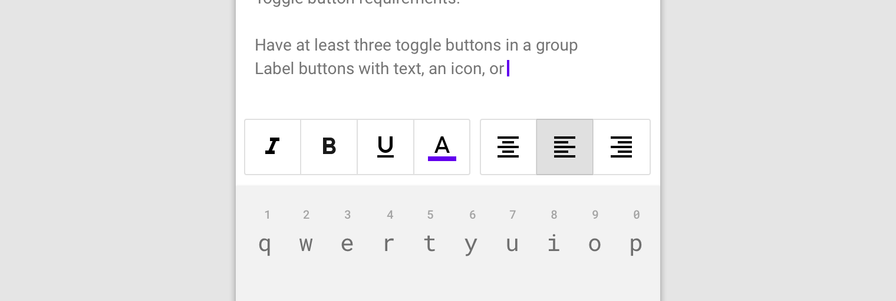
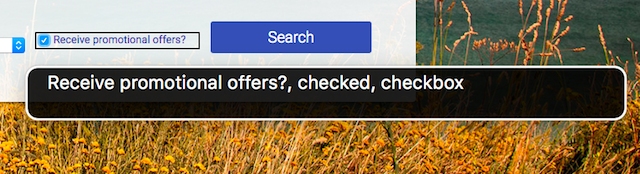

# Labels and text alternatives

In order for a screen reader to present a spoken UI to the user, meaningful
elements must have proper labels or text alternatives. A label or text
alternative gives an element its accessible **name**, one of the key properties
for [expressing element semantics in the accessibility
tree](https://web.dev/accessible/semantics-and-screen-readers/#semantic-properties-and-the-accessibility-tree).

When an element's name is combined with the element's **role**, it gives the
user context so they can understand what type of element they're interacting
with, and how it is represented on the page. If a name is not present, then a
screen reader will only announce the element's role. Imagine trying to navigate
a page and hearing, "button", "checkbox", "image" without any additional
context. This is why labeling and text alternatives are crucial to a good,
accessible experience.

## Inspect an element's name
It's easy to check an element's accessible name using Chrome's DevTools.

1. Right-click on an element and choose **Inspect**. This will open the DevTools
   Elements panel.
1. In the Elements panel, look for the **Accessibility** pane. It may be hidden
   behind a `»` symbol.
1. In the **Computed Properties** dropdown, look for the **Name** property.



<div class="aside note">
To learn more, check out the <a href="">DevTools Accessibility Reference</a>.
</div>

Whether you're looking at an `image` with `alt` text, or an `input` with a
`label`, you'll soon discover that all of these things result in the same
outcome: giving an element its accessible name.

## Check for missing names
There are a number of accessibility and SEO audits in Lighthouse that will test
for missing accessible names.

<table>
  <thead>
    <tr>
      <th>Failed audit</th>
      <th>How to fix</th>
    </tr>
  </thead>
  <tbody>
    <tr>
      <td>
        Document has a &lt;title&gt; element
      </td>
      <td>
        Label documents and frames
      </td>
    </tr>
    <tr>
      <td>
        &lt;frame&gt; or &lt;iframe&gt; elements have a title
      </td>
      <td>
        Label documents and frames
      </td>
    </tr>
    <tr>
      <td>
        Image elements have [alt] attributes
      </td>
      <td>
        Text alternatives for images and objects
      </td>
    </tr>
    <tr>
      <td>
        &lt;input type="image"&gt; elements have [alt] text
      </td>
      <td>
        Text alternatives for images and objects
      </td>
    </tr>
    <tr>
      <td>
        &lt;object&gt; elements have [alt] text
      </td>
      <td>
        Text alternatives for images and objects
      </td>
    </tr>
    <tr>
      <td>
        Buttons have an accessible name
      </td>
      <td>
        Label simple interactive elements
      </td>
    </tr>
    <tr>
      <td>
        Links have a discernible name
      </td>
      <td>
        Label simple interactive elements
      </td>
    </tr>
    <tr>
      <td>
        Form elements have associated labels
      </td>
      <td>
        Label form elements
      </td>
    </tr>
  </tbody>
</table>

## Label documents and frames
Every page should have a
[`title`](https://developer.mozilla.org/en-US/docs/Web/HTML/Element/title)
element that briefly explains what the page is about. The `title` element gives
the page its accessible name. When a screen reader enters the page, this is the
first text that will be announced.

<pre class="prettyprint devsite-disable-click-to-copy">
&lt;!doctype html&gt;
  &lt;html lang=&quot;en&quot;&gt;
    &lt;head&gt;
      <strong>&lt;title&gt;Mary's Maple Bar Fast-Baking Recipe&lt;/title&gt;</strong>
    &lt;/head&gt;
  &lt;body&gt;
    …
  &lt;/body&gt;
&lt;/html&gt;
</pre>

<div class="aside note">
For tips on writing effective titles, see the
<a href="https://web.dev/discoverable/write-descriptive-text">
Write descriptive titles guide
</a>.
</div>

Similarly, any `frame` or `iframe` elements should have a `title` attribute.

```html
<iframe title="An interactive map of San Francisco" src="…"></iframe>
```

While an `iframe` may contain its own internal `title` element, a screen
reader will usually stop at the frame boundary and announce the element's
role—"frame"—and its accessible name, provided by the `title` attribute. This
lets the user to decide if they wish to enter the frame or bypass it.

## Text alternatives for images and objects
An `img` should always be accompanied by an
[`alt`](https://developer.mozilla.org/en-US/docs/Web/HTML/Element/img#Attributes)
attribute, to give the image its accessible name. If the image fails to load,
the `alt` text will be used as a placeholder so users have a sense of what the
image was trying to convey.

Writing good `alt` text is a bit of an art, but there are a couple of guidelines
you can follow:

1. Determine if the image provides content that would otherwise be difficult to
attain from reading the surrounding text.
1. If so, convey the content as succinctly as possible.

If the image is more of a decoration, and does not provide any useful content,
you can give it an empty `alt=""` attribute to remove it from the accessibility
tree.

<div class="aside note">
You can learn more about writing effective <code>alt</code> by checking out <a
href="https://webaim.org/techniques/alttext/">WebAIM's guide to Alternative
Text.</a>
</div>

### Images as links and inputs

An image wrapped in a link should describe where the user will navigate to if
they click the link.

```html
<a href="https://en.wikipedia.org/wiki/Google">
  
</a>
```

Similarly, if an `<input type="image">` element is being used to create an image
button, it should contain `alt` text that describes the action that will occur
if the user clicks the button.

```html
<form>
  <label>
    Username:
    <input type="text">
  </label>
  <input type="image" alt="Sign in"
             src="./sign-in-button.png">
</form>
```

### Embedded objects

`<object>` elements, which are typically used for embeds like Flash, PDFs, or
ActiveX, should also contain alternative text. Similar to images, this text will
display if the element fails to render.

```
<object type="application/pdf"
    data="/report.pdf"
    width="600"
    height="400">
Annual report.
</object>
```

## Label simple interactive elements
Buttons and links are simple, and common, interactive elements. Because they are
often crucial to the experience on a site, it is important that both have a good
accessible name.

### Buttons

A `button` element will always attempt to compute its accessible name using its
text content. For buttons that are not part of a `form`, just writing a clear
action as the text content may be all you need to create a good accessible name.



One common exception to this rule are icon buttons. An icon button may use an
image, or an icon font, to provide the text content for the button. For example,
the buttons used in a WYSIWYG editor to format text are typically just graphic
symbols.



When working with icon buttons, it can be helpful to give them an explicit
accessible name using the `aria-label` attribute. `aria-label` will override any
text content inside of the button, letting you clearly describe the action to
anyone using a screen reader.

```html
<button aria-label="Left align">
```

### Links

Similar to buttons, links primarily get their accessible name from their text
content. A nice trick when creating a link is to put the most meaningful piece
of text into the link itself, rather than filler words like "Here" or "Read
More".

<p><span class="compare-worse">Not recommended</span> — not descriptive</p>
<pre class="prettyprint devsite-disable-click-to-copy">
Check out our guide to web performance &lt;a href="…"&gt;here&lt;/a&gt;.
</pre>

<p><span class="compare-better">Recommended</span> — useful content</p>
<pre class="prettyprint devsite-disable-click-to-copy">
Check out &lt;a href="…"&gt;our guide to web performance&lt;/a&gt;.
</pre>

This is especially helpful for screen readers which offer shortcuts to list all
of the links on the page. If links are full of repetitive filler text, these
shortcuts become much less useful.

<figure>
  
  <figcaption>
    Example of VoiceOver, a screen reader for macOS, showing the navigate by
    links menu.
  </figcaption>
</figure>

## Label form elements

There are two ways to associate a label with a form element, such as a checkbox.
Either of the methods causes the label text to also become a click target for
the checkbox, which is also helpful for mouse or touchscreen users. To associate
a label with an element, either

Place the input element inside a label element

```
<label>
  <input type="checkbox">Receive promotional offers?</input>
</label>
```

Or, use the label's `for` attribute and refer to the element's `id`

```
<input id="promo" type="checkbox"></input>
<label for="promo">Receive promotional offers?</label>
```

When the checkbox has been labeled correctly, the screen reader can report that
the element has a role of checkbox, is in a checked state, and is named "Receive
promotional offers?".


