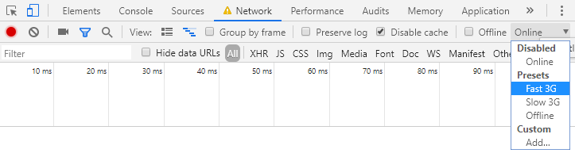

--- 
page_type: glitch 
title: Adaptive serving based on network quality 
author: mihajlija 
description: |
  In this codelab you’ll learn how to use the Network Information API to adapt your content based on the network quality.
web_updated_on: 2019-01-31 
web_published_on: 2019-01-31 
glitch: adaptive-serving-netinfo-starter 
---

# Adaptive serving based on network quality

In this codelab you’ll learn how to adapt your content based on the network quality. This page’s background video should load only when users are on a fast network. On slower networks an image should load instead.

The [Network Information API](https://developer.mozilla.org/en-US/docs/Web/API/NetworkInformation) enables you to access information about the user's connection quality. You will use its `effectiveType` property to decide when to serve a video and when to serve an image. `effectiveType` can be ‘slow-2g’, ‘2g’, ‘3g’, or ‘4g’.

## Step 1: Check for browser support

The background video is currently specified index.html and then lazy-loaded in `script.js`. 

To load it conditionally, first check if connection type detection is supported. In `script.js` add an if statement that tests whether the `navigator.connection` object exists and whether it has the effectiveType property.

```if (navigator.connection && !!navigator.connection.effectiveType) {}```

Wrap the existing video loading code in an else statement, so that video will still load in browsers that don’t support the Network Information API.

```
if (navigator.connection && !!navigator.connection.effectiveType) {
  //...
}
else {
    const video = document.getElementById("coverVideo");
    const videoSource = video.getAttribute('data-src');
    video.setAttribute('src', videoSource);
    
    video.setAttribute('style', "height: 100%; width: 100%; display:inline");
}
```


## Step 2: Check connection type

Add an if statement to check the `effectiveType` of the network. Since the video should load only on the fastest connections, it’s enough to check the connection for ‘4g’ and in any other case load the image.

```
if (navigator.connection && !!navigator.connection.effectiveType) {
   if (navigator.connection.effectiveType === '4g') {
   // video loading code
   }
   else {
   // image loading code
   }
}
```

## Step 3: Load video

If the effectiveType is ‘4g’, you can use the video loading code from the beginning of the codelab.

```
if (navigator.connection.effectiveType === '4g') {

    const video = document.getElementById("coverVideo");
    const videoSource = video.getAttribute('data-src');
    video.setAttribute('src', videoSource);
    
    video.setAttribute('style', "height: 100%; width: 100%; display:inline");
} 
else {
    // image loading code
}
```

Here’s how the video loading code works: the video source is specified inside [data-src attribute](https://developer.mozilla.org/en-US/docs/Learn/HTML/Howto/Use_data_attributes) in `index.html` and then lazy-loaded in `script.js`.

```<video id="coverVideo" autoplay loop muted data-src="https://cdn.glitch.com/b6491350-b058-4eb6-aa6c-55c93122073e%2FMatrix%2C%20Console%2C%20Hacking%2C%20Code.mp4?1551464245607"></video>```

Because the video source is specified in the `data-src` attribute, it isn’t displayed or downloaded initially. [Data attributes](https://developer.mozilla.org/en-US/docs/Learn/HTML/Howto/Use_data_attributes) allow you to store extra information on standard HTML elements. They can be named anything, as long as it starts with "data-". 

To actually display the video on the page, the location from `data-src` needs to be set as the `src` attribute of the video element. This is done in `script.js`.

First, get the DOM element that contains the asset:

```const video = document.getElementById("coverVideo");```

Then get the resource location from the `data-src` attribute: 

```const videoSource = video.getAttribute('data-src');```

And finally set that as the `src` attribute of the video element:

```video.setAttribute('src', videoSource);```

The last line takes care of CSS positioning:

```video.setAttribute('style', "height: 100%; width: 100%; display:inline");```

## Step 4: Load image

To conditionally load an image on slower networks, use the same strategy as for the video. 

Add an image element to `index.html` (right after the video element), and use the `data-src` attribute instead of the `src` attribute. 

``````

In `script.js`, add code to set the image’s `src` attribute depending on the `effectiveType` of the network.

```
if (navigator.connection.effectiveType === '4g') {

    const video = document.getElementById("coverVideo");
    const videoSource = video.getAttribute('data-src');
    video.setAttribute('src', videoSource);
    
    video.setAttribute('style', "height: 100%; width: 100%; display:inline");
}
else {

    const image = document.getElementById("coverImage");
    const imageSource = image.getAttribute('data-src');
    image.setAttribute('src', imageSource);

    image.setAttribute('style', "height: 100%; width: 100%; display:inline");
}
```

## Extra Credit: Respond to changes

Remember how this API has an `onchange` <a href="">event listener</a>? You can use it for many things: dynamically adapt content such as video quality, restart deferred data transfers when a change to a high-bandwidth network type is detected, or notify users when the network quality changes.

Here’s a simple example of how this listener works, add it to `script.js`. This code will call the `displayNetworkInfo` function whenever the network information changes.

```navigator.connection.addEventListener('change', displayNetworkInfo);```

There’s already an empty `<h2>` element on the `index.html` page. Now define the `displayNetworkInfo` function so that it displays the network information in the `<h2>` element and invoke the function.

```
function displayNetworkInfo() {
   document.getElementById("connection").innerHTML = navigator.connection.effectiveType;
  }

displayNetworkInfo();
```


## Try it out

Here’s the final state of the [app on Glitch](https://glitch.com/~adaptive-serving-netinfo).


To test it yourself:

1. Click the **Show Live** button on Glitch.

2. Press **Control+Shift+J** or **Cmd+Option+J** (Mac), to open DevTools.

3. Click on the **Network tab**.

4. Select **Fast 3G** from throttling presets.



The app will update the network information to **3g**:


Now reload the page with Fast 3G still enabled and the app will load an image in the background instead of the video: 


