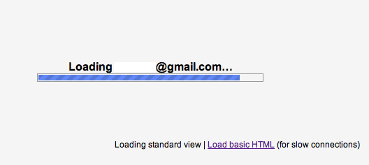
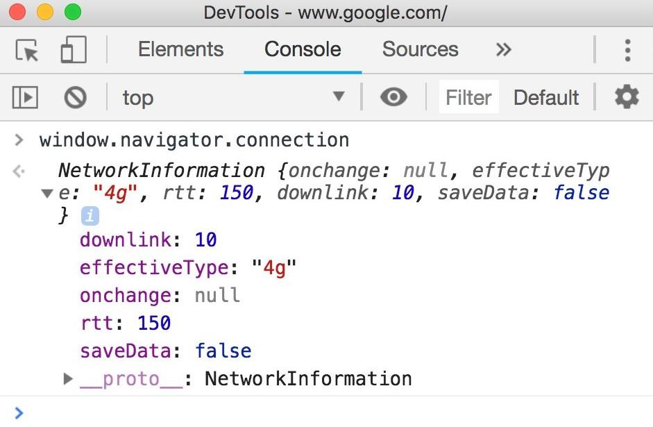

# Adaptive serving based on network quality

Loading a website can be a very different experience depending on the network conditions. Everything is usually smooth when you are on a fast network, but when you are on the go with a humble data plan and spotty connection, or stuck with a laptop on a sluggish coffee shop wifi, it's a different story.

One way to deal with this is by adapting which assets you're serving to users based on the quality of their connection. This is now [possible](https://caniuse.com/#feat=netinfo) with the [Network Information API](https://developer.mozilla.org/en-US/docs/Web/API/Network_Information_API) which enables web applications to access information about the user's network.

## Usage

There are many ways you can use this network information to improve the user experience:

* Switch between serving high-definition and low-definition content based on the user's network. 
* Decide whether to preload resources. 
* Defer uploads and downloads when users are on a slow connection. 
* Enable offline mode if the network quality is not good enough to load the app and use the features.
* Warn users that doing something (e.g. watching video) over cellular could cost them money.
* Use it in your analytics to gather data on your users’ network quality.

Many applications are already doing something similar. For example, YouTube, Netflix and most other video (or video calling) services automatically adjust the resolution during streaming. When Gmail is loading, it provides users with a link to "load basic HTML (for slow connections)" - a simplified (yet functional) version of Gmail. 



With the Network Information API you can now implement these functionalities in your own applications without much effort.

## How it works

The **navigator.connection** object contains information about a client’s connection. Its properties are:

1. **downlink**: the bandwidth estimate in megabits per second
2. **effectiveType**: the effective type of the connection, with possible values **‘slow-2g’**,**‘2g’**, **‘3g’**, or **‘4g’**
3. **onchange:** an event handler that fires when connection information changes
4. **rtt**: the estimated round-trip latency of the connection in milliseconds
5. **saveData:** boolean that defines whether the user has requested a reduced data usage mode 

Here’s what this looks like when you run it in the browser’s console:



It might seem odd that the **effectiveType **only goes up to ‘**4g’**, but that segment actually includes all connections that are **‘4g’ and higher.** The API determines the effective connection type based on the combination of **round-trip time (RTT) and downlink speed**. For example, if you have a 10 Mbps downlink combined with 1000 ms latency, the **effectiveType **will be ‘3g’ due to the latency. 

The **effectiveType** values are also available via [Client Hints](https://www.chromestatus.com/features/5407907378102272) and allow you to communicate the browser's connection type to servers.

<table>
  <caption><a href="https://wicg.github.io/netinfo/#effective-connection-types">Table of effective connection types</a></caption>
  <tr>
    <th>effectiveType</th>
    <th>RTT (ms)</th>
    <th>Downlink (Kbps)</th>
    <th>Usage</th>
  </tr>
  <tr>
    <td>slow-2g</td>
    <td>2000 - ∞</td>
    <td>0 - 50</td>
    <td>The network is suited for small transfers only such as text-only pages.</td>
  </tr>
  <tr>
    <td>2g</td>
    <td>1400 - 1999</td>
    <td>51 - 70</td>
    <td>The network is suited for transfers of small images.</td>
  </tr>
  <tr>
    <td>3g</td>
    <td>270 - 1399</td>
    <td>71 - 700</td>
    <td>The network is suited for transfers of large assets such as high-resolution images, audio, and SD video.</td>
  </tr>
  <tr>
    <td>4g</td>
    <td>0 - 269</td>
    <td>701 - ∞</td>
    <td>The network is suited for HD video, real-time video, etc.</td>
  </tr>
</table>

<div class="aside note">You can access Network Information API inside <a href="https://developer.mozilla.org/en-US/docs/Web/API/ServiceWorker">Service Workers</a> to adapt to situations when users are offline.</div>

The **onchange** event listener enables you to dynamically adapt to changes in network quality. If you deferred uploads or downloads because of poor network conditions, you can rely on the event listener to restart the transfer when it detects better network conditions. You can also use it to notify users when the network quality changes. For example, if they lost their wi-fi signal and were dropped to a cellular network this can prevent accidental data transfers (and charges 💸).

Use the "onchange" event listener as you would any other event listener:

```navigator.connection.addEventListener('change', doSomethingOnChange);```


<div class="aside note">Network information API is <a href="https://caniuse.com/#feat=netinfo">supported in Chromium-based browsers</a> since version 62.</div>

## Conclusion 

The potential benefits of the Network Information API are big, especially for users on slow networks and applications that require a lot of bandwidth. Best of all, it can be used as a progressive enhancement technique.


