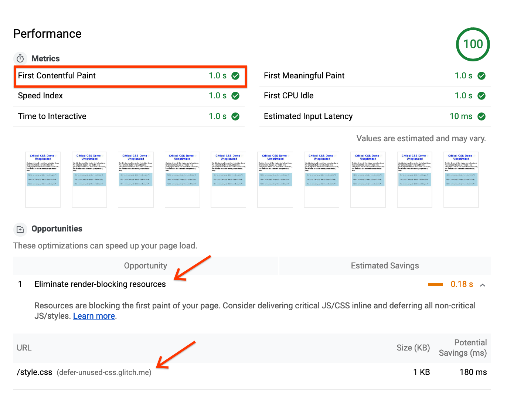
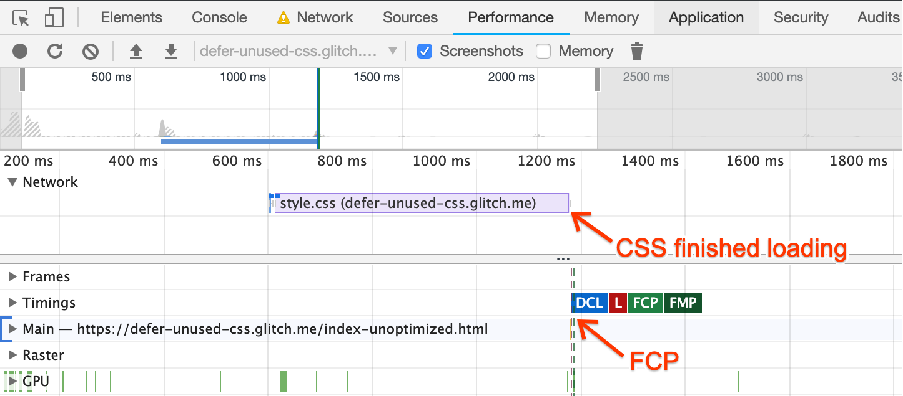
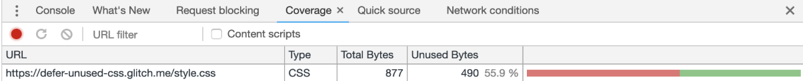
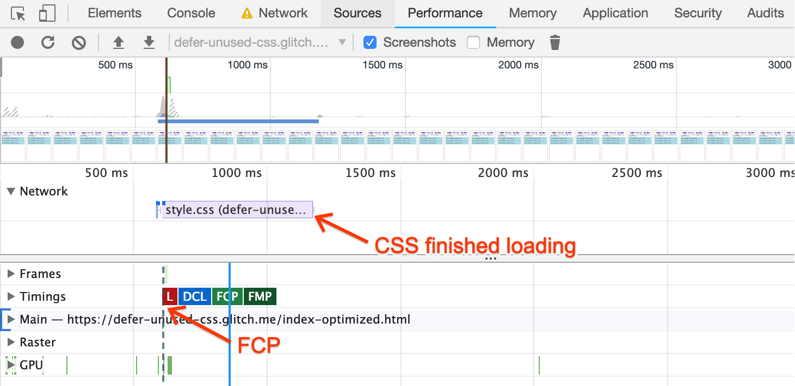
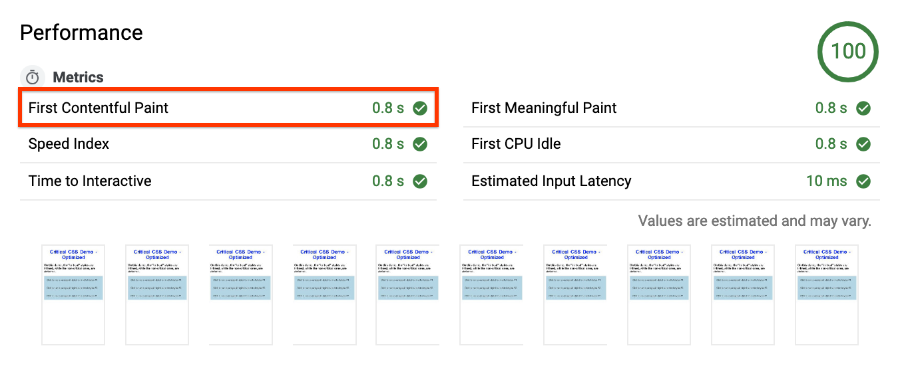
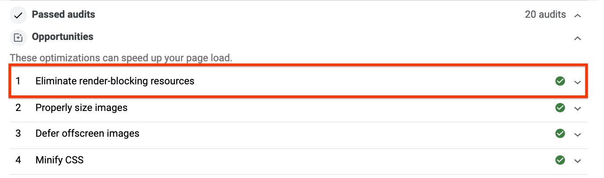

# Why should you care?

CSS files are [render-blocking resources](https://developers.google.com/web/tools/lighthouse/audits/blocking-resources), meaning that they have to be loaded and processed before the browser can start rendering the page. For this reason, web pages that contain unnecessarily large or unused styles may take longer to render, increasing the likelihood that a user may bounce: 53% of mobile visits bounce if the page does not load [in 3 seconds or less](https://www.thinkwithgoogle.com/intl/en-154/insights-inspiration/research-data/need-mobile-speed-how-mobile-latency-impacts-publisher-revenue/).

On this guide, you’ll learn how to defer unused CSS with the goal of optimizing the [Critical Rendering Path](https://developers.google.com/web/fundamentals/performance/critical-rendering-path/), and improving [FCP (First Contentful Paint)](https://developers.google.com/web/tools/lighthouse/audits/first-contentful-paint).

## Loading CSS in a suboptimal way

The following example page contains an accordion with three hidden paragraphs of text, each of which is styled with a different class.

<div class="glitch-embed-wrap" style="height: 420px; width: 100%;">
  <iframe
    allow="geolocation; microphone; camera; midi; encrypted-media"
    src="https://glitch.com/embed/#!/embed/defer-css-unoptimized?path=index.html&previewSize=100&attributionHidden=true"
    alt="defer-css-unoptimized on Glitch"
    style="height: 100%; width: 100%; border: 0;">
  </iframe>
</div>

This page requests a CSS file with eight classes, but not all of them are necessary to render the "visible" content. 

The goal of this guide is to optimize this page, so only the **critical** styles are loaded synchronously, while the rest (like the ones applied to paragraphs), are loaded in a non-blocking way.

## Measure

Run [Lighthouse](https://developers.google.com/web/tools/lighthouse/) on [the page](https://defer-css-unoptimized.glitch.me/) and go to the **Performance** section.

The report shows the **FCP** metric with a value of "1s", and the Opportunity **Eliminate render-blocking resources**, pointing to the **style.css** file:

<figure>
  
</figure>

To visualize how this CSS is actually blocking rendering:

1. Open [the page](https://defer-css-unoptimized.glitch.me/) in Chrome.
1. Press Control+Shift+J or Cmd+Option+J (Mac), to open DevTools.
1. Go to the **Performance** tab and click on the **Reload** button.

On the resulting trace you’ll see that the **FCP** marker is placed immediately after the CSS finishes loading:

<figure>
  
</figure>

This means that the browser needs to wait for the whole CSS to be loaded and processed before painting a single pixel on the screen.

## Optimize

As a first step to optimize this page, you need to know which classes are actually considered “critical”.
You'll use the the [Coverage Tool](https://developers.google.com/web/updates/2017/04/devtools-release-notes#coverage) for that:

1. On DevTools, open the [Command Menu](https://developers.google.com/web/tools/chrome-devtools/ui#command-menu), by pressing Control+Shift+P or Cmd+Shift+P (Mac).
1. Type “Coverage” and select “Show Coverage”.
1. Click the “Reload” button, to reload the page and start capturing the coverage.

<br/>

<figure>
  
</figure>


Double-click on the report, to see classes marked in two colors:

* Green (**"critical"**): These are the classes the browser needs to render the visible content (like the title, subtitle, and accordion buttons).
* Red (**"non-critical"**): These styles are applied to content that's not immediately visible (like the paragraphs that appear after cliking on each button). Additionally, class definitions like "h2" are not even used on this page.

With this information, you'll apply an optimization to let the browser start processing the “critical” styles immediately after the page loads, while deferring the load of the “non-critical” CSS for later:

* Extract the class definitions marked with green on the report obtained from the coverage tool, and put those classes inside a ```<style>``` block on the head of the page:

```
<style type="text/css">
.accordion-btn {background-color: #ADD8E6;color: #444;cursor: pointer;padding: 18px;width: 100%;border: none;text-align: left;outline: none;font-size: 15px;transition: 0.4s;}.container {padding: 0 18px;display: none;background-color: white;overflow: hidden;}h1 {word-spacing: 5px;color: blue;font-weight: bold;text-align: center;}
</style>
```

* Then, load the rest of the classes asynchronously, by applying the following pattern:

```
<link rel="preload" href="styles.css" as="style" onload="this.onload=null;this.rel='stylesheet'"> 
<noscript><link rel="stylesheet" href="styles.css"></noscript>
```

This is not the standard way of loading CSS. Here's how it works:

* ```link rel=”preload” as=”style”``` allows to request the style asynchronously (for more information about ```"preload"```  , check out [this guide](https://web.dev/fast/preload-critical-assets)).
* The ```onload``` attribute on the link allows the CSS to be processed, when it finishes loading.
* “nulling” the ```onload``` handler once it is used, helps some browsers to avoid re-calling the handler upon switching the rel attribute.
* The ordinary reference to the stylesheet inside a noscript element works as a fallback, for browsers that don’t execute JS.

The [resulting page](https://defer-css-optimized.glitch.me/) looks exactly like the previous version, even when most of its styles are loaded asynchronously:

<div class="glitch-embed-wrap" style="height: 420px; width: 100%;">
  <iframe
    allow="geolocation; microphone; camera; midi; encrypted-media"
    src="https://glitch.com/embed/#!/embed/defer-css-optimized?path=index.html&previewSize=100&attributionHidden=true"
    alt="defer-css-optimized on Glitch"
    style="height: 100%; width: 100%; border: 0;">
  </iframe>
</div>

## Monitor

Obtain a new Performance trace with DevTools, now running it on the [optimized page](https://defer-css-optimized.glitch.me/). 

The **FCP** marker appears before the page requests the CSS, which means the browser doesn’t need to wait for the CSS to be loaded to start rendering the page:

<figure>
  
</figure>

As a final step, run Lighthouse on the optimized page. 

On the report you’ll see that the FCP page has been reduced in **0.2s** (a 20% improvement!):

<figure>
  
</figure>

Also, as a result, the **Eliminate render-blocking resources** suggestion is no longer under **Opportunities**, and now belongs to the **Passed Audits** section:

<figure>
  
</figure>

## Next steps & references

On this guide you used vanilla code to implement this optimization. In a real production scenario, it’s a good practice use functions like [loadCSS](https://github.com/filamentgroup/loadCSS/blob/master/README.md), that can encapsulate this behavior and work well across browsers. As a complement of this, you can use tools like [Critical](https://github.com/addyosmani/critical/blob/master/README.md), which helps extracting and inlining the “Above the Fold” CSS, you did manually on the **Optimize** step.
These tools will be covered in an upcoming guide.