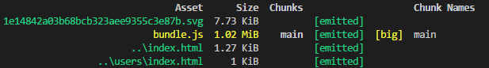
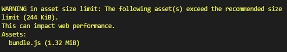
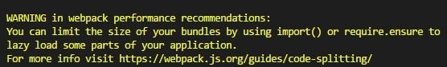
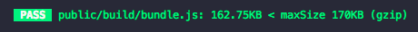
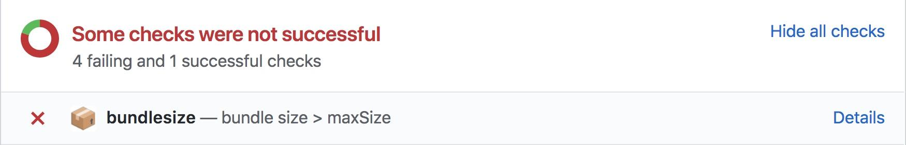
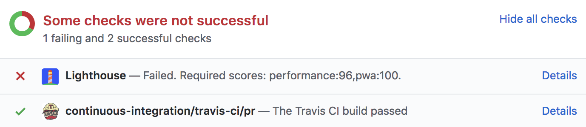
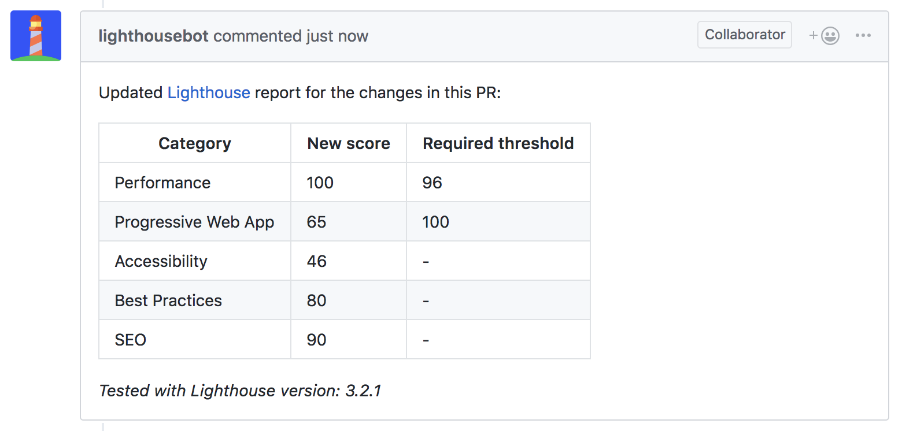

# Incorporate performance budgets into your build process

Once you’ve defined a performance budget, it’s time to set up the build process to keep track of it. There are a number of tools that let you define thresholds for chosen performance metrics and will warn you if you go over budget. Find out how to choose one that best fits your needs and current setup. 🕵️‍♀️

## Webpack Performance Hints

[Webpack](https://developers.google.com/web/fundamentals/performance/webpack/) is a powerful build tool for optimizing how your code is delivered to the users. It also supports setting performance budgets based on **asset size**. 

Turn on [performance hints](https://webpack.js.org/configuration/performance/) in the configuration file and Webpack will show you command line warnings or errors when your bundle size grows over the limit. It’s a great way to stay mindful about asset sizes throughout the development.

After build step, Webpack outputs a color-coded list of assets and their sizes. Anything over budget is highlighted in yellow. 

<figure>
  
  <figcaption>
    The highlighted bundle.js is bigger than your budget
  </figcaption>
</figure>

The default limit for both assets and entry-points is 250 KB (or 244 [KiB](https://en.wikipedia.org/wiki/Kibibyte)).

<figure>
  
  <figcaption>
    Webpack warning you about bulky JS bundle ⚠️
  </figcaption>
</figure>

You can set your own targets (measured in bytes) in the configuration file:

* Use `maxAssetSize` for individual assets
* Use `maxEntrypointSize` for the sum of all assets used during initial load

<pre class="prettyprint">
  module.exports = {
  //...
  performance: {
    maxAssetSize: 170000
    maxEntrypointSize: 170000,
    hints: 'warning'
  }
};
</pre>

The numbers are compared against **uncompressed asset sizes**. This is not an ideal situation, since most hosting platforms, CDNs and reverse proxy servers compress assets by default. You can give yourself some wiggle room during development, but keep in mind that compression speeds up only the transfer. Browsers still have to parse uncompressed files and this [parsing cost is not small](https://medium.com/@addyosmani/the-cost-of-javascript-in-2018-7d8950fbb5d4), especially on mobile devices.

Bonus feature: Webpack won’t only warn you, it will give you a recommendation on how to downsize your bundles. You can learn more about the recommended techniques on [Web Fundamentals](https://developers.google.com/web/fundamentals/performance/webpack/).

<figure>
  
  <figcaption>
    Webpack performance optimization recommendation 💁
  </figcaption>
</figure>

## Bundlesize

[Bundlesize](https://github.com/siddharthkp/bundlesize) is a simple npm package that tests asset size against a threshold you’ve set. It can run locally and integrate with your CI.

### Bundlesize CLI

Run [bundlesize CLI](https://github.com/siddharthkp/bundlesize#cli) by specifying a threshold and the file that you want to test.

<pre class="prettyprint">bundlesize -f "dist/bundle.js" -s 170kB</pre>

Bundlesize will output color-coded test results in one line.

<figure>
  
  <figcaption>
    Failing bundlesize CLI test ❌
  </figcaption>
</figure>

<figure>
  
  <figcaption>
    Passing bundlesize CLI test ✔️
  </figcaption>
</figure>

### Bundlesize for CI 

You’ll get the most value out of bundlesize if you integrate it with a CI to automatically enforce size limits on pull requests. **If bundlesize test fails, that pull request will not be merged.** It currently works with [Travis CI](https://travis-ci.org/), [CircleCI](https://circleci.com/), [Wercker](http://www.wercker.com/), and [Drone](http://readme.drone.io/).

<figure>
  
  <figcaption>
    bundlesize check status on Github 
  </figcaption>
</figure>

You may have a fast app today, but adding new code can often change this. Checking pull requests with bundlesize will help you avoid performance regressions. Bootstrap, Tinder, Trivago and many others use it to keep their budgets in check.

With bundlesize, it’s possible to set thresholds for each file separately in `package.json`. This is especially useful if you are code-splitting a bundle in your application. 

<pre class="prettyprint">
"bundlesize": [
  {
    "path": "./dist/vendor-*.js",
    "maxSize": "35 kB"
  },
  {
    "path": "./dist/app-*.js",
    "maxSize": "25 kB"
  }
]
</pre>

Setting different budgets per-script with bundlesize

By default, **it tests gzipped asset sizes**. You can use the compression option to switch to [brotli compression](https://css-tricks.com/brotli-static-compression/) or turn it off completely. 

## Lighthouse CI

<figure>
  
  <figcaption>
  </figcaption>
</figure>

[Lighthouse](https://developers.google.com/web/tools/lighthouse/) is an auditing tool that tests sites in a few key areas — performance, accessibility, best practices and how well your site performs as a progressive web application. You can run it in Chrome DevTools, from the command line, or as a Node module. 
 
<figure>
  
  <figcaption>
    Lighthouse scores 💯 
  </figcaption>
</figure>

It’s sometimes simpler to keep an eye on a single number than individual asset budgets and Lighthouse performance score takes a lot of things into account.

[Lighthouse CI](https://github.com/ebidel/lighthouse-ci) currently integrates only with Travis and runs an audit after you deploy a site to staging server. It enforces budgets based on any of the five scores. In .travis.yml file set targets with `--perf`, `--pwa`,  `--a11y`, `--bp` or `--seo` options. Aim to stay in the green zone with a performance score of at least 80.

<pre class="prettyprint">
after_success:
  - ./deploy.sh # Deploy the PR changes to staging server
  - npm run lh -- --perf=96 https://staging.example.com # Run Lighthouse test
</pre>

If the scores for a pull request fall below the threshold you’ve set, **Lighthouse CI will prevent pull request from being merged**. ⛔

<figure>
  
  <figcaption>
    Lighthouse CI check status on Github  
  </figcaption>
</figure>

The **Lighthouse bot** will then comment on your pull request with updated scores. This is a neat feature which encourages conversation about performance as code changes are happening.

<figure>
  
  <figcaption>
    Lighthouse reporting scores on pull request 💬 
  </figcaption>
</figure>

If you find your pull request blocked by a poor Lighthouse score, run an audit with [Lighthouse CLI](https://developers.google.com/web/tools/lighthouse/#cli) or in [Dev Tools](https://developers.google.com/web/tools/lighthouse/#devtools). You’ll get a report with details about bottlenecks and hints for simple optimizations.

## Summary

<table>
  <tr>
    <td>Tool</td>
    <td>CLI</td>
    <td>CI</td>
    <td>Pros</td>
    <td>Cons</td>
  </tr>
  <tr>
    <td>Webpack</td>
    <td>✅</td>
    <td>✘</td>
    <td>Easy to set up</td>
    <td>Checks uncompressed sizes </td>
  </tr>
  <tr>
    <td>Bundlesize</td>
    <td>✅</td>
    <td>✅</td>
    <td>
        - Checks compressed sizes 
        - Enforces budgets on PRs
    </td>
    <td>Works only for PRs on GitHub</td>
  </tr>
  <tr>
    <td>Lighthouse CI</td>
    <td>✘</td>
    <td>✅</td>
    <td>
        - Enforces budgets on PRs 
        - Score history in PR comments
    </td>
    <td>
        - Only checks scores, no other metrics (yet) 
        - Works only for PRs on GitHub
    </td>
  </tr>
</table>

