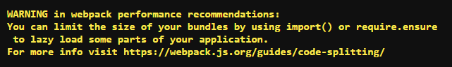

[Webpack](https://developers.google.com/web/fundamentals/performance/webpack/)
combines all your imported files and packages them into one or more output
files known as bundles. Bundling is neat, but as your app grows your bundles
will grow too. You need to monitor bundle sizes to ensure that they don’t grow
too large and affect how long your application takes to load. Webpack supports
setting [performance budgets](https://web.dev/fast/performance-budgets-101)
based on **asset size** and it can keep an eye on bundle sizes for you.

To see it in action, here’s an app that counts the days left until New Year’s.
It’s built with [React](https://reactjs.org/) and [moment.js](https://momentjs.com/).
(Just like real-world apps that increasingly rely on frameworks and libraries. 😉)

## Measure

This Glitch already contains the app bundled with webpack.

1. To start, click the **Remix to Edit** button to make the project editable.

2. Click the **Tools** button.

3. Then click the **Console button**. It will open the Console in another tab.

<web-screenshot type="console"></web-screenshot>

4. To get a color-coded list of assets and their sizes, in the Glitch console
   type:

<pre class="devsite-terminal devsite-click-to-copy">webpack</pre>

The main bundle is highlighted in yellow because it’s larger than 244 KiB (250
KB).

    Webpack uses the unit "KiB", which you might not have 
    seen before. 1 “KiB” and 1 “KB” are fairly close in size: 1 KiB is 1024 bytes, 
    while 1 KB is 1000 bytes.)

These warnings are enabled by default in [production mode](https://webpack.js.org/concepts/mode/)
and the default threshold is **244 KiB uncompressed**, for both assets and
[entry points](https://webpack.js.org/concepts/entry-points/)
(the combination of all assets used during the initial load of a page).

<figure>
  
  <figcaption>
    Webpack warning you about bulky JS bundle ⚠️
  </figcaption>
</figure>

Webpack will not only warn you, but it will also give you a recommendation on
how to downsize your bundles. You can learn more about the recommended techniques on
[Web Fundamentals](https://developers.google.com/web/fundamentals/performance/webpack/use-long-term-caching#lazy-loading).

<figure> 
     
    <figcaption>Webpack performance optimization recommendation 💁</figcaption> 
</figure>

## Set a custom performance budget

An appropriate performance budget will depend on the nature of your project.
It’s always best to [do your own research](https://web.dev/fast/your-first-performance-budget).
A [good rule](https://web.dev/fast/your-first-performance-budget#budget-for-quantity-based-metrics)
of thumb is to deliver under 170 KB of compressed/minified
[critical-path](https://developers.google.com/web/fundamentals/performance/critical-rendering-path/)
resources.

    Critical-path resources are the minimal set of resources required
    for the browser to display the first screen's worth of content.

For this simple demo, try being even more conservative and set the budget to
100 KB. In the configuration file, add the following:

<pre class="prettyprint"> 
    module.exports = { 
        //... 
            performance: { 
            maxAssetSize: 100000, 
            maxEntrypointSize: 100000, 
            hints: 'warning' 
        } 
    };
</pre>

The new performance budget is set in **bytes**:

- 100000 bytes for individual assets (maxAssetSize)

- 100000 bytes for the entry-point (maxEntrypointSize)

In this case, there’s only one bundle which also acts as the entry point.

Possible values for **hints** are:

1. **`warning`** (default): Displays a yellow warning message, but the build
   passes. It’s best to use this in development environments.

2. **`error`**: Displays a red error message, but the build still passes. This
   setting is recommended for production builds.

3. **`false`**: No warnings or errors are shown.

<figure> 
     
    <figcaption>Webpack performance hint "error" 🚨</figcaption> 
</figure>

## Optimize

The purpose of a performance budget is to warn you about performance issues
before they become too difficult to fix. There is always more than one way to
build an app and some techniques will make for faster load times. (A lot of
them are documented right here in [Optimizing your JavaScript](https://web.dev/fast#topic-Optimize-your-JavaScript). 🤓)

Frameworks and libraries make developers’ lives easier, but end users don’t
really care how apps are built, only that they’re functional and fast. If you
find yourself going over the performance budget, it’s time to think about
possible optimizations.

In the real world, large client-side frameworks are usually hard to swap out,
so it’s important to use them wisely. With a bit of research, you can often
find smaller alternatives to popular libraries that do the job just as well
([date-fns](https://date-fns.org/) is a good alternative for moment.js).
Sometimes it makes more sense to not use a framework or library at all if it
has a significant performance impact.

Removing unused code a good way to optimize apps that include large third-party
libraries. The [Remove unused code guide](https://web.dev/fast/remove-unused-code) explains this process in detail.
and here’s a quick way to rewrite the countdown code without using moment.js.

In **app/components/Countdown.jsx** remove:

<pre class="prettyprint"> 
    <s> 
        const today = moment(); 
        const yearEnd = moment().endOf('year'); 
        const daysLeft = yearEnd.diff(today, 'days'); 
    </s> 
</pre>

And delete this line:

<pre class="prettyprint"> 
    <s>const moment = require('moment');</s> 
</pre>

It takes a bit of math, but you can implement the same countdown with vanilla
JavaScript:

<pre class="prettyprint"> 
    const today = new Date(); 
    const year = today.getFullYear(); 
    const yearEnd = new Date(year,11,31); //months are zero indexed in JS 
    const timeDiff = Math.abs(yearEnd.getTime() - today.getTime()); 
    const daysLeft = Math.ceil(timeDiff / (1000 * 3600 * 24)); 
</pre>

Now remove `moment.js` from `package.json` and run webpack in the console
again to build the optimized bundle.

Ta-da! You have shaved off 223 KiB (230KB) and the app is under budget.🎉

## Monitor

Setting up a performance budget in webpack takes just a couple of lines of code
and it will warn you if you ever (accidentally) add a big dependency. The
saying goes "out of sight, out of mind" but webpack can make sure that you are
aware of performance implications at all times.
