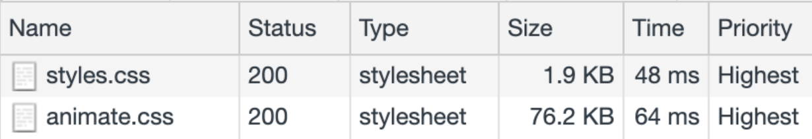
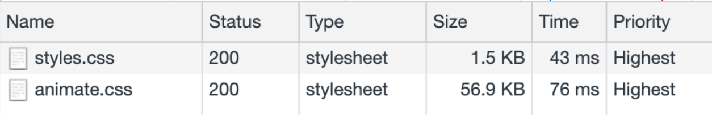

# Minify CSS

CSS files can contain unnecessary characters, such as comments, whitespaces, and indentation, but, once in production, these bytes can be safely removed, in order to reduce file sizes, without affecting how the browser processes the styles. This technique is called **minification**.

## Loading unminified CSS

Take a look at the following CSS block:

```
body {
  font-family: "Benton Sans", "Helvetica Neue", helvetica, arial, sans-serif;
  margin: 2em;
}

/* all titles need to have the same font, color and background */
h1 {
  font-style: italic;
  color: #373fff;
  background-color: #000000;
}

h2 {
  font-style: italic;
  color: #373fff;
  background-color: #000000;
}
```

This content is easy to read, at the cost of producing a larger than necessary file:

- It uses spaces for indentation purposes and contains comments, which will be ignored by the browser.
- The `<h1>` and `<h2>` elements have the same styles: instead of declaring them separately: "`h1 {...} h2 {...}`" they could be expressed as "`h1, h2{...}`".
- The **background-color**, `#000000` could be expressed as just `#000`.

After applying these observations, you would obtain a more compact version of the same styles:

```
body{font-family:"Benton Sans","Helvetica Neue",helvetica,arial,sans-serif;margin:2em}h1,h2{font-style:italic;color:#373fff;background-color:#000}
```

In practice, you would like to introduce this technique as one of the steps of your build process. In this guide, you’ll learn how to do it by using a popular build tool: [Webpack](https://webpack.js.org/).

## Measure

You’ll apply CSS minification to a site that has been used in other guides: [Fav Kitties](https://fav-kitties-animated.glitch.me/). This version of the site uses a cool CSS library: [animate.css](https://github.com/daneden/animate.css), to animate different page elements when a user votes for a cat 😺.

First, run [Lighthouse](https://web.dev/measure) on [the page](https://fav-kitties-animated.glitch.me/), click on **Performance** and go the **Opportunities** section.

The resulting report shows that up to **16KB** can be saved from the **animate.css** file:


Now you'll inspect the content of the CSS files:

1. Open the [site](https://fav-kitties-animated.glitch.me/) in Chrome.
1. Press `Control+Shift+J` or `Cmd+Option+J` (Mac), to open DevTools.
1. Click on the **Network** panel and filter for **CSS**.
1. Make sure **Disable Cache** is checked and reload the page.



The page is requesting two CSS files, of **1.9KB** and **76.2KB** respectively. 

Inspect the content of **animate.css**, by clicking on the file in the **Response** tab. You’ll see that the stylesheet contains characters for whitespaces and indentation:


Next, you’ll minify these files as part of the build process, by using some useful [Webpack](https://webpack.js.org/) plugins.

<div class="aside note">
<strong>Note:</strong> On the previous <strong>Lighthouse</strong> report, the only file that appears as an opportunity for minification is <strong>animate.css</strong>. The reason is that the bytes saved after minifyng <strong>style.css</strong> would be under the threshold that the tool considers "significant".
In any case, recall that minification is a general best practice, which sould be applied to any CSS file, regardless that they show up or not as suggestions on performance tools.
</div>

## CSS Minification with Webpack:

Before jumping into the optimizations, take some time understanding how the [demo site](https://glitch.com/edit/#!/fav-kitties-animated?path=webpack.config.js:1:0]) works:

<div class="glitch-embed-wrap" style="height: 420px; width: 100%;">
  <iframe
    allow="geolocation; microphone; camera; midi; vr; encrypted-media"
    src="https://glitch.com/embed/#!/embed/fav-kitties-animated?path=webpack.config.js&previewSize=0"
    alt="fav-kitties-animated on Glitch"
    style="height: 100%; width: 100%; border: 0;">
  </iframe>
</div>

By default, the resulting JS bundle that Webpack produces would contain the content of the CSS files inlined. Since we want each CSS to be on its own file, we are using two complementary plugins:

- [mini-css-extract-plugin](https://github.com/webpack-contrib/mini-css-extract-plugin) will extract each CSS into its own file, as one o the steps of the build process.
- [webpack-fix-style-only-entries](https://github.com/fqborges/webpack-fix-style-only-entries) is used to correct an issue on Wepback 4, to avoid generating an extra JS file for each CSS declared as entry in **webpack-config.js**.

You will now make some changes in the project:

1. Open the project [in Glitch](https://glitch.com/~fav-kitties-animated).
1. Click “View Source”, and then, click on the name of the project in the upper left side.
1. In the drop-down menu, choose “Remix and Edit” 🎤, to make changes on the project.
1. Once in the cloned project, go to the “Tools” option in the lower left corner of the edit view, and click on “Console”.

To minify the resulting CSS, you’ll use the [optimize-css-assets-webpack-plugin](https://github.com/NMFR/optimize-css-assets-webpack-plugin): 

1. In Glitch console, run `npm install --save-dev optimize-css-assets-webpack-plugin`.
1. Run `refresh`, so the changes are synchronized with the Glitch editor.

Next, go back to the Glitch editor, open the **webpack.config.js** file, and make the following modifications:

Load the module at the beginning of the file:
```
const OptimizeCSSAssetsPlugin = require("optimize-css-assets-webpack-plugin");
```

Then, pass an instance of the plugin to the **plugins** array:
```
  plugins: [
    new HtmlWebpackPlugin({template: "./src/index.html"}),
    new MiniCssExtractPlugin({filename: "[name].css"}),
    new FixStyleOnlyEntriesPlugin(),
    new OptimizeCSSAssetsPlugin({})
  ]
```
After making the changes a rebuild of the project will be triggered.
This is how the resulting **webpack.config.js** will look like:

<div class="glitch-embed-wrap" style="height: 420px; width: 100%;">
  <iframe
    allow="geolocation; microphone; camera; midi; vr; encrypted-media"
    src="https://glitch.com/embed/#!/embed/fav-kitties-animated-min?path=webpack.config.js&previewSize=0"
    alt="fav-kitties-animated-min on Glitch"
    style="height: 100%; width: 100%; border: 0;">
  </iframe>
</div>

Next, you'll check the result of this optimization with performance tools.

## Monitor

First, run Lighthouse on the [optimized site](https://fav-kitties-animated-min.glitch.me/). 

The report doesn't show "Minify CSS" as "Opportunity" anymore, and has now moved to "Passed Audits" section:


To inspect the size and content of the files:

1. Open the resulting [optimized page](https://fav-kitties-animated-min.glitch.me/) in Chrome, and open DevTools.
1. Click in the **Network** panel and filter for “CSS”.
1. Make sure "Disable Cache" is checked and reload the page.



You can inspect these files, and see that the new versions don't contain any whitespaces. Both files are much smaller, in particular, the [animate.css](http://fav-kitties-animated-min.glitch.me/animate.css) has been reduced in **~26%**, saving **~20KB**!

Since CSS files are [render-blocking resources](https://developers.google.com/web/tools/lighthouse/audits/blocking-resources), if you apply minification on sites that use large CSS files, you can see improvements on metrics like [First Contentful Paint](https://developers.google.com/web/tools/lighthouse/audits/first-contentful-paint).

## Next steps and resources

In this guide, we've covered CSS Minification with Webpack, but the same approach can be followed with other build tools, like [gulp-clean-css](https://www.npmjs.com/package/gulp-clean-css) for [Gulp](https://gulpjs.com/), or
[grunt-contrib-cssmin](https://www.npmjs.com/package/grunt-contrib-cssmin) for [Grunt](https://gruntjs.com/).

Minification can also be applied to other types of files. Check out the [Minify and compress network payloads guide](https://web.dev/fast/reduce-network-payloads-using-text-compression) to learn more about tools to minify JS, and some complementary techniques, like compression.