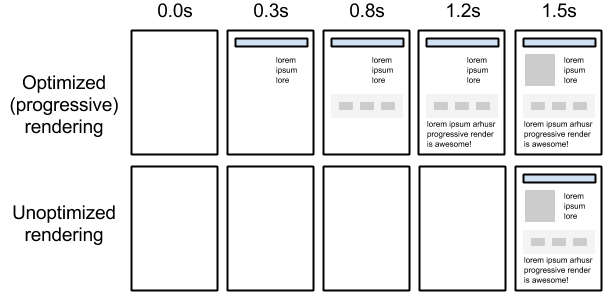

# Performance budgets 101

Performance is an important part of the user experience and it [affects business metrics](https://wpostats.com/). It’s tempting to think that if you are a good developer you’ll end up with a performant site, but the truth is that good performance is rarely a side effect. As with most other things—to reach a goal you have to define it clearly. Start the journey by setting a **performance budget**. 

## Definition

A performance budget is a set of limits imposed on metrics that affect site performance. This could be the total size of a page, the time it takes to load on a mobile network, or even the number of HTTP requests that are sent. Defining a budget helps get the web performance conversation started. It serves as a point of reference for making decisions about design, technology, and adding features.

Having a budget enables designers to think about the effects of high-resolution images and the number of web fonts they pick. It also helps developers compare different approaches to a problem and evaluate frameworks and libraries based on their size and [parsing cost](https://medium.com/@addyosmani/the-cost-of-javascript-in-2018-7d8950fbb5d4).

## Choose metrics

### Quantity-based metrics ⚖️

These metrics are useful in the early stages of development because they highlight the impact of including heavy images and scripts. They are also easy to communicate to both designers and developers. 

We’ve already mentioned a few things you can include in a performance budget such as page weight and the number of HTTP requests, but you can split these up into more granular limits like:

* Maximum size of images 
* Maximum number of web fonts
* Maximum size of scripts, including frameworks
* Total number of external resources, such as third-party scripts

However, these numbers don’t tell you much about the user experience. Two pages with the same number of requests or same weight can render differently depending on the order in which resources get requested. If a [critical resource](https://developers.google.com/web/fundamentals/performance/critical-rendering-path/) like a hero image or a stylesheet on one of the pages is loaded late in the process, the users will wait longer to see something useful and perceive the page as slower. If on the other page the most important parts load quickly, they may not even notice if the rest of the page doesn't. 

This is why it’s important to keep track of another type of metric.

### Milestone timings ⏱️

Milestone timings mark events that happen during page load, such as [DOMContentLoaded](https://developer.mozilla.org/en-US/docs/Web/Events/DOMContentLoaded) or [load](https://developer.mozilla.org/en-US/docs/Web/Events/load) event. The most useful timings are [user-centric performance metrics](https://developers.google.com/web/fundamentals/performance/user-centric-performance-metrics) that tell you something about the experience of loading a page. These metrics are available through [browser APIs](https://developers.google.com/web/fundamentals/performance/user-centric-performance-metrics#measuring_these_metrics_on_real_users_devices) and as part of [Lighthouse](https://developers.google.com/web/tools/lighthouse/) reports.

[First Contentful Paint](https://developers.google.com/web/tools/lighthouse/audits/first-contentful-paint) (FCP) measures when the browser displays the first bit of content from the DOM, like text or images. 

[Time to Interactive](https://developers.google.com/web/fundamentals/performance/user-centric-performance-metrics#time_to_interactive) (TTI) measures how long it takes for a page to become fully interactive and reliably respond to user input. It’s a very important metric to track if you expect any kind of user interaction on the page like clicking links, buttons, typing or using form elements. 

### Rule-based metrics 💯

[Lighthouse](https://developers.google.com/web/tools/lighthouse/) and [WebPageTest](https://www.webpagetest.org/) calculate [performance scores](https://developers.google.com/web/tools/lighthouse/scoring#perf-scoring) based on general best practice rules, that you can use as guidelines. As a bonus, Lighthouse also offers you hints for simple optimizations.

You’ll get the best results if you keep track of a combination of quantity-based and user-centric performance metrics. Focus on asset sizes in the early phases of a project and start tracking FCP and TTI as soon as possible. 

## Establish a baseline

The only way to really know what works best for your site is to try it—research and then test your findings. Analyze the competition to see how you stack up. 🕵️

If you don’t have time for that, here are good default numbers to get you started:

* Under **5 s** Time to Interactive 
* Under **170 KB** of [critical-path](https://developers.google.com/web/fundamentals/performance/critical-rendering-path/) resources (compressed/minified)

These [numbers](https://infrequently.org/2017/10/can-you-afford-it-real-world-web-performance-budgets/) are calculated based on real-world baseline devices and **3G network speed**. [Over half of the internet traffic](https://www.statista.com/statistics/277125/share-of-website-traffic-coming-from-mobile-devices/) today happens on mobile networks, so you should use 3G network speed as a starting point.

### Examples of budgets

You should have a budget in place for different types of pages on your site since the content will vary. For example:

* Our product page must ship less than 170 KB of JavaScript on mobile
* Our search page must include less than 2 MB of images on desktop
* Our home page must load and get interactive in < 5 s on slow 3G on a Moto G4 phone
* Our blog must score > 80 on Lighthouse performance audits

## Add performance budgets to your build process

Choosing a tool for this will depend a lot on the scale of your project and resources that you can dedicate to the task. There are a few open-source tools that can help you add budgeting to your build process: 

* [Webpack performance features](https://webpack.js.org/configuration/performance/)
* [bundlesize](https://github.com/siddharthkp/bundlesize)
* [Lighthouse CI](https://github.com/ebidel/lighthouse-ci)

If something goes over a defined threshold, you can either: 

* Optimize an existing feature or asset 🛠️
* Remove an existing feature or asset 🗑️
* Not add the new feature or asset ✋⛔

## Track performance 

Making sure your site is fast enough means you have to keep measuring after the initial launch. Monitoring these metrics over time and [getting data from real users](https://developers.google.com/web/fundamentals/performance/navigation-and-resource-timing/) will show you how changes in performance impact key business metrics. 

## Wrap up

The purpose of a performance budget is to make sure you focus on performance throughout a project and setting it early will help prevent backtracking later. It should be the point of reference for helping you figure out what to include on your website. The main idea is to set goals so that you can better balance performance without harming functionality or user experience.🎯

The next guide will walk you through defining your first performance budget in a few simple steps.
