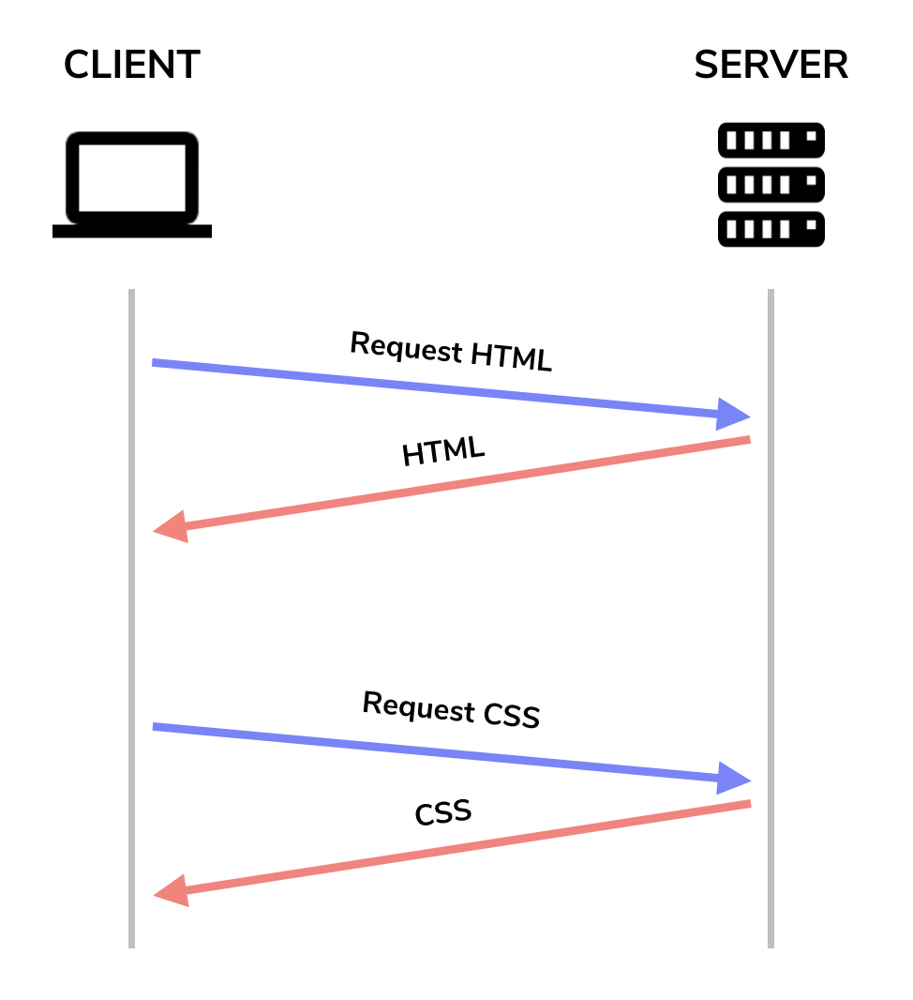
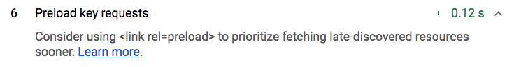

# Preload critical assets to improve loading speed

Nobody likes waiting for a long time in order to interact with an application. 
Learn how to improve page performance by preloading and prefetching important
assets. 

## Preload

As soon as you open any web page, the browser requests an HTML document from a
server, parses the contents of the HTML file, and submits separate requests for
any other external references. 

Requests/responses with client and server

The **critical request chain** represents the order of resources that are
prioritized and fetched by the browser. Lighthouse identifies assets that are on
the third level of this chain as _late-discovered_: 

Lighthouse: Preload key requests audit

**Preload** is a declarative fetch request that tells the browser to request an
important resource as soon as possible. The browser assigns a higher priority
level to the resource and tries to download it sooner while not delaying the
`window.onload` event. Take a look at the
[Chrome Resource Priorities and Scheduling](https://docs.google.com/document/d/1bCDuq9H1ih9iNjgzyAL0gpwNFiEP4TZS-YLRp_RuMlc/edit)
document to learn more about how the browser prioritizes different types of
resources. 

By preloading a certain resource, you are telling the browser that you would
like to fetch it sooner since it is important for the current page. Preload
resources by adding a`<link>` tag with `rel="preload"` to the head of your HTML
document:

<link rel="preload" as="script" href="critical.js">

For more information about all the attributes that can be used as well as the
types of content that can be preloaded, refer to
[Preloading content with rel="preload"](https://developer.mozilla.org/en-US/docs/Web/HTML/Preloading_content).

Preloading is best suited for resources typically discovered later by the
browser. For example, an external
[`@font-face](https://developers.google.com/web/fundamentals/performance/optimizing-content-efficiency/webfont-optimization#defining_a_font_family_with_font-face)`
rule in a CSS file isn't discovered until the browser finishes requesting and
parsing the CSS file. Preload this font to ensure it's fetched before the CSS
file has downloaded.

If you are using a module bundler that creates build files of your application,
you will need to check if it supports the injection of preload tags. With
[webpack](https://webpack.js.org/) version 4.6.0 or later, use a specific inline
directive to preload scripts:

**import**(_/* webpackPreload: true */_ "CriticalChunk")

This works best if you [code-split](https://example.com) your bundle and only
preload critical chunks. If you are using an older version of webpack, use a
third-party plugin such as
[preload-webpack-plugin](https://github.com/GoogleChromeLabs/preload-webpack-plugin).

## Prefetch

**Prefetch** is another browser hint that tells the browser a resource is
important. A prefetched resource is requested at a low priority once the browser
has finished requesting all the needed assets for the current page. To speed up
future navigations, use prefetch to request assets that would be needed for a
different route. 

<link rel="prefetch" as="script" href="important-for-next-page.js">

Similarly, webpack allows you prefetch script chunks if you are using version
4.6.0 or later.

**import**(_/* webpackPrefetch: true */_ "ImportantForNextPageChunk")

Refer to the
[Link prefetching FAQ](https://www.google.com/url?q=https://developer.mozilla.org/en-US/docs/Web/HTTP/Link_prefetching_FAQ&sa=D&ust=1536630604621000&usg=AFQjCNHm8zqhdHujGtsAxHsWXKZcCbR2XQ)
for more details about link prefetching.
