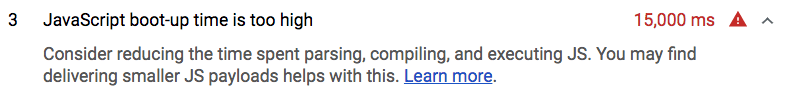

# Reduce JavaScript payloads with code-splitting

Nobody likes waiting.
**[Over 50% of users will abandon a website if it takes longer than 3 seconds to load](https://www.thinkwithgoogle.com/intl/en-154/insights-inspiration/research-data/need-mobile-speed-how-mobile-latency-impacts-publisher-revenue/)**.

Sending large JavaScript payloads will impact the speed of your site
significantly. Instead of shipping all the JavaScript to your user as soon as
the first page of your application is loaded, **code-split** your bundle into
multiple "pieces" and only send what's necessary at the very beginning. 

## Measure

Lighthouse displays a failed audit when a significant amount of time is taken to
execute all the JavaScript on a page. 

Split the JS bundle to only send the code needed for the initial route when the
user loads an application. This minimizes the amount of script that needs to be
parsed and compiled, which will result in faster page load times. 

Popular module bundlers like [webpack]((https://webpack.js.org/)),
[Parcel](https://parceljs.org/code_splitting.html), and
[Rollup](https://rollupjs.org/guide/en#dynamic-import) allow you to split your
bundles using [dynamic imports](https://developers.google.com/web/updates/2017/11/dynamic-import).
For example, consider the following code snippet that shows an example of a
`someFunction `method that gets fired when a form is submitted.

<pre class="prettyprint">
import moduleA from "library";

form.addEventListener("submit", e => {
  e.preventDefault();
  someFunction();
});

const someFunction = () => {
  // uses moduleA
}
</pre>

In here, `someFunction` uses a module imported from a particular library. If
this module is not being used elsewhere, the code block can be modified to use a
dynamic import to fetch it only when the form is submitted by the user. 

<pre class="prettyprint">
form.addEventListener("submit", e => {
  e.preventDefault();
  <strong>import('library.moduleA')</strong>
    <strong>.then(module => module.default) // using the default export</strong>
    <strong>.then(someFunction())</strong>
    <strong>.catch(handleError());</strong>
});

const someFunction = () => {
    // uses moduleA
}
</pre>

The code that makes up the module does not get included into the initial bundle
and is now **lazy loaded**, or provided to the user only when it is needed after
the form submission. To further improve page performance, [preload critical
chunks to prioritize and fetch them sooner](/path/fast/preload-critical-assets).

Although the previous code snippet is a simple example, lazy loading third party
dependencies is not a common pattern in larger applications. Usually, third
party dependencies are split into a separate vendor bundle that can be cached
since they don't update as often. You can read more about how the
[**SplitChunksPlugin**](https://webpack.js.org/plugins/split-chunks-plugin/) can
help you do this.

Splitting on the route or component level when using a client-side framework is
a simpler approach to lazy loading different parts of your application. Many
popular frameworks that use webpack provide abstractions to make lazy loading
easier than diving into the configurations yourself.

## Next Steps

Although it's useful to understand how dynamic imports work, use the method
recommended by your framework/library instead. Refer to any of the following
sample code projects to learn more about how following frameworks allow you to
split on the route or component level:

+  [Angular](https://angular.io/guide/lazy-loading-ngmodules)
+  [React](https://reacttraining.com/react-router/web/guides/code-splitting)
+  [Vue](https://router.vuejs.org/guide/advanced/lazy-loading.html)
