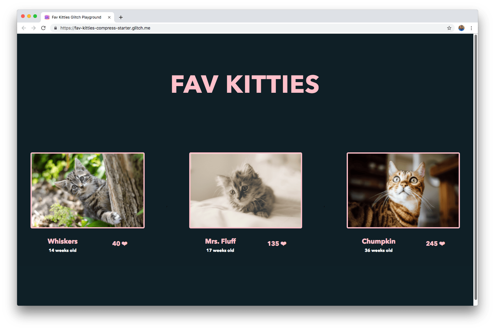

This codelab is an extension of the [Minify and compress network payloads codelab](/fast/reduce-network-payloads-using-text-compression/codelab-text-compression) and assumes you are familiar with the basics concepts of compression. As compared to other compression algorithms like `gzip`, this codelab explores how Brotli compression can further reduce compression ratios and your app’s overall size.



## Measure

<div class="aside note">
 Since [webpack](https://webpack.js.org/) is used in this application, any changes made to the code will trigger a new build which can take a few seconds. Once it completes, you should see your changes reflected in the application.
</div>

Before diving in to add optimizations, it's always a good idea to first analyze
the current state of the application.

1. Click the **Remix to Edit** button to make the project editable.
2. Click on the **Show Live** button.

In the previous [Minify and compress network payloads codelab](/fast/reduce-network-payloads-using-text-compression/codelab-text-compression), we reduced the size of `main.js` from 225 KB to 61.6 KB. In this codelab, you will explore how Brotli compression can reduce this bundle size even further.

## Brotli Compression

<div class="aside warning">
Many hosting platforms, CDNs and reverse proxy servers either encode 
assets with compression by default or allow you to easily configure them. If your hosting platform supports Brotli, you may not need to setup your server to compress your assets with Brotli as described in this tutorial.
</div>

[Brotli](https://opensource.googleblog.com/2015/09/introducing-brotli-new-compression.html) is a newer compression algorithm which can provide even better text compression results than `gzip`. According to [CertSimple](https://certsimple.com/blog/nginx-brotli), Brotli performance is:
+  14% smaller than `gzip` for JavaScript
+  21% smaller than `gzip` for HTML
+  17% smaller than `gzip` for CSS

To use Brotli, your server must support HTTPS. Brotli is supported in the [latest versions of most browsers](https://caniuse.com/#feat=brotli). Browsers that support Brotli will include `br` in `Accept-Encoding` headers:

```
Accept-Encoding: gzip, deflate, br
```

You can determine which compression algorithm is used via the `Content-Encoding` field in the Chrome Developer Tools Network tab (CMD+option+I or Ctrl+alt+I):


### Enabling Brotli

#### Dynamic compression

**Dynamic compression** involves compressing assets on-the-fly as they get requested by the browser.

#### Pros
* Creating and updating saved compressed versions of assets does not need to be done.
* Compressing on-the-fly works especially well for web pages that are dynamically generated.

#### Cons
+  Compressing files at higher levels to achieve better compression ratios takes longer. This can cause a performance hit as the user waits for assets to compress before they are sent by the server.

#### Dynamic compression with Node/Express

The `server.js` file is responsible for setting up the Node server that hosts the application.

```
var express = require('express');

var app = express();

app.use(express.static('public'));

var listener = app.listen(process.env.PORT, function() {
  console.log('Your app is listening on port ' + listener.address().port);
});
```

All this currently does is import `express` and use the `express.static` middleware to load all the static HTML, JS and CSS files in the `public/directory` (and those files are created by webpack with every build).

To make sure all of the assets are compressed using brotli every time they're requested, the [`shrink-ray`](https://github.com/aickin/shrink-ray#readme) module can be used. Begin by adding it as a `devDependency` in `package.json`:

<pre class="prettyprint">
"devDependencies": {
  //...
  <strong>"shrink-ray": "^0.1.3"</strong>
},
</pre>

And import it into the server file, `server.js`:

<pre class="prettyprint">
var express = require('express');
<strong>var shrinkRay = require('shrink-ray');</strong>
</pre>

And add it as a middleware before `express.static` is mounted:

<pre class="prettyprint">
//...
var app = express();

app.use(express.static('public'));

// compress all requests
<strong>app.use(shrinkRay());</strong>
</pre>

Now reload the app, and take a look at the bundle size in the Network panel:


You can now see `brotli` is applied from `bz` in the `Content-Encoding` header. `main.bundle.js` is reduced from **225 KB to 53.1 KB**! This is ~14% smaller compared to `gzip` (61.6 KB).

<div class="aside note">
Brotli has eleven quality levels  from <code>0</code> (no compression) to <code>9</code> (maximum compression). A quality of <code>1</code> is very fast but less effective, whereas a quality setting of <code>11</code> is very slow but provides big savings in file size. Note that unlike the standard brotli library, which defaults to quality <code>11</code>, <code>shrink-ray</code> defaults to quality <code>4</code>, which is generally more appropriate for dynamic content. You can adjust the parameters of the brotli algorithm by passing in an <code>options</code> parameters to <code>shrinkRay([options])</code>.
</div>

### Static compression

The idea behind static compression is to have assets compressed and saved ahead of time.

#### Pros:
+  Latency due to high compression levels is not a concern anymore. Nothing needs to happen on-the-fly to compress files as they can now be fetched directly.

#### Cons:
+  Assets need to compressed with every build. Build times can increase significantly if high compression levels are used.

#### Static compression with Node/Express and webpack

Since **static compression** involves compressing files ahead of time, webpack settings can be modified to compress assets as part of the build step. The `brotli-webpack-plugin` can be used for this.

Begin by adding it as a `devDependency` in `package.json`:

<pre class="prettyprint">
"devDependencies": {
  //...
 <strong>"brotli-webpack-plugin": "^1.1.0"</strong>
},
</pre>

Like any other webpack plugin, import it in the configurations file, `webpack.config.js`:

<pre class="prettyprint">
var path = require("path");

//...
<strong>var BrotliPlugin = require('brotli-webpack-plugin');</strong>
},
</pre>

And include it within the plugins array:

<pre class="prettyprint">
module.exports = {
  // ... 
  plugins: [
    // ... 
    <strong>new BrotliPlugin({
      asset: '[file].br',
      test: /\.(js)$/
    })</strong>
  ]
}
},
</pre>

The following arguments are used in the plugin array:
+  `asset`: The target asset name. 
 +  `[file]` is replaced with the original asset file name
+  `test`: All assets that match this RegExp (i.e. javascript assets ending in `.js`) are processed

For example, `main.js` would be renamed to `main.js.br`.

When the app reloads and rebuilds, a compressed version of the main bundle is now created. Open the Glitch Console to take a look at what's inside the final `public/` directory that's served by the Node server.

+ Click the **Status** button.

<web-screenshot type="status"></web-screenshot>

+ Click the **Console** button.

<web-screenshot type="console"></web-screenshot>

+ In the console, run the following commands to change into the `public` directory
and see all of its files:

<pre class="devsite-terminal devsite-click-to-copy">
cd public
ls -lh
</pre>


The brotli compressed version of the bundle, `main.bundle.js.br`, is now saved here as well and is **~76% smaller in size** (225 KB vs. 53 KB) than `main.bundle.js`.

Next, tell the server to send these brotli-compressed files whenever their original JS versions are being requested. This can be done by defining a new route in `server.js` before the files are served with `express.static`.

<pre class="prettyprint">
var express = require('express');

var app = express();

<strong>app.get('*.js', (req, res, next) => {
  req.url = req.url + '.br';
  res.set('Content-Encoding', 'br');
  next();
});</strong>
</pre>

`app.get` is used to tell the server how to respond to a `GET` request for a specific endpoint. A callback function is then used to define how to handle this request. The route works like this:
+ Specifying `'*.js'` as the first argument means that this works for every endpoint that is fired to fetch a JS file.
+ Within the callback, `.br` is attached to the URL of the request and the `Content-Encoding` response header is set to `br`.
+ Finally, `next()` ensures that the sequence continues to any callback that may be next.

Once the app reloads, take a look at the Network panel once more.


Success! You have used Brotli compression to further compress your assets!

## Conclusion

This codelab illustrated how `brotli` can further reduce your app’s overall size. Where supported, `brotli` is a more powerful compression algorithm than `gzip`.