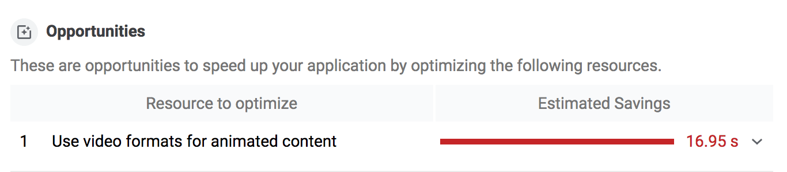
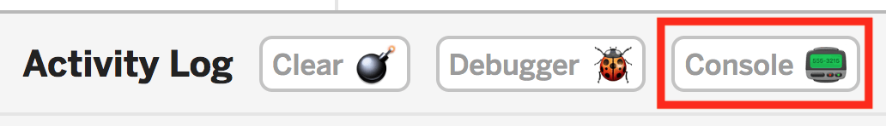
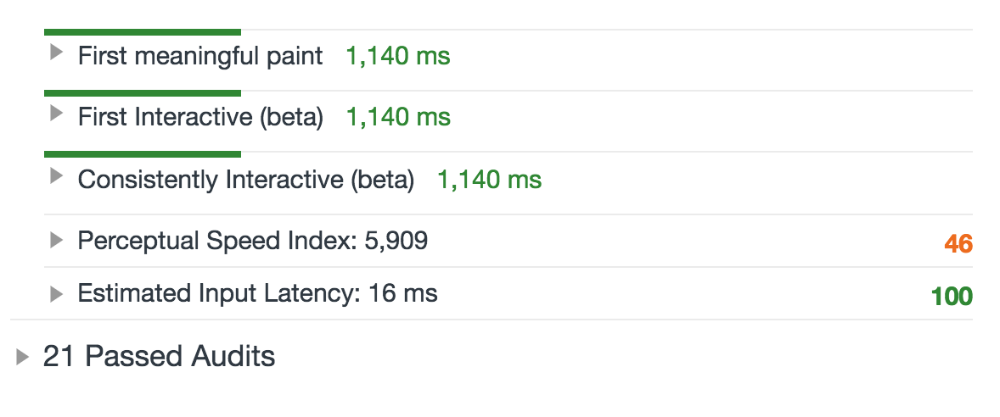

In this codelab, improve performance by replacing an animated GIF with a
video.

## Measure first

First measure how the website performs:

1. Click on the Show Live button to boot up the app.

1. Open Chrome DevTools.
1. Click on the **Audits** panel.
1. Select the **Performance** checkbox.
1. Click **Run Audits** to generate a report.

When you're finished, you should see that Lighthouse has flagged our GIF as an
issue.

## Get FFmpeg

There are a number of ways you can convert GIFs to video; this guide uses
**[FFmpeg](https://www.ffmpeg.org/)**. It's already setup on our Glitch VM, and,
if you want, you can follow
**[these instructions to install it on your local machine](https://developers.google.com/web/fundamentals/performance/optimizing-content-efficiency/replace-animated-gifs-with-video/#converting_animated_gifs_to_video)**
as well

---

## Open the console

In the codelab editor, click on the Logs button. Inside the Logs panel, click
on the console button:

First, you'll need to verify that FFmpeg is installed. In the console, run:

    $ which ffmpeg

You should get a file path back:

    /usr/bin/ffmpeg

## Change GIF to video

In the console, run `cd images` to enter the images directory. Then run `ls` to
see the contents.

You should see something like this:

    $ ls
    cat-herd.gif

Run `ffmpeg -i cat-herd.gif cat-herd.mp4`.  

This tells FFmpeg to take the **input**, signified by the `-i` flag, of our
cat-herd.gif and convert it to a video called cat-herd.mp4. This should take a
second to run. Lots of text and numbers will fly by the screen. When the command
finishes, you should be able to type `ls` again and see two files:

    $ ls  
    cat-herd.gif  cat-herd.mp4

## Create WebM videos

While MP4 has been around since 1999, WebM is a relative newcomer having been
initially released in 2010. WebM videos can be much smaller than MP4 videos, so
it makes sense to generate both. Thankfully the <video> element will let you add
multiple sources, so if a browser doesn't support WebM, it can fallback to
MP4.

In the terminal, run `ffmpeg -i cat-herd.gif -c vp9 -b:v 0 -crf 41
cat-herd.webm`.

Run `ls -lh` to check your file sizes.

You should have one GIF, and two videos:

    $ ls -lh
    total 4.5M
    -rw-r--r-- 1 app app 3.7M May 26 00:02 cat-herd.gif  
    -rw-r--r-- 1 app app 551K May 31 17:45 cat-herd.mp4  
    -rw-r--r-- 1 app app 341K May 31 17:44 cat-herd.webm

Notice that the original GIF is 3.7M, whereas the MP4 version is 551K, and the
WebM version is only 341K. That's a huge savings!

## Update HTML to recreate GIF effect

Animated GIFs have three key traits that our video needs to replicate:

+  They play automatically.
+  They loop continuously (usually, but it is possible to prevent looping).
+  They're silent.

Luckily, you can recreate these behaviors using the `<video>` element.

+  Switch from the console back to your source files.
+  In the index.html file, delete the line with the 
+  Add a new line with <video autoplay loop muted playsinline></video>

A `<video>` element using these attributes will play automatically, loop
endlessly, play no audio, and play inline (i.e., not fullscreen), all the
behaviors expected of animated GIFs! 🎉

## Specify your sources

All that's left to do is specify your video sources. The `<video>` element requires
one or more `<source>` child elements pointing to different video files the
browser can choose from, depending on format support.  
Update the `<video>` with `<source>` elements that link to your cat-herd videos:  

    <video autoplay loop muted playsinline>  
      <source src="/images/cat-herd.webm" type="video/webm">  
      <source src="/images/cat-herd.mp4" type="video/mp4">  
    </video>

**Note**: Browsers don't speculate about which `<source>` is optimal, so the order
of `<source>`s matters. For example, if you specify an MP4 video first and the
browser supports WebM, browsers will skip the WebM `<source>` and use the MPEG-4
instead. If you prefer a WebM `<source>` be used first, specify it first!

## Do it live

+  Click on the Show Live button.

The experience should look the same. So far so good.  

Now let's go ask Lighthouse if we've met our performance goal.  

## Lighthouse. Give me the good news.

With the live site open:
+  Open Chrome DevTools.
+  Click on the **Audits** tab.
+  Check the Performance checkbox and run Lighthouse.

You should see that all audits are now passing! Woohoo! 💪

