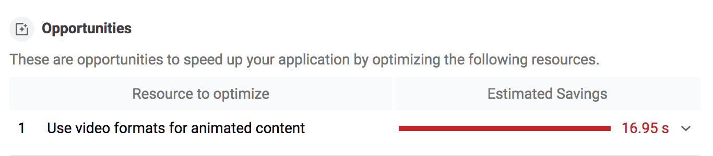

# Replace animated GIFs with video for faster page loads

Have you ever seen an animated GIF on a service like Imgur or Gfycat, inspected
it in your dev tools, only to find out that GIF was really a video? There's a
good reason for that. Animated GIFs can be downright _huge_.


Thankfully, this is one of those areas of loading performance where you can do
relatively little work to realize huge gains! **By converting large GIFs to
videos, you can save big on users' bandwidth**.

## Measure first

Use Lighthouse to check your site for GIFs that can be converted to videos. In
DevTools, click on the Audits tab and check the Performance checkbox. Then run
Lighthouse and check the report.   
If you have any GIFs that can be converted, you should see a suggestion to "Use
video formats for animated content":



## Create MPEG videos

There are a number of ways to convert GIFs to video,
**[FFmpeg](https://www.ffmpeg.org/)** is the tool used in this guide.   
To use FFmpeg to convert the GIF, `my-animation.gif` to an MP4 video, run the
following command in your console:  
```  
ffmpeg -i my-animation.gif my-animation.mp4  
```  
This tells FFmpeg to take `my-animation.gif` as the **input**, signified by the
`-i` flag, and to convert it to a video called `my-animation.mp4`.

## Create WebM videos

While MP4 has been around since 1999, WebM is a relatively new file format
initially released in 2010. WebM videos are much smaller than MP4 videos, but
not all browsers support WebM so it makes sense to generate both. 

To use FFmpeg to convert `my-animation.gif` to a WebM video, run the following
command in your console:  

```  
ffmpeg -i my-animation.gif -c vp9 -b:v 0 -crf 41 my-animation.webm  
```

## Compare the difference

The cost savings between a GIF and a video can be pretty significant.


In this example, the initial GIF is 3.7 MB, compared to the MP4 version, which
is 551 KB, and the WebM version, which is only 341 KB!

## Replace the GIF img with a video

Animated GIFs have three key traits that a video needs to replicate:

+  They play automatically.
+  They loop continuously (usually, but it is possible to prevent looping).
+  They're silent.

Luckily, you can recreate these behaviors using the `<video>` element.  
```  
<video autoplay loop muted playsinline></video>  
```  
A `<video>` element with these attributes plays automatically, loops endlessly,
plays no audio, and plays inline (i.e., not full screen), all the hallmark
behaviors expected of animated GIFs! 🎉  

Finally, the `<video>` element requires one or more `<source>` child elements
pointing to different video files that the browser can choose from, depending on
the browser's format support. Provide both WebM and MP4, so that if a browser
doesn't support WebM, it can fall back to MP4.  
```  
<video autoplay loop muted playsinline>  
  <source src="my-animation.webm" type="video/webm">  
  <source src="my-animation.mp4" type="video/mp4">  
</video>  
```  
**⚠ Note**: Browsers don't speculate about which `<source>` is optimal, so the
order of `<source>`s matters. For example, if you specify an MP4 video first and
the browser supports MP4 as well as WebM, browsers will skip the WebM `<source>`
and use the MP4 instead. If you prefer a WebM `<source>` be the default, specify
it first!

## 📚 References and materials

+  [ffmpeg.org](https://www.ffmpeg.org/)
+  [ffmpeg installation instructions](https://developers.google.com/web/fundamentals/performance/optimizing-content-efficiency/replace-animated-gifs-with-video/#converting_animated_gifs_to_video)
