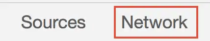
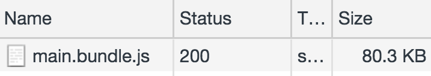
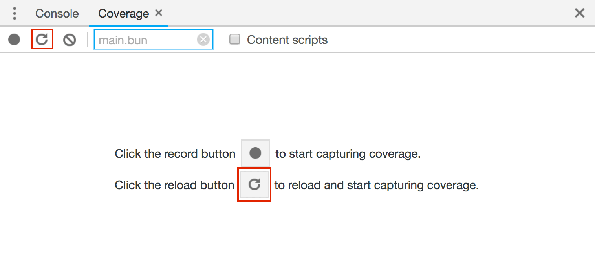
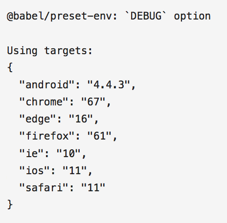
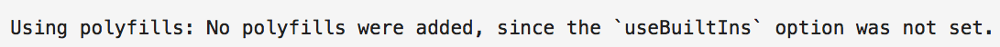
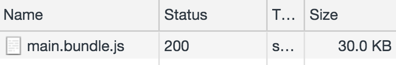
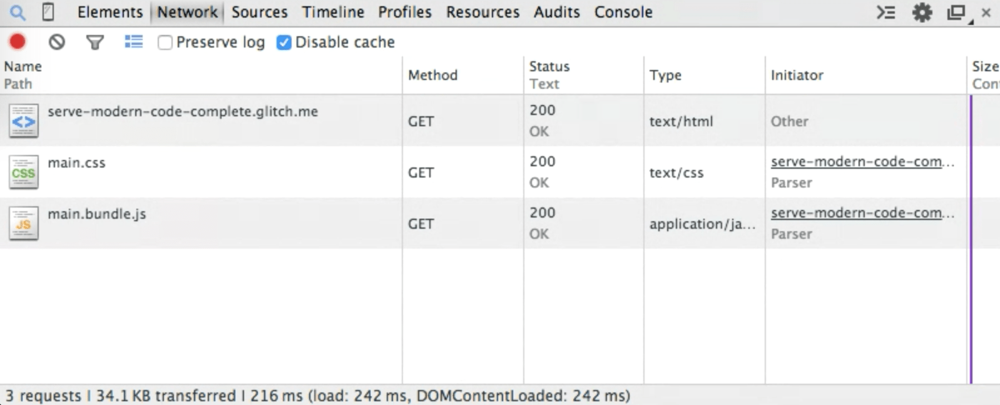

In this codelab, improve the performance of this simple application that allows
users to rate random cats. Learn how to optimize the JavaScript bundle by
minizming how much code is transpiled.


You only have the option to select a word or emoji to convey how much you like
each cat. With any button that you click, the value is displayed underneath the
image.

## Measure

<div class="aside note">
 Since webpack is used in this application, any changes made to the code will trigger a new build which can take a few seconds. Once it completes, you should see your changes reflected in the application.
</div>

It's always a good idea to begin by inspecting a website before adding any
optimizations.

+ Click on the Show Live button to boot up the app.

<web-screenshot type="show-live"></web-screenshot>

+ Open DevTools by pressing `CTRL + SHIFT + i` / `CMD + OPTION + i`.
+ Click on the **Network** panel.



+ Make sure Disable Cache is checked and reload the app.



Over 80 KB is used for this application! Time to find out if parts of the bundle
aren't being used.

+ With DevTools open, press `CMD + SHIFT + p` / `CTRL + SHIFT + p` to open
the Command Menu. Search for "coverage".


+ Click "Show Coverage" and click the "Reload" button to reload the
application while capturing coverage.



+ Take a look at how much code was used versus how much was loaded for
the main bundle.


Over half the bundle (44 KB) is not even utilized. This is because a lot of the
code within consists of polyfills to ensure that the application works in older
browsers.

## Use @babel/preset-env

The syntax of the JavaScript language conforms to a standard known as
ECMAScript, or [ECMA-262](https://github.com/tc39/ecma262). Newer versions of
the specification are released every year and include new features that have
passed the proposal process. Each major browser is always at a different stage
of supporting these features.

The following ES2015 features are used in the application:

+  [Arrow functions](https://developer.mozilla.org/en-US/docs/Web/JavaScript/Reference/Functions/Arrow_functions)
+  [Template literals](https://developer.mozilla.org/en-US/docs/Web/JavaScript/Reference/Template_literals)
+  [For...of loop](https://developer.mozilla.org/en-US/docs/Web/JavaScript/Reference/Statements/for...of)
+  [Destructuring assignment](https://developer.mozilla.org/en-US/docs/Web/JavaScript/Reference/Operators/Destructuring_assignment#Object_destructuring)

The following ES2017 feature is used as well:

+  [Async functions](https://developer.mozilla.org/en-US/docs/Web/JavaScript/Reference/Statements/async_function)

Feel free to dive into the source code in `src/index.js` to see how all of this
is used.

All of these features are supported in the latest version of Chrome, but what
about other browsers that don't support them? [Babel](https://babeljs.io/docs/en),
which is included in the application, is the most popular library used to compile
code that contains newer syntax into code that older browsers and environments can
understand. It does this in two ways:

+ **Polyfills** are included to emulate newer ES2015+ functions so that their APIs
can be used even if it is not supported by the browser. Here is an example of a
[polyfill](https://developer.mozilla.org/en-US/docs/Web/JavaScript/Reference/Global_Objects/Array/includes#Polyfill)
of the `Array.includes` method.
+ **Plugins** are used to transform ES2015 code (or later) into older ES5 syntax.
Since these are syntax related changes (such as arrow functions), they cannot be emulated with polyfills.

Look at `package.json` to see which Babel libraries are included:

```
"dependencies": {
  "@babel/polyfill": "^7.0.0"
},
"devDependencies": {
  //...
  "babel-loader": "^8.0.2",
  "@babel/core": "^7.1.0",
  "@babel/preset-env": "^7.1.0",
  //...
}
```

+ `@babel/core` is the core Babel compiler. With this, all the Babel configurations are defined in a `.babelrc` at the root of the project.
+ `babel-loader` includes Babel in the webpack build process.

Now look at `webpack.config.js` to see how `babel-loader` is included as a
rule:

<pre class="prettyprint">
module: {
  rules: [
    //...
    <strong>{
      test: /\.js$/,
      exclude: /node_modules/,
      loader: "babel-loader"
    }</strong>
  ]
},
</pre>

+ `@babel/polyfill` provides all the necessary polyfills for any newer ECMAScript features so that they can
work in environments that do not support them. It is already imported at the very top of `src/index.js.`

<pre class="prettyprint">
import "./style.css";
<strong>import "@babel/polyfill";</strong>
</pre>

+ `@babel/preset-env` identifies which transforms and polyfills are necessary for any browsers or environments chosen as targets.

Take a look at the Babel configurations file, `.babelrc`, to see how it's included:

```
{
  "presets": [
    [
      "@babel/preset-env",
      {
        "targets": "last 2 versions"
      }
    ]
  ]
}
```

This is a Babel and webpack setup. [Learn how to include Babel in your application](https://babeljs.io/en/setup)
if you happen to use a different module bundler than webpack.

The `targets` attribute
in `.babelrc` identifies which browsers are being targeted. `@babel/preset-env`
integrates with browserslist, which means you can find a full list of compatible
queries that can be used in this field in the
[browserlist documentation](https://github.com/browserslist/browserslist#full-list).

The `"last 2 versions"` value transpiles the code in the application for the
[last two versions](http://browserl.ist/?q=last+2+versions) of every browser.

### Debugging

To get a complete look at all the browsers Babel targets as well as all the
transforms and polyfills that are included, add a `debug` field to `.babelrc:`

<pre class="prettyprint">
{
  "presets": [
    [
      "@babel/preset-env",
      {
        "targets": "last 2 versions",
        <strong>"debug": true</strong>
      }
    ]
  ]
}
</pre>

Click the "Status" button.

<web-screenshot type="status"></web-screenshot>

Reload the application and take a look at the Glitch status logs at the bottom
of the editor.

### Targeted browsers

Babel logs a number of details to the console about the compilation process,
including all the target environments that the code has been compiled for.



Notice how discontinued browsers, such as Internet Explorer, are included in
this list. This is a problem because unsupported browsers won't have newer
features added, and Babel continues to transpile specific syntax for them. This
unnecessarily increases the size of your bundle if users are not using this
browser to access your site.

Babel also logs a list of transform plugins used:


That's a pretty long list! These are all the plugins that Babel needs to use to
transform any ES2015+ syntax to older syntax for all the targeted browsers.

However, Babel doesn't show any specific polyfills that are used:



This is because the entire `@babel/polyfill` is being imported directly.

### Load polyfills individually

By default, Babel includes every polyfill needed for a complete ES2015+ environment when
`@babel/polyfill` is imported into a file. To import specific polyfills needed for
the target browsers, add a `useBuiltIns: 'entry'` to the configuration.

<pre class="prettyprint">
{
  "presets": [
    [
      "@babel/preset-env",
      {
        "targets": "last 2 versions",
        "debug": true
        <strong>"useBuiltIns": "entry"</strong>
      }
    ]
  ]
}
</pre>

Reload the application. You can now see all the specific polyfills included:


Although only needed polyfills for `"last 2 versions"` is now included, it is still a super long list! This is because
polyfills needed for the target browsers for _every_ newer feature is still included. Change the value of the attribute to `usage`
to only include those needed for features that are being used in the code.

<pre class="prettyprint">
{
  "presets": [
    [
      "@babel/preset-env",
      {
        "targets": "last 2 versions",
        "debug": true,
        <s>"useBuiltIns": "entry"</s>
        <strong>"useBuiltIns": "usage"</strong>
      }
    ]
  ]
}
</pre>

With this, polyfills are automatically included where needed.
This means you can remove the `@babel/polyfill` import in `src/index.js.`

<pre class="prettyprint">
import "./style.css";
<s>import "@babel/polyfill";</s>
</pre>

Now only the required polyfills needed for the application are included.


The application bundle size is reduced significantly.


## Narrowing the list of supported browsers

The number of browser targets included is still quite large, and not many users
use discontinued browsers such as Internet Explorer. Update the configurations
to the following:

<pre class="prettyprint">
{
  "presets": [
    [
      "@babel/preset-env",
      {
        <s>"targets": "last 2 versions",</s>
        <strong>"targets": [">0.25%", "not ie 11"],</strong>
        "debug": true,
        "useBuiltIns": "usage",
      }
    ]
  ]
}
</pre>

Take a look at the details for the fetched bundle.



Since the application is so small, there really isn't much of a difference with
these changes. However, using a browser market share percentage (such as
`">0.25%"`) along with excluding specific browsers that you are confident your
users are not using is the recommended approach. Take a look at the
["Last 2 versions" considered harmful](https://jamie.build/last-2-versions)
article by James Kyle to learn more about this.

## Use &lt;script type=&quot;module&quot;&gt;

There is still more room for improvement. Although a number of unused polyfills
have been removed, there are many that are being shipped that are not needed for
some browsers. By using modules, newer syntax can be written and shipped to
browsers directly without the use of any unnecessary polyfills.

**JavaScript modules** are a relatively new feature supported in [all major browsers](https://caniuse.com/#feat=es6-module).
Modules can be created using a `type="module"` attribute to define scripts that import and export from other
modules. For example:

```
// math.mjs
export const add = (x, y) => x + y;

<!-- index.html -->
<script type="module">
  import { add } from './math.mjs';

  add(5, 2); // 7
</script>
```

Many newer ECMAScript features are already supported in environments that
support JavaScript modules (instead of needing Babel.) This means that the Babel
config can be modified to send two different versions of your application to the
browser:

+ A version that would work in newer browsers that support modules and that includes a module that is largely untranspiled but has a smaller file size
+ A version that includes a larger, transpiled script that would work in any legacy browser

## Using ES Modules with Babel

In order to have separate `@babel/preset-env` settings for the two versions of
the application, remove the `.babelrc` file. Babel settings can be added to the
webpack configuration by specifying two different compilation formats for each
version of the application.

Begin by adding a configuration for the legacy script to `webpack.config.js`:

```
const legacyConfig = {
  entry,
  output: {
    path: path.resolve(__dirname, "public"),
    filename: "[name].bundle.js"
  },
  module: {
    rules: [
      {
        test: /\.js$/,
        exclude: /node_modules/,
        loader: "babel-loader",
        options: {
          presets: [
            ["@babel/preset-env", {
              useBuiltIns: "usage",
              targets: {
                esmodules: false
              }
            }]
          ]
        }
      },
      cssRule
    ]
  },
  plugins
}
```

Notice that instead of using the `targets` value for `"@babel/preset-env"`,
`esmodules` with a value of `false` is used instead. This means that Babel
includes all the necessary transforms and polyfills to target every browser that does
not yet support ES modules.

Add `entry`, `cssRule`, and `corePlugins` objects to the beginning of the
`webpack.config.js` file. These are all shared between both the module and
legacy scripts served to the browser.

```
const entry = {
  main: "./src"
};

const cssRule = {
  test: /\.css$/,
  use: ExtractTextPlugin.extract({
    fallback: "style-loader",
    use: "css-loader"
  })
};

const plugins = [
  new ExtractTextPlugin({filename: "[name].css", allChunks: true}),
  new HtmlWebpackPlugin({template: "./src/index.html"})
];
```

Now similarly, create a config object for the module script below where `legacyConfig` is defined:

```
const moduleConfig = {
  entry,
  output: {
    path: path.resolve(__dirname, "public"),
    filename: "[name].mjs"
  },
  module: {
    rules: [
      {
        test: /\.js$/,
        exclude: /node_modules/,
        loader: "babel-loader",
        options: {
          presets: [
            ["@babel/preset-env", {
              useBuiltIns: "usage",
              targets: {
                esmodules: true
              }
            }]
          ]
        }
      },
      cssRule
    ]
  },
  plugins
}
```

The main difference here is that a `.mjs` file extension is used for the output
filename. The `esmodules` value is set to true here which means that the code
that is outputted into this module is a smaller, less compiled script that does
not go through any transformation in this example since all the features used
are already supported in browsers that support modules.

At the very end of the file, export both configurations in a single array.

```
module.exports = [
  legacyConfig, moduleConfig
];
```

Now this builds both a smaller module for browsers that support it and a larger
transpiled script for older browsers.

Browsers that support modules ignore scripts with a `nomodule` attribute.
Conversely, browsers that do not support modules ignore script elements with
`type="module"`. This means you can include a module as well as a compiled
fallback. Ideally, the two versions of the application should be in `index.html`
like this:

```
<script type="module" src="main.mjs"></script>
<script nomodule src="main.bundle.js"></script>
```

Browsers that support modules fetch and execute `main.mjs` and ignore
`compiled.js.` The browsers that do not support modules do the opposite.

The last thing that needs to be done here is to add the `module` and `nomodule`
attributes to the module and legacy script respectively, Import the
[ScriptExtHtmlWebpackPlugin](https://github.com/numical/script-ext-html-webpack-plugin)
at the very top of `webpack.config.js`:

<pre class="prettyprint">
const path = require("path");

const webpack = require("webpack");
const HtmlWebpackPlugin = require("html-webpack-plugin");
<strong>const ScriptExtHtmlWebpackPlugin = require("script-ext-html-webpack-plugin");</strong>
</pre>

Now update the `plugins` array in the configurations to include this plugin:

<pre class="prettyprint">
const plugins = [
  new ExtractTextPlugin({filename: "[name].css", allChunks: true}),
  new HtmlWebpackPlugin({template: "./src/index.html"}),
  new ScriptExtHtmlWebpackPlugin({
    <strong>module: /\.mjs$/,
    custom: [
      {
        test: /\.js$/,
        attribute: 'nomodule',
        value: ''
    },
    ]</strong>
  })
];
</pre>

These plugin settings add a `type="module"` attribute for all `.mjs` script
elements as well as a `type="nomodule"` attribute for all `.js` script modules.

<div class="aside note">
  If you're having trouble understanding how to add all of these configurations to <code>webpack.config.js</code>, take a look at the <a href="https://glitch.com/edit/#!/serve-modern-code-complete?path=webpack.config.js:1:0">complete version of the file</a>.
</div>

## Serving modules in the HTML document

The last thing that needs to be done is to output both the legacy and modern script elements to the HTML file. Unfortunately, the plugin that creates the final HTML file, `HTMLWebpackPlugin`, [does not currently support](https://github.com/jantimon/html-webpack-plugin/issues/782) the output of both the module and nomodule scripts. Although there are workarounds and separate plugins created to solve this problem, such as [BabelMultiTargetPlugin](https://github.com/DanielSchaffer/webpack-babel-multi-target-plugin) and [HTMLWebpackMultiBuildPlugin](https://github.com/firsttris/html-webpack-multi-build-plugin), a simpler approach of adding the module script element manually is used for the purpose of this tutorial.

Add the following to `src/index.js` at the end of the file:

<pre class="prettyprint">
    ...
    &lt;/form&gt;
    <strong>&lt;script type=&quot;module&quot; src=&quot;main.mjs&quot;&gt;&lt;/script&gt;</strong>
  &lt;/body&gt;
&lt;/html&gt;
</pre>

Now load the application in a browser that supports modules, such as the latest
version of Chrome.


Only the module is fetched, with a much smaller bundle size due to it being
largely untranspiled! The other script element is completely ignored by the
browser.

If you load the application on an older browser, only the larger, transpiled
script with all the needed polyfills and transforms are be fetched. Here is a
screenshot for all the requests made on an older version of Chrome (version
38).



## Conclusion

You now understand how to use `@babel/preset-env` to provide only the necessary
polyfills required for targeted browsers. You also know how JavaScript modules
can improve performance further by shipping two different transpiled versions of an
application. With a decent understanding of how both these techniques can cut
your bundle size down significantly, go forth and optimize!
