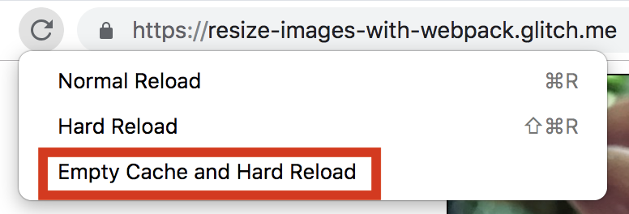

<div class="aside note">
The
<a href="https://github.com/herrstucki/responsive-loader">responsive-loader</a> plugin is a
good choice for projects that import images using JavaScript. For projects that
do not import images into JavaScript files, using a Node script to resize images
is probably more convenient.
</div>

## Configure webpack.config.js

- View `webpack.config.js` for an example of how to configure
`responsive-loader`.

In this demo, the [sharp](http://sharp.dimens.io/en/stable/) image processing
library resizes JPEG and PNG images to five default sizes: 480, 720, 1080, 1440,
and 1920 pixels wide. (Note: Specifying default sizes is optional.)

- View the `dist` directory to see the multiple image versions created by
`responsive-loader`.

## Update image tags

`responsive-loader` sets the `src` and `srcset` properties on image imports (see
`app.js`):

```javascript
const flowerImage = require('./flower.jpg');
// flowerImage.src ==> "63f6dd53b67be54696fabc5192aa1520-480.jpg"
// flowerImage.srcSet ==> "63f6...8a135486-1920.jpg 1920w"
```

- Use images created by `responsive-loader` by updating the `src` and `srcset`
attributes on image tags to the values set by `responsive-loader`:

```javascript
const flowerImage = require('./flower.jpg');
ReactDOM.render(, ...);
```

<div class="aside note">
Don't forget to include the
<a href="https://developer.mozilla.org/en-US/docs/Web/HTML/Element/img#attr-sizes"><code>sizes</code></a>
attribute in the HTML of any responsive image. `responsive-loader` will not set
this attribute for you.
</div>

## View the Final Result

### Code

- Click the **Show Live** button to preview the app.

<web-screenshot type="show-live"></web-screenshot>

Notice that `responsive-loader` has done the heavy lifting for you and generated
the contents of the `src` and `srcset` attributes. This is particularly handy
when supporting many images sizes.

<table>
<tbody>
<tr>
<td><strong>Initial Code</strong></td>
<td>
<code>&lt;img src={flowerImage.src} srcset={flowerImage.srcSet} sizes="50vw"/&gt;</code>
</td>
</tr>
<tr>
<td><strong>Final Code</strong></td>
<td>
<code>&lt;img src="63f6dd53b67be54696fabc5192aa1520-480.jpg" srcset="63f6dd53b67be54696fabc5192aa1520-480.jpg 480w,0e6cca2660ff3c6df90db07b68cb97aa-720.jpg 720w,b0b8f6c340a98d96a2a414a70d2c73fe-1080.jpg 1080w,5596f85fbfb994ccf46eab8ee9a12779-1440.jpg 1440w,17bb43ce70871ce91e64c6908a135486-1920.jpg 1920w" sizes="50vw"&gt;</code>
</td>
</tr>
</tbody>
</table>

### Responsive images

- Reload this demo using different browser sizes. Notice how different image
sizes are loaded depending on the width of the browser.

Note:

+  If the cache is not cleared between page loads, the browser tries to
    use the image version that is already in the cache. If you are using
    Chrome, open DevTools, click the "refresh page" button and Chrome displays
    the option to "Empty Cache and Hard Reload."



+  The
    [`window.devicePixelRatio`](https://developer.mozilla.org/en-US/docs/Web/API/Window/devicePixelRatio)
    of the device that you're using (or emulating) affects which image sizes
    are loaded. To learn how `devicePixelRatio` works, read [Responsive Images: Density Descriptors](/fast/serve-responsive-images/codelab-density-descriptors).

# Extra Credit

+  Check out `responsive-loader`'s
    [options](https://github.com/herrstucki/responsive-loader#options)
+  View other ways to
    [use](https://github.com/herrstucki/responsive-loader#usage) responsive-loader
