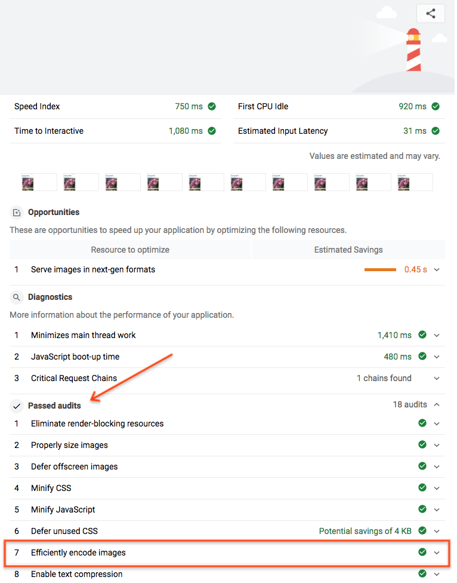

This workbook will show you how to add Imagemin to an existing Gulp project.

## Install the Imagemin Gulp plugin

`gulp` and `gulp-cli` have already been installed for you, but you'll need to install the `gulp-imagemin` plugin.

- Click the **Remix This** button.
/edit_button.png

<web-screenshot type="remix"></web-screenshot>

- Click the **Status** button.

<web-screenshot type="status"></web-screenshot>

- Then click the "Console" button.


- Type the following command:

<pre class="devsite-terminal devsite-click-to-copy">
npm install --save-dev gulp-imagemin
</pre>

## Setup `gulpfile.js`

You don't need to create a `gulpfile.js` file because this project already has one.

- First, initialize the `gulp-imagemin` plugin that was just installed by adding this code at the top of `gulpfile.js`:

```javascript
const imagemin = require('gulp-imagemin');
```

- Next, replace the `//Add tasks here` comment in `gulpfile.js` with this code block:

```javascript
gulp.src('images/*')
    .pipe(imagemin())
    .pipe(gulp.dest('images/'))
```

This code adds a Gulp task that uses Imagemin to compress the images in the `images/` directory. The original images are overwritten and saved in the same `images/` directory.

### ✔︎ Check-in

Your `gulpfile.js` file should now look like this:

```javascript
const imagemin = require('gulp-imagemin');
const gulp = require('gulp');

gulp.task('default', () => {
    gulp.src('images/*')
        .pipe(imagemin())
        .pipe(gulp.dest('images/'))
});
```

This `gulpfile.js` can now be used to compress images.

## Run Gulp

- Run Gulp to compress the images:

<pre class="devsite-terminal devsite-click-to-copy">
gulp
</pre>

When Gulp finishes there should be a message like this in the terminal:

```shell
gulp-imagemin: Minified 6 images (saved 64 kB - 6.4%)
```

A 6% improvement in file size is a good start - however, this can be significantly improved by using different compression settings. Next you'll customize Imagemin's configuration to yield bigger file size savings.

## Customize Imagemin's configuration

In this example, Imagemin's configuration will be customized to use the `imagemin-pngquant` plugin to compress PNGs. This plugin allows you to specify a compression quality level.

- Install the plugin using npm:

<pre class="devsite-terminal devsite-click-to-copy">
npm install --save-dev imagemin-pngquant
</pre>

- Declare the `imagemin-pngquant` plugin by adding this line at the top of `gulpfile.js`:

```javascript
const pngquant = require('imagemin-pngquant');
```

- Add the `imagemin-pngquant` plugin (and its settings) by passing the following array to `ImageminPlugin()`:

```javascript
[pngquant({quality: '50'})]
```

This code tells Imagemin to compress PNGs to a quality of `50` (`0` is the worst; `100` is the best) using the Pngquant plugin.

### ✔︎ Check-in

Your `gulpfile.js` should now look like this:

```javascript
const pngquant = require('imagemin-pngquant');
const imagemin = require('gulp-imagemin');
const gulp = require('gulp');

gulp.task('default', () => {
  gulp.src('images/*')
    .pipe(imagemin([
      pngquant({quality: '50'})
    ]))
    .pipe(gulp.dest('images/'))
});
```

But what about JPEGs? This project also has JPEG images, so we should specify how they are compressed as well.

## Customize Imagemin configuration (continued)

This example will use the `imagemin-mozjpeg` plugin to compress JPEG images.

- Install the plugin using npm.
<pre class="devsite-terminal devsite-click-to-copy">
npm install --save-dev imagemin-mozjpeg
</pre>

- Declare the `imagemin-mozjpeg` plugin by putting this line at the top your `gulpfile.js`.

```javascript
const mozjpeg = require('imagemin-mozjpeg');
```

- Next, add `mozjpeg({quality: '50'})` to the array that is passed to `ImageminPlugin()`. That array should now look like this:

```javascript
[
  pngquant({quality: '50'}),
  mozjpeg({quality: '50'})
]
```

### ✔︎ Check-in

Your `gulpfile.js` file should now look like this:

```javascript
const mozjpeg = require('imagemin-mozjpeg')
const pngquant = require('imagemin-pngquant');
const imagemin = require('gulp-imagemin');
const gulp = require('gulp');

gulp.task('default', () => {
  gulp.src('images/*')
    .pipe(imagemin([
      pngquant({quality: '50'}),
      mozjpeg({quality: '50'})
    ]))
    .pipe(gulp.dest('images/'))
});
```

## Re-run Gulp

- Re-run Gulp:

<pre class="devsite-terminal devsite-click-to-copy">
$ gulp
</pre>

When Gulp completes you should see a message like this in terminal:

```shell
gulp-imagemin: Minified 6 images (saved 651 kB - 69.2%)
```

Hooray! These results are much better.

## Verify results using Lighthouse

Lastly, it's a good idea to use Lighthouse to verify the changes that you just made. Lighthouse's "Efficiently encode images" performance audit will let you know if the JPEG images on your page are optimally compressed.

- Click the **Show Live** button

<web-screenshot type="show-live"></web-screenshot>

- Run the Lighthouse performance audit (Lighthouse > Options > Performance) on the live version of your Glitch and verify that the "Efficiently encode images" audit was passed.



Success! You have used Imagemin to optimally compress the images on your page.
