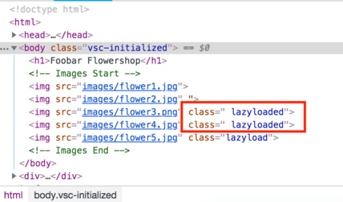
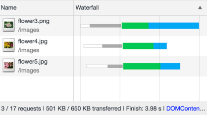
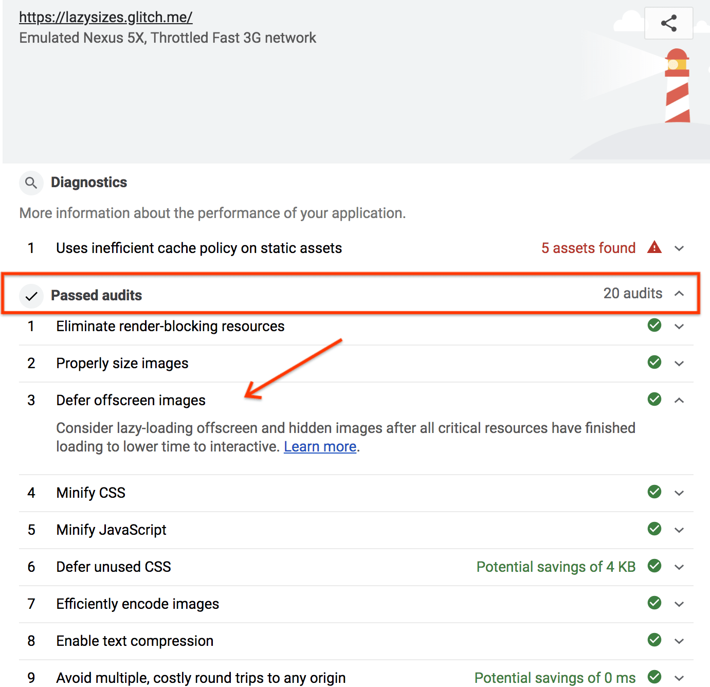

Lazy loading is the approach of waiting to load resources until they are needed,
rather than loading them in advance. This can improve performance by reducing
the amount of resources that need to be loaded and parsed on initial page load.

Images that are offscreen during the initial pageload are ideal candidates for
this technique. Best of all, [lazysizes](https://github.com/aFarkas/lazysizes)
makes this a very simple strategy to implement.

---

## Add the lazysizes script to the page

- Click the **Remix This** button to make the project editable.

<web-screenshot type="remix"></web-screenshot>

`lazysizes.min.js` has already been downloaded and added to this Glitch. To
include it in the page:

- Add the following `<script>` tag to `index.html`:

<pre class="prettyprint devsite-disable-click-to-copy">
  <strong>&lt;script src=&quot;lazysizes.min.js&quot; async&gt;&lt;/script&gt;</strong>
  &lt;!-- Images End --&gt;
&lt;/body&gt;
</pre>

The
[lazysizes.min.js](https://raw.githubusercontent.com/aFarkas/lazysizes/gh-pages/lazysizes.min.js)
file has already been added to this project, so there is no need to add it
separately. The script you just added can use this script.

lazysizes will intelligently load images as the user scrolls through the page
and prioritize the images that the user is going to encounter soon.

## Indicate the images to lazy load

- Add the class `lazyload` to images that should be lazy loaded. In addition,
  change the `src` attribute to `data-src`.

For example, the changes for `flower3.png` would look like this:

<pre class="prettyprint devsite-disable-click-to-copy">
<s>&lt;img src=&quot;images/flower3.png&quot;&gt;</s>
<strong>&lt;img data-src=&quot;images/flower3.png&quot; class=&quot;lazyload&quot;&gt;</strong>
</pre>

For this example, try lazy loading `flower3.png`, `flower4.jpg`, and
`flower5.jpg`.

You may be wondering why it is necessary to change the <code>src</code>
attribute to <code>data-src</code>.

If this attribute is not changed, all the images will load immediately instead
of being lazy-loaded. <code>data-src</code> is not an attribute that the browser
recognizes, so when it encounters an image tag with this attribute, it doesn't
load the image. In this case, that is a good thing, because it then allows the
lazysizes script to decide when the image should be loaded, rather than the
browser.

## See it in action

That's it! To see these changes in action, follow these steps:

- Click on the **Show Live** button to view the live version of the Glitch.

<web-screenshot type="show-live"></web-screenshot>

- Open the console and find the images that were just added. Their classes
  should change from `lazyload` to `lazyloaded` as you scroll down the page.

- Watch the network panel to see the image files load individually as you scroll
  down the page.

## Verify using Lighthouse

Lastly, it's a good idea to use Lighthouse to verify these changes. Lighthouse's
"Defer offscreen images" performance audit will indicate if you've forgotten to
add lazy loading to any offscreen images.

- Click on the **Show Live** button to view the live version of the your Glitch.

<web-screenshot type="show-live"></web-screenshot>

- Run the Lighthouse performance audit (Lighthouse > Options > Performance) on
  the live version of your Glitch and verify that the "Defer offscreen images"
  audit was passed.

Success! You have used lazysizes to lazy load the images on your page.
