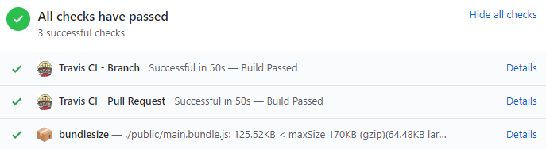

# Using bundlesize with Travis CI

Using [bundlesize](https://github.com/siddharthkp/bundlesize) with [Travis
CI](https://travis-ci.com/) lets you define performance budgets with minimal
setup and enforce them as part of your development workflow. Travis CI is a
service that runs tests for your app in the cloud every time you push code to
GitHub. You can [configure your
repository](https://help.github.com/articles/about-required-status-checks/) so
that it won’t allow merging pull-requests unless the bundlesize tests have
passed.

You can also use bundlesize with <a href="https://circleci.com/">Circle CI</a>,
<a href="https://app.wercker.com">Wrecker</a> and
<a href="https://readme.drone.io/">Drone</a>.

To see it in action, here’s an app bundled with
[webpack](https://webpack.js.org/) that lets you [vote for your favorite
kitty](https://glitch.com/edit/#!/scarce-pixie). 

## Set the performance budget

This [Glitch](https://glitch.com/edit/#!/scarce-pixie) already contains
bundlesize. To start, click the Remix to Edit button to make the project
editable.

The main bundle of this app is in the public folder. To test its size, add the
following section to the `package.json` file:

<pre class="prettyprint">
"bundlesize": [
  {
    "path": "./public/*.bundle.js",
    "maxSize": "170 kB"
  }
]
</pre>  

You can also set
<a href="https://github.com/siddharthkp/bundlesize#1-add-the-path-and-maxsize-in-your-packagejson">different thresholds for different files</a>.
This is especially useful if you are
<a href="https://web.dev/fast/reduce-javascript-payloads-with-code-splitting">code-splitting</a>
a bundle in your application.

To keep the compressed JavaScript bundle size [under the recommended
limit](https://web.dev/fast/your-first-performance-budget#budget-for-quantity-based-metrics),
set the performance budget to 170KB in the `maxSize` field. 

Bundlesize supports [glob patterns](https://github.com/isaacs/node-glob) and the
* wildcard character in the file path will match all bundle names in the public
folder.

By default, bundlesize tests gzipped sizes. You can use the <a href="https://github.com/siddharthkp/bundlesize#1-add-the-path-and-maxsize-in-your-packagejson">compression option</a>
to switch to <a href="https://en.wikipedia.org/wiki/Brotli">brotli</a>
compression or turn it off completely.

### Create a test script

Since Travis needs a test to run, add a test script to `package.json`:

<pre class="prettyprint">
"scripts": {
  "start": "webpack && http-server -c-1",
  "test": "bundlesize"
}
</pre>  

## Set up continuous integration

### Integrate GitHub and Travis CI

First, create a new repository for this project on your GitHub account and
initialize it with a `README.md`.

You’ll need to [register an account on
Travis](https://docs.travis-ci.com/user/tutorial) and activate GitHub Apps
integration under the Settings section of your profile.

Once you have an account, go to Settings under your profile, hit the Sync
account button, and make sure your new repo is listed on Travis.

### Authorize bundlesize to post on pull requests

Bundlesize needs authorization to be able to post on pull requests, so [visit
this link to get the bundlesize
token](https://github.com/login/oauth/authorize?scope=repo%3Astatus&client_id=6756cb03a8d6528aca5a)
that will be stored in the Travis configuration. 

In your project's Travis dashboard, go to More options > Settings > Environment
variables.

Add a new environment variable with the token as the value field and
BUNDLESIZE_GITHUB_TOKEN as the name. 

The last thing needed to kick-off continuous integration is a `.travis.yml`
file, which tells Travis CI what to do. To speed things up, it is already
included in the project and it specifies that the app is using NodeJS. 

With this step, you’re all set up and bundlesize will warn you if your
JavaScript ever goes over the budget. Even when you start off great, over time,
as you add new features, kilobytes can pile up. With automated performance
budget monitoring, you can rest easy knowing that it won’t go unnoticed. 

## Try it out

### Trigger your first bundlesize test

To see how the app stacks up against the performance budget, add the code to the
GitHub repo that you created in step 3. On Glitch, click your project name to go
to Project options > Advanced options.

In the Advanced options menu, select Export to GitHub.

In the pop-up, enter your GitHub username and the name of the repo as
"username/repo". 

Glitch will export your app to a new branch named glitch. Create a new pull
request by clicking the New pull request button on the homepage of the
repository.

You’ll now see status checks in progress on the pull request page.

It won’t take long until all checks are done. Unfortunately, the cat voting app
is a bit bloated and does not pass the performance budget check. The main bundle
is 266KB and the budget is 170KB. 

### Optimize

Luckily, there are some easy performance wins you can make by [removing unused
code](https://web.dev/fast/remove-unused-code). There are two main imports in
`src/index.js`:

<pre class="prettyprint">
import firebase from "firebase";
import * as moment from 'moment';
</pre>

The app is using [Firebase Realtime
Database](https://firebase.google.com/products/realtime-database/) to store the
data, but it’s importing the entire firebase package which consists of a lot
more than just a database (auth, storage, messaging etc.).

Fix this by importing only the package that the app needs in the `src/index.js`
file:

<pre class="prettyprint">
import firebase from "firebase";
import firebase from 'firebase/app';
import 'firebase/database';
</pre>

The <code>firebase/app</code> import, which sets up the API surface for each of
the different services, is always required.

### Re-run test

Since the source file has been updated, you need to run webpack to build the new
bundle file.

* Click the Logs button.

* Then click the Console button. 

* In Glitch console, type <pre class="devsite-terminal devsite-click-to-copy">
  webpack</pre> and wait for it to finish the build.

* Export the code to GitHub from Project options > Advanced options > Export to
  GitHub.

* Go to the pull request page on GitHub and wait for all checks to finish.

Success! The new size of the bundle is 125.5KB and all the checks have passed.
🎉

Unlike Firebase, importing parts of the moment library cannot be done as easily,
but it’s worth a shot. Check out how you can further optimize the app in the
[Remove unused code
codelab](https://web.dev/fast/remove-unused-code/codelab-remove-unused-code).  

### Monitor

The app is now under the budget and all is well. Travis CI and bundlesize will
keep monitoring the performance budget for you, making sure your app stays fast.