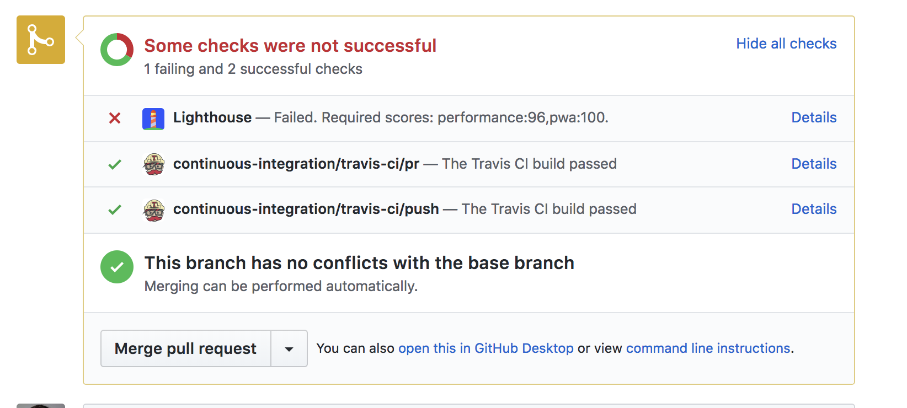
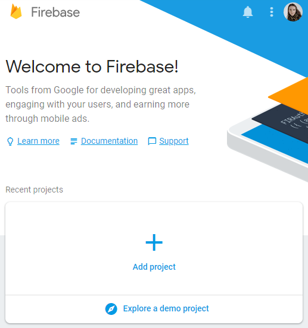
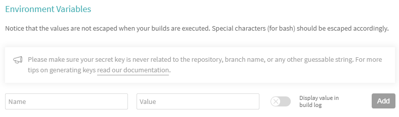
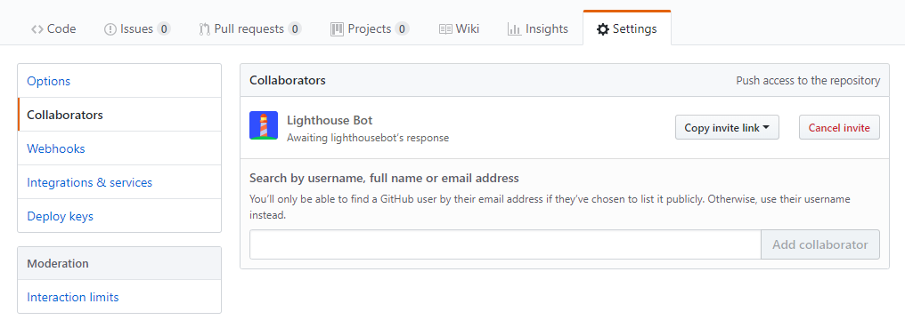
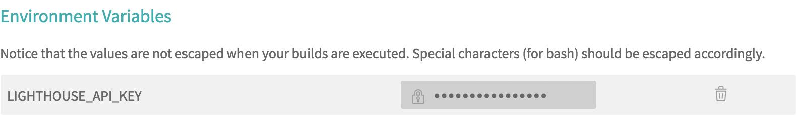
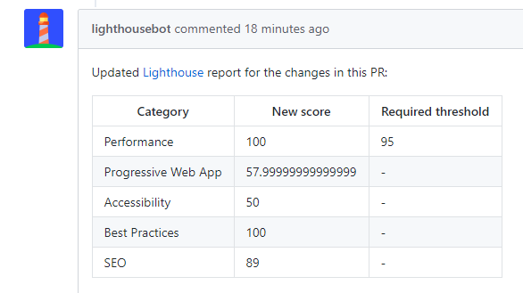
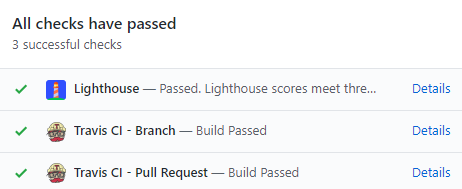

# Using Lighthouse CI to set a performance budget

You’ve done hard work to get fast so let’s make sure you stay fast! Let’s automate performance testing with [Lighthouse CI](https://github.com/ebidel/lighthouse-ci). 

Lighthouse grades your app in 5 categories, and one of those is performance. While you could try to remember to monitor performance changes with [DevTools](https://developers.google.com/web/tools/lighthouse/#devtools) or [Lighthouse CLI](https://developers.google.com/web/tools/lighthouse/#cli) every time you edit your code, you don’t have to do that. Tools can do the tedious stuff for you. [Travis CI](https://travis-ci.com/) is a great service that automatically runs tests for your app in the cloud every time you push new code. 

Lighthouse CI integrates with Travis and by enabling its performance budget feature, you’ll be safe knowing that you won’t accidentally downgrade performance without noticing. If the scores for a pull request fall below the threshold you’ve set (e.g. < 80/100), **Lighthouse CI will prevent that pull request from being merged**.

Testing performance on localhost is okay, but it’s different from how sites perform on live servers. To get a realistic picture, it’s best to deploy to a staging server. You can use any hosting service, we’ll be taking [Firebase](https://firebase.google.com/) hosting for a spin.

## 1. Setup

We are working with a simple app that helps you sort three numbers. 

[Clone the example from GitHub](https://github.com/mihajlija/lighthouse-ci-starter/).

## 2. Deploy to Firebase

### Firebase newbie

To get started you’ll need an account. Once you’ve taken care of that [create a new project in Firebase console](https://console.firebase.google.com/).

### Deploying to Firebase

You need [Firebase CLI](https://firebase.google.com/docs/cli/) to deploy the app. Even if you already have it installed, it's a good practice to frequently update the CLI to the latest version by running:

<pre class="devsite-terminal devsite-click-to-copy">npm install -g firebase-tools </pre>

Authorize the Firebase CLI by running:

<pre class="devsite-terminal devsite-click-to-copy">firebase login</pre>

Now initialize the project:

<pre class="devsite-terminal devsite-click-to-copy">firebase init</pre>

Select hosting feature, the project that you’ve created in the Firebase console and type in "public" as the default directory. Say no to single page application prompt and no to overwriting index.html. This creates a `firebase.json` configuration file in the root of your project directory.

Congrats, you’re ready to deploy! Run:

<pre class="devsite-terminal devsite-click-to-copy">firebase deploy</pre>

In a split second, you’ll have a live app. 

## 3. Setting up Travis

### Travis newbie

You’ll need to [register an account](https://travis-ci.com) on Travis and activate Github Apps integration. 

### If you already have an account 

Go to Settings, hit the Sync account button and make sure your project repo is listed on Travis. 

To kick-off continuous integration we need two things:

1. To have a `.travis.yml` file in the root directory

2. To trigger a build by doing a regular old git push

<pre class="prettyprint">
language: node_js
node_js:
 - "8.1.3"
install:
 - npm install
before_script:
 - npm install -g firebase-tools
script:
 - webpack</td>
</pre>

We’ve already prepared the YAML file that tells Travis to install all the dependencies and build your app. Now it’s your turn to **push the example app to your own Github repository**.

Go to Travis dashboard and if everything is cool you’ll see your build go from yellow to green in a couple of minutes. 🎉

## 4. Automate Firebase deployment with Travis 

In Step 2 we’ve logged in our Firebase account and deployed the app from CLI with firebase deploy. In order for Travis to deploy our app to Firebase, we have to authorize it somehow. How do we do that? With a Firebase token 🗝️🔥

### Authorize Firebase

To generate the token run this command: 

<pre class="devsite-terminal devsite-click-to-copy">firebase login:ci</pre>

It will open a new tab so Firebase can verify you. After that, look back at the console and you’ll see your freshly minted token. Copy it and go back to Travis.

In your project on Travis go to More options > Settings > Environment variables. 

Paste the token in the value field, name the variable FIREBASE_TOKEN and add it.

### Add deployment to your Travis setup

We just need this one line to tell Travis to deploy our app after every successful build. Add it to the end of your .travis.yml. 🔚

<pre class="prettyprint">
after_success:
   - firebase deploy --token $FIREBASE_TOKEN --non-interactive
</pre>

Let’s push this change to Github and wait for our first automated deployment. If you take a look at your Travis log, it should soon say ✔️ Deploy complete!

Now whenever you make new changes to your app, they will be automatically deployed to Firebase.

## 5. Setting up Lighthouse CI 

### Befriend Lighthouse bot

Lighthouse CI has its very own friendly bot that updates you on your app’s Lighthouse scores. It just needs an invitation to your repo. 

On GitHub, go to your project’s settings and **add lighthousebot as your collaborator** (Settings>Collaborators). Approving these requests is a manual process, it doesn’t always happen instantly so make sure lighthousebot has the collaborator status before you start testing.

In the meantime, you also need to add another key to your projects environment variables on Travis. [Leave your email here](https://docs.google.com/forms/d/e/1FAIpQLSdIc3QNIMn7bBMgl2cfxmmo6wGBlUpdLGxjB_ml464t9eCg_A/viewform) and the Lighthouse CI key will be delivered to your inbox. 📬

On Travis, add this key as an environment variable and name it LIGHTHOUSE_KEY.

Note: You can reuse this same key for other projects

### Add Lighthouse CI to your project

Next, add Lighthouse CI to your project by running:

<pre class="devsite-terminal devsite-click-to-copy"> npm i --save-dev https://github.com/ebidel/lighthouse-ci</pre>

And add this bit to your `package.json`:

<pre class="prettyprint">
"scripts": {
  "lh": "lighthouse-ci"
}
</pre>

### Add Lighthouse CI to your Travis configuration

For our final trick, let’s test the performance of our app after every pull request!

In `.travis.yml` add another step in after_success:

<pre class="prettyprint">
after_success:
 - firebase deploy --token $FIREBASE_TOKEN --non-interactive
 - npm run lh -- https://staging.example.com
</pre>

It will run a Lighthouse audit on the given URL, so replace https://staging.example.com with the URL of your app (that’s your-app-123.firebaseapp.com).

We’ve set our standards high and won’t accept any changes to the app that bring the performance score lower than 95. Let’s tweak our setup to include that.

<pre class="prettyprint">
- npm run lh -- --perf=95 https://staging.example.com 
</pre>

### Make a pull request to trigger Lighthouse CI on Travis

Lighthouse CI will only test pull requests, so if you push to master branch now you’ll just get "This script can only be run on Travis PR requests" in your Travis log.

To trigger our Lighthouse CI test, let’s make a pull request.

Checkout a new branch, push it to Github and make a pull request. Hang tight on that pull request page and wait for Lighthouse bot to sing! 🎤

Our performance score is great, we are under budget and the check has passed! 

### More Lighthouse options

Remember how Lighthouse tests 5 different categories? You can enforce scores for any of those with Lighthouse CI flags:

 `--perf` (performance)

 `--pwa` (progressive web app score)

 `--a11y` (accessibility score)

 `--bp` (best practices score)

 `--seo` (SEO score)

Example: 

<pre class="prettyprint"> npm run lh --perf=93 --seo=100 https://staging.example.com</pre>

This will fail the PR if the performance score drops below 93 **or** the SEO score drops below 100. 

You can also choose not to get Lighthouse bot’s comments with the `--no-comment` option.

