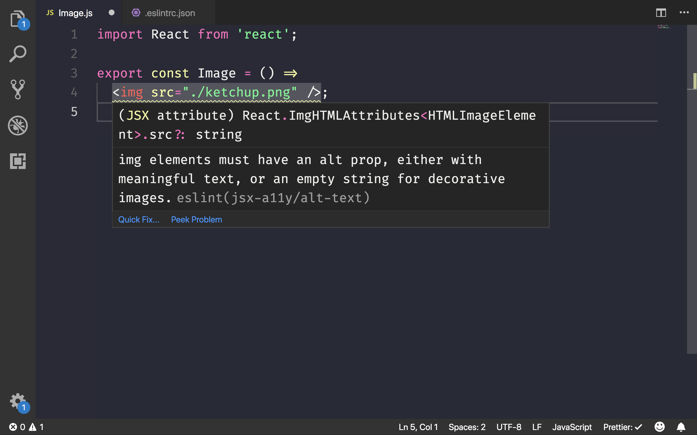
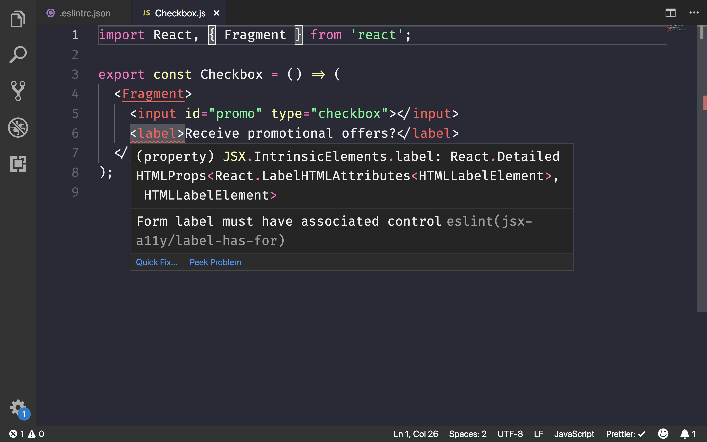
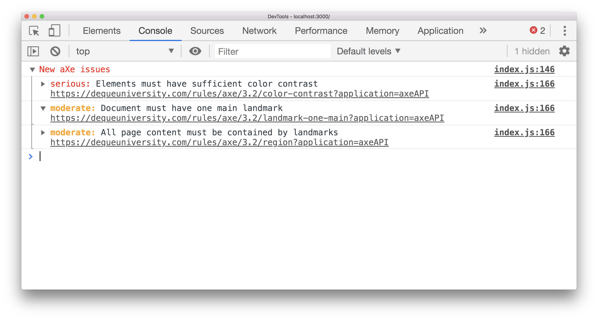

# Accessibility auditing with react-axe and eslint-plugin-jsx-a11y

<div class="aside note">
  If you would like to learn about the basic concepts behind accessibility in web pages, refer to the <a href="/accessible/what-is-accessibility">What is accessibility</a> guide first.
</div>

[`react-axe`](https://github.com/dequelabs/react-axe) is a library that audits a React application and logs any accessibility issues to the Chrome DevTools console. It uses the open-source [axe](https://github.com/dequelabs/axe-core) testing library to flag any issues and their severity.

[`eslint-plugin-jsx-a11y`](https://github.com/evcohen/eslint-plugin-jsx-a11y) is an ESLint plugin that identifies and enforces a number of accessibility rules directly in your JSX. Using this in combination with a tool that tests the final rendered DOM, such as `react-axe`, can provide a comprehensive auditing approach to find and fix any accessibility concerns.

## Why is this useful?

It is crucial to build web sites that provide every user, regardless of any impairment or restriction, the capability to access its content. Using auditing libraries such as `react-axe` and `eslint-plugin-jsx-a11y` during the development of your React application will automatically surface any accessibility issues as they pop up.

## Use eslint-plugin-jsx-a11y

React already supports writing accessible HTML elements within JSX syntax. For example, you only need to use the `htmlFor` attribute instead of `for` to link a label to a specific form element within a React component.

```
<input id="promo" type="checkbox"></input>
<label htmlFor="promo">Receive promotional offers?</label>
```

The [React accessibility documentation](https://reactjs.org/docs/accessibility.html) covers all the nuances of handling accessibility concerns within a React component. To make it easier to spot these issues during development, Create React App (CRA) includes the **`eslint-plugin-jsx-a11y`** plugin for ESLint by default. 

To enable pre-configured linting provided by CRA:

1. Install the appropriate ESLint plugin for your code editor
2. Add a `.eslintrc.json` file to your project

```
{
  "extends": "react-app"
}
```

<div class="aside note">
  You can find more details about configuring your editor to support out-of-box linting in the <a href="https://facebook.github.io/create-react-app/docs/setting-up-your-editor">CRA documentation</a>.
</div>

Some common accessibility issues will now show up.



To check for even more accessibility rules, modify the file to automatically include all the recommended rules by the plugin:

```
{
  "extends": ["react-app", "plugin:jsx-a11y/recommended"]
}
```

An even stricter subset of rules is also supported:

```
{
  "extends": ["react-app", "plugin:jsx-a11y/strict"]
}
```



The project [documentation](https://github.com/evcohen/eslint-plugin-jsx-a11y#difference-between-recommended-and-strict-mode) provides information on the differences between recommended and strict mode.

## Use react-axe

`eslint-plugin-jsx-a11y` can help you easily pinpoint any accessibility issues in your JSX, but it does not test any of the final HTML output. **`react-axe`** is a library that does exactly this by providing a React wrapper around the [`axe-core`](https://github.com/dequelabs/axe-core) testing tool by Deque Labs.

Install the library as a development dependency to begin:

```
npm install --save-dev react-axe
```

You now only need to initialize the module in `index.js`:

```
if (process.env.NODE_ENV !== 'production') {
  import('react-axe').then(axe => {
    axe(React, ReactDOM, 1000);
    ReactDOM.render(<App />, document.getElementById('root'));
  });
} else {
  ReactDOM.render(<App />, document.getElementById('root'));
}
```

A [dynamic import](https://developers.google.com/web/updates/2017/11/dynamic-import) is used here to only load the library when it is not in production mode before rendering and booting up the root `App` component. This ensures that it is not unecessarily included in the final production bundle.

Now when you run the application during development, issues are surfaced directly to the Chrome DevTools console.



A severity level is also assigned for each violation. These levels are:

* Minor
* Moderate
* Serious
* Critical

<div class="aside note">
  If you would like to include accessibility testing in your unit testing workflow, take a look at the <a href="https://github.com/dequelabs/axe-core/tree/develop/doc/examples/jest_react">Jest and axe integration example</a> to understand how.
</div>

## Conclusion

1. If you are building a site with React, include accessibility auditing into your workflow early to catch problems as you build your components.
2. Use `eslint-plugin-jsx-a11y` to add accessibility checks into your linting workflow. CRA already comes with it included, but switch to either the recommended or strict mode.
3. In addition to local development testing, include `react-axe` into your application to catch any issues on the final rendered DOM. Do not include it into your production bundle.