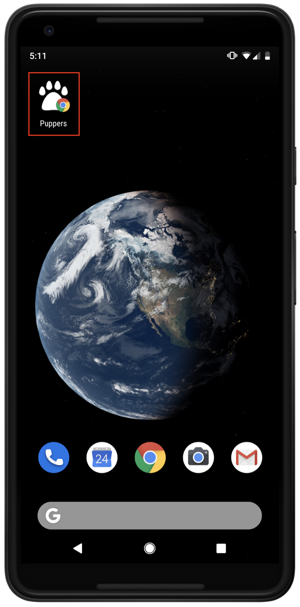
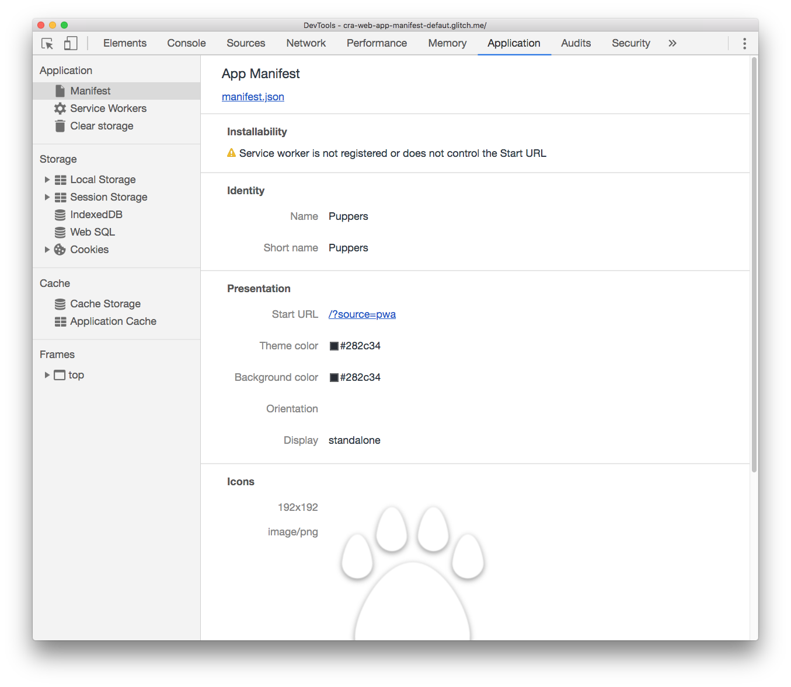

# Adding a web app manifest with Create React App

<div class="aside note">
  If you don't know how web app manifest files work, refer to the <a href="/installable/add-manifest">Add a Web App Manifest/a> guide first.
</div>

Create React App (CRA) includes a web app manifest by default. Modifying this file will allow you to change how your application is displayed when installed on the user's device.



## Why is this useful?

Web app manifest files provide the capability to change how an installed application will look like on a device home screen. By modifying properties in the JSON file, you can modify a number of details in your application, including its:

* Name
* Description
* App icon
* Theme color

The [MDN documentation](https://developer.mozilla.org/en-US/docs/Web/Manifest) covers all the properties that can be changed in detail.

## Modify the default manifest

In CRA, a default manifest file, `/public/manifest.json` is included automatically when a new app is created:

```
{
  "short_name": "React App",
  "name": "Create React App Sample",
  "icons": [
    {
      "src": "favicon.ico",
      "sizes": "64x64 32x32 24x24 16x16",
      "type": "image/x-icon"
    }
  ],
  "start_url": ".",
  "display": "standalone",
  "theme_color": "#000000",
  "background_color": "#ffffff"
}
```

This allows anybody to install the device to their home screen and see some default details of the application. The HTML file, `public/index.html`, also includes a `<link>` element to load the manifest.

```
<link rel="manifest" href="%PUBLIC_URL%/manifest.json" />
```

Here is an example of an application built with CRA that has a modified manifest file:

<div class="glitch-embed-wrap" style="height: 346px; width: 100%;">
  <iframe
    src="https://glitch.com/embed/#!/embed/cra-web-app-manifest-defaut?path=public/manifest.json&previewSize=0"
    alt="cra-web-app-manifest-defaut on Glitch"
    style="height: 100%; width: 100%; border: 0;">
  </iframe>
</div>

To find out if all the properties are working correctly:

+  Click the **Show Live** button to preview the app.
+  Open the DevTools by pressing `CMD + OPTION + i` / `CTRL + SHIFT + i`.
+  Click on the **Application** panel.
+  Switch to the **Manifest** tab.



You can try this with the above [Glitch example](https://cra-web-app-manifest-defaut.glitch.me/).

## Conclusion

1. If you're building a site that you think does not need to be installed on a device, remove the manifest and the `<link>` element in the HTML file that points to it.
2. If you would like users to install the application on their device, modify the manifest file (or create one if you are not using CRA) with any properties that you like. The [MDN documentation](https://developer.mozilla.org/en-US/docs/Web/Manifest) explains all the necessary as well as optional attributes.