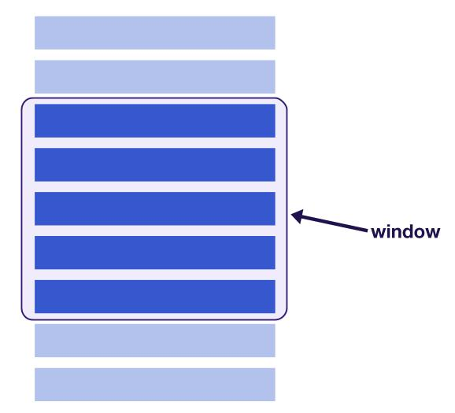
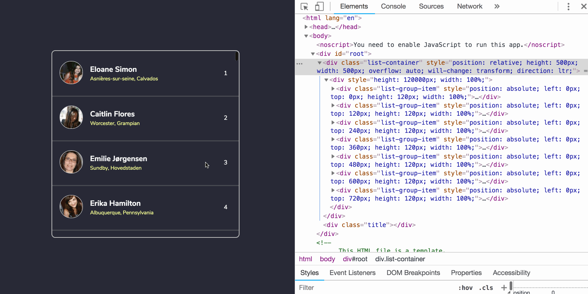
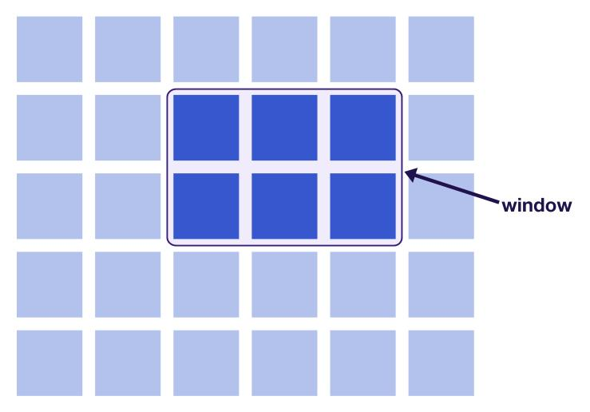
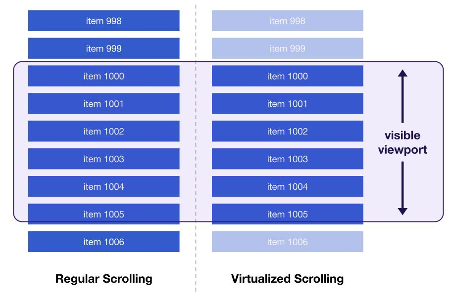

# Virtualize long lists with react-window

[`react-window`](https://react-window.now.sh/#/examples/list/fixed-size) is a library that allows large lists to be rendered efficiently.

Here's an example of a list that contains 1000 rows being rendered with `react-window`. Try scrolling as fast you can.

<div class="glitch-embed-wrap" style="height: 750px; width: 100%;">
  <iframe
    src="https://glitch.com/embed/#!/embed/react-window?path=src/App.js&previewSize=100"
    alt="react-window on Glitch"
    style="height: 100%; width: 100%; border: 0;">
  </iframe>
</div>

## Why is this useful?

There may be times where you need to display a large table or list that contains many rows. Loading every single item on a massive list can affect performance significantly.

**List virtualization**, or "windowing", is the concept of only rendering what is visible to the user. The number of elements that are rendered at first is a very small subset of the entire list and the "window" of visible content _moves_ when the user continues to scroll. This improves both the rendering and scrolling performance of the list. 



DOM nodes that exit the "window" are recycled, or immediately replaced with newer elements as the user scrolls down the list. This keeps the number of all rendered elements specific to the size of the window.



## react-window

**`react-window`** is a small, third-party library that makes it easier to create virtualized lists in your application. It provides a number of base APIs that can be used for different types of lists and tables.

### When to use fixed size lists

Use the **`FixedSizeList`** component if you have a long, one-dimensional list of equally sized items.

```
import React from 'react';
import { FixedSizeList } from 'react-window';

const items = [...] // some list of items
 
const Row = ({ index, style }) => (
  <div style={style}>
     {/* define the row component using items[index] */}
  </div>
);
 
const ListComponent = () => (
  <FixedSizeList
    height={500}
    width={500}
    itemSize={120}
    itemCount={items.length}
  >
    {Row}
  </FixedSizeList>
);

export default ListComponent;
```

* The `FixedSizeList` component accepts a `height`, `width` and `itemSize` prop to control the size of the items within the list.
* A function that renders the rows is passed as a child to `FixedSizeList`. Details about the particular item can be accessed with the `index` argument (`items[index]`). 
* A `style` parameter is also passed in to the row rendering method that **must** be attached to the row element. List items are absolutely positioned with their height and width values assigned inline, and the `style` parameter is responsible for this. 

<div class="aside caution">
Do not assign <code>height</code> and <code>width</code> properties to the list or the list item with an external CSS file. This would be ignored due to the fact that these style attributes are assigned inline.
</div>

The Glitch example shown earlier in this article shows an example of a `FixedSizeList` component.

### When to use variable sized lists

Use the `VariableSizeList` component to render a list of items that have different sizes. This component works in the same way as a fixed size list, but instead expects a function for the `itemSize` prop instead of a specific value.

```
import React from 'react';
import { VariableSizeList } from 'react-window';

const items = [...] // some list of items
 
const Row = ({ index, style }) => (
  <div style={style}>
     {/* define the row component using items[index] */}
  </div>
);

const getItemSize = index => {
  // return a size for items[index]
}
 
const ListComponent = () => (
  <VariableSizeList
    height={500}
    width={500}
    itemCount={items.length}
    itemSize={getItemSize}
  >
    {Row}
  </VariableSizeList>
);

export default ListComponent;
```

The following embed shows an example of this component.

<div class="glitch-embed-wrap" style="height: 750px; width: 100%;">
  <iframe
    allow="geolocation; microphone; camera; midi; vr; encrypted-media"
    src="https://glitch.com/embed/#!/embed/react-window-variable-list?path=src/ListComponent.js&previewSize=100"
    alt="react-window-variable-list on Glitch"
    style="height: 100%; width: 100%; border: 0;">
  </iframe>
</div>

The item size function passed to `itemSize` prop randomizes the row heights in this example. In a real application however, there should be actual logic defining the sizes of each item. Ideally, these sizes should be calculated based on data or obtained from an API.

<aside class="aside note">
Both <code>FixedSizeList</code> and <code>VariableSizeList</code> components support horizontal lists by using a <code>layout="horizontal"</code> prop. Take a look at the <a href="https://react-window.now.sh/#/examples/list/fixed-size">documentation</a> to see an example.
</aside>

### Grids

`react-window` also provides support for virtualizing multi-dimensional lists, or grids. In this context, the "window" of visible content changes as the user scrolls horizontally **and** vertically.



Similary, both `FixedSizeGrid` and `VariableSizeGrid` components can be used depending on whether the size of specific list items can vary. 

* For `FixedSizeGrid`, the API is about the same but with the fact that heights, widths and item counts need to be represented for both columns and rows.
* For `VariableSizeGrid`, both the column widths and row heights can be changed by passing in functions instead of values to their respective props.

Take a look at the [documentation](https://react-window.now.sh/#/examples/grid/fixed-size) to see examples of virtualized grids.

<aside class="aside note">
  Aside from providing the base components to create efficient lists and grids, <code>react-window</code> also provides other capabilities such as scrolling to a specific item or providing an indicator when the user is scrolling. The <a href="https://react-window.now.sh/#/examples/list/scrolling-indicators">documentation</a> provides examples for this.
</aside>

## Lazy loading on scroll

Many websites improve performance by waiting to load and render items in a long list until the user has scrolled down. This technique, commonly referred to as "infinite loading", adds new DOM nodes into the list as the user scrolls past a certain threshold close to the end. Although this is better than loading all items on a list at once, it still ends up populating the DOM with thousands of row entries if the user has scrolled past that many. This can lead to an excessively large DOM size, which starts to impact performance by making style calculations and DOM mutations slower.

The following diagram might help summarize this:



The best approach to solve this problem is continue to use a library like `react-window` to maintain a small "window" of elements on a page, but to also lazy loading newer entries as the user scrolls down. A separate package, `react-window-infinite-loader`, makes this possible with `react-window`.

Consider the following piece of code which shows an example of state that is managed in a parent `App` component. 

```
import React, { Component } from 'react';

import ListComponent from './ListComponent';

class App extends Component {
  constructor(props) {
    super(props);
    this.state = {
      items: [], // instantiate initial list here
      moreItemsLoading: false 
    };
    
    this.loadMore = this.loadMore.bind(this);
  }
  
  loadMore() {
   // method to fetch newer entries for the list
  }

  render() {
    const { items, moreItemsLoading } = this.state;

    return (
      <ListComponent items={items} moreItemsLoading={moreItemsLoading} loadMore={this.loadMore}/>
    );
  }
}

export default App;
```

A `loadMore` method is passed into a child `ListComponent` that contains the infinite loader list. This is important because the infinite loader needs to fire a callback to load more items once the user has scrolled past a certain point.

Here's how the `ListComponent` that renders the list can look like:

```
import React from 'react';
import { FixedSizeList } from 'react-window';
import InfiniteLoader from "react-window-infinite-loader";
 
const ListComponent = ({ items, moreItemsLoading, loadMore }) => {
  const Row = ({ index, style }) => (
     {/* define the row component using items[index] */}
  );

  return (
    <InfiniteLoader
      isItemLoaded={index => index < items.length - 1}
      itemCount={items.length}
      loadMoreItems={loadMore}
    >
      {({ onItemsRendered, ref }) => (
        <FixedSizeList
          height={500}
          width={500}
          itemCount={items.length}
          itemSize={120}
          onItemsRendered={onItemsRendered}
          ref={ref}
        >
          {Row}
        </FixedSizeList>
      )}
  </InfiniteLoader>
  )
};

export default ListComponent;
```

In here, the `FixedSizeList` component is wrapped within the `InfiniteLoader`. The props assigned to the loader are:

* `isItemLoaded`: Method that checks whether a certain item has loaded
* `itemCount`: Number of items on the list (or expected)
* `loadMoreItems`: Callback that returns a promise that resolves to additional data for the list

A [render prop](https://reactjs.org/docs/render-props.html#using-props-other-than-render) is used to return a function that the list component uses in order to render. Both `onItemsRendered` and `ref` attributes are attributes that need to be passed in.

The following is an example of how infinite loading can work with a virtualized list.

<div class="glitch-embed-wrap" style="height: 750px; width: 100%;">
  <iframe
    src="https://glitch.com/embed/#!/embed/react-window-infinite-loader?path=src/ListComponent.js&previewSize=100"
    alt="react-window-infinite-loader on Glitch"
    style="height: 100%; width: 100%; border: 0;">
  </iframe>
</div>

Scrolling down the list might feel the same, but a request is now made to retrieve 10 users from a [random user API](https://randomuser.me/) everytime you scroll close to the end of the list. This is all done while only rendering a single "window" of results at at a time.

By checking the `index` of a certain item, a different loading state can be shown for an item depending on whether a request has been made for newer entries and the item is still loading.

For example:

```
const Row = ({ index, style }) => {
  const itemLoading = index === items.length;

  if (itemLoading) {
      // return loading state
  } else {
      // return item
  }
};
```

## Conclusion

If you are unsure where to begin virtualizing lists and tables in your application, follow these steps:

1. Measure rendering and scrolling performance. This [article](https://addyosmani.com/blog/react-window/) shows how the [FPS meter](https://developers.google.com/web/tools/chrome-devtools/evaluate-performance/#analyze_frames_per_second) in Chrome DevTools can be used to explore how efficiently items are rendered on a list.
2. Include `react-window` for any long lists or grids that are affecting performance.
3. If there are certain features not supported in `react-window`, consider using [`react-virtualized`](https://github.com/bvaughn/react-virtualized) if you cannot add this functionality yourself.
4. Wrap your virtualized list with `react-window-infinite-loader` if you need to lazy load items as the user scrolls.