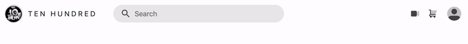

<figure style="text-align:center; margin: 4rem 0;">
  
</figure>

Armed with some **custom properties** and **CSS Grid**, let's knock this component layout out of the park shall we?!

<br><br>

**Preview**
<div class="glitch-embed-wrap" style="height: 200px; width: 100%;">
  <iframe
    src="https://glitch.com/embed/#!/embed/logical-tab-order?path=index.html&previewSize=100&attributionHidden=true"
    alt="logical-tab-order on Glitch"
    style="height: 100%; width: 100%; border: 0;">
  </iframe>
</div>

<br><br>

Look nice? Feel nice? **Curious how we got there**!? Let's dig in.

<br><br>

# Engineering A Responsive Navbar

**HTML**
```html
<nav>
  
  <brand>Ten Hundred</brand>
  <search>...</search>
  <icon-button-list>...</icon-button-list>
  <button class="profile"></button>
</nav>
```
<div class="note">Nice flat HTML structure</div>

<br>

**CSS**

```css
nav {
  height: var(--body-rails);
  display: grid;
  grid-auto-flow: column;
  align-items: center;
  grid-template-columns:
    var(--body-rails)
    minmax(min-content, var(--sidebar-width))
    minmax(min-content, var(--search-width))
    1fr
    var(--body-rails);

  & > :matches(:first-child, :last-child) {
    justify-self: center;
  }
}
```

<div class="note">
  <b>CSS Grid In English:</b> Explained below 👇
</div>

<figure style="text-align:center; margin: 4rem 0;">
  
</figure>

1. `grid-template-columns` leverages **custom properties to share values** with other grids
1. `grid-auto-flow` let's us specify this nav should **only layout in columns**
1. Children are **vertically centered**
1. Height is the same as the rail width (**not intrinsic but meaningful** in this case!)
1. Brand and search **flex in their space** via `minmax()` and `min-content`

<br>

Let's **flex it** and **then chat** about what's happenin:

<figure style="text-align:center; margin: 4rem 0;">
  
</figure>

Look at how they flex, look at how we defined the flex, look at all those new keywords ([fr](https://css-tricks.com/introduction-fr-css-unit/), [minmax()](https://developer.mozilla.org/en-US/docs/Web/CSS/minmax), [min-content](https://developer.mozilla.org/en-US/docs/Web/CSS/width), [var()](https://developer.mozilla.org/en-US/docs/Web/CSS/--*))! I recommend trying to **learn what they mean by how they behave**.

<div class="note">
  The above gif goes down below `320px` which is really small! We have 1 layout definition that's <b>getting us almost all the way to tiny device sizes</b>. That's niiiiice. 2 components adjust themselves at certain breakpoints, and I find them to be very manageable adaptive responses.
</div>

<br><br>

# Let's break down each column:
1. **Brand logo column:** `var(--body-rails)`

   This column get's it height from the parent nav, which also happens to be the same CSS variable we used for the width. **Gives us a nice square!** The nav already articulated vertical centering for all children, but we horizontally center via the `:matches() ` selector that's telling the first and last element in the nav to be horizontally centered. **Result is a very symmetrical and perfectly centered logo**. Love it.

   <figure style="text-align:center; margin: 2rem 0 4rem;">
     
   </figure>

2. **Brand name column:** `minmax(min-content, var(--sidebar-width))`

   This columns definition could read like the following English: **clamp** this column to a minimum of it's own content width ("Ten Hundred" the phrase, **an intrinsic measurement**), and to a maximum of the desired width of our sidebar. `min-content` is very important here, because it ensures that when we do get real scrunchy, **allow line breaks but not word breaks**. Our brand should never be Ten Hund
   ed. **But**, we're cool with Ten

   Hundred. We also don't want the column to overflow, and min-content ensures our column is as long as our longest word.

   <figure style="text-align:center; margin: 2rem 0 4rem;">
     
   </figure>

   > **Try changing min-content to max-content!** I feel it's a great example to illustrate some of the power and capabilty we have with those words.

   <br><br>

3. **Search column:** `minmax(min-content, var(--search-width))`

   This should look familiar now 😏 Same scenario as our brand name, we want to **be respectful of our contents natural width**, while also **giving it a safe area to grow** per our design. We may end up changing away from a minimum of min-content because our breakpoint appears to be happening before that time. But we'll see, for now it's **a great safe intrinsic default**.

   <figure style="text-align:center; margin: 2rem 0 4rem;">
     
   </figure>

4. **Global actions column:** `1fr`

   Boom, just a straight up flex zone that says "gimme allllll the rest!" The reason `1fr`, which means 1 fraction of the left over, is all the rest of the space in our nav layout is because there're no other `fr`'s to compete/share space with. `1fr` in this case is a succinct way to say "be liquid and fill anything left over in the viewport, grow til you hit a wall." We could probably get away with `auto` or `100%` or even `10000000fr` lol.

   <figure style="text-align:center; margin: 2rem 0 4rem;">
     
   </figure>

5. **Account session column:** `var(--body-rails)`

   Same story as column 1, the brand logo. Be the same tall as you are wide, center center.

   <figure style="text-align:center; margin: 2rem 0 4rem;">
     
   </figure>

<br><br><br>

# Responsive Final Touches

We need to **take an adaptive approach** to fixing our nav at a small viewport. Our **search input** is consuming too much space and I feel it'd be healthiest to replace the search input with a search button. That search button can invoke a more dedicated mobile search experience that **doesnt need to squish into a tiny pill**.

Furthermore, to squeeze our layout into even smaller devices, we can shed the text version of our brand "Ten Hundred" and let the logo do the talkin'. We'll have 1 media query for swapping a search input for a search button, and another for hiding the text brand name.

<br><br>

**Search Adaptive CSS**
```css
search {
  ...

  @media (width >= 500px) {
    & > button {
      display: none;
    }
  }

  @media (width <= 500px) {
    justify-self: flex-end;

    & > :matches(svg, input) {
      display: none;
    }
  }
}
```
<div class="note"><a href="https://preset-env.cssdb.org/features#media-query-ranges">Media Query Ranges</a>, <a href="https://preset-env.cssdb.org/features#matches-pseudo-class">:matches()</a> & <a href="https://preset-env.cssdb.org/features#nesting-rules">nesting</a> shown in the CSS above 👍</div>

<br>

**Brand Adaptive CSS**
```css
brand {
  ...

  @media (width <= 350px) {
    width: 0;
    overflow: hidden;
  }
}
```
<div class="note">hold the grid track but take no space</div>

<br><br>

Little preview of the **[adaptive](http://mediumwell.com/responsive-adaptive-mobile/)** responsive effect on the search bar:

<figure style="text-align:center; margin: 4rem 0;">
  
</figure>

<br><br>

Look how **little code** we need handle desktop to tiny phone 😍 **Only the search bar and brand name** needed touched, **not the layout**.

<br><br><br>

# Conclusion

**Love it**. `minmax()` really does most the work here to let that desktop layout still squeeze within reason down to mobile. Our layout doesn't even know (or need to know) that children are showing and hiding themselves. We created a healthy layout system, and if things get tight, those elements can handle themselves.

This nav bar is a great example of **liquid and adaptive responsive tactics working together**. Next we'll tackle the sidebar navigation layout, and smash a UX bug too.
