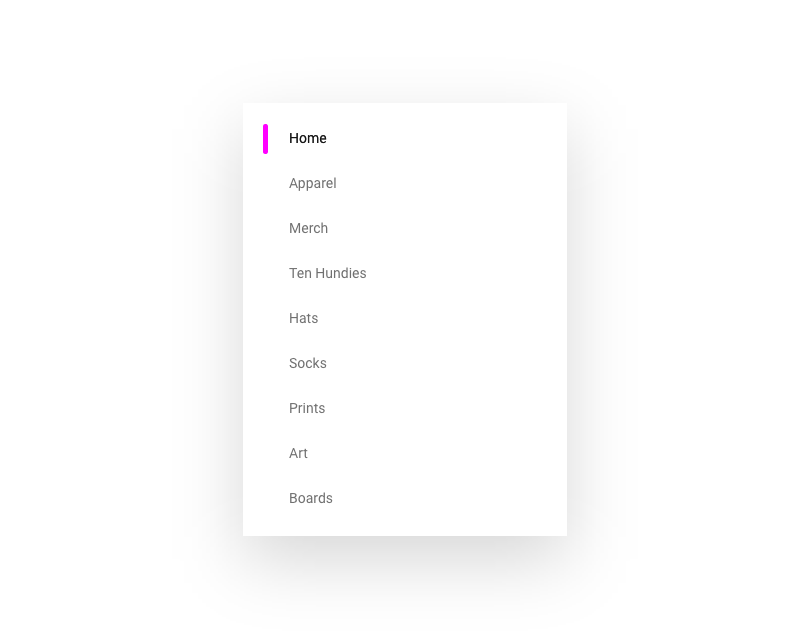
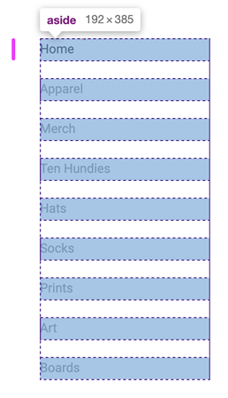
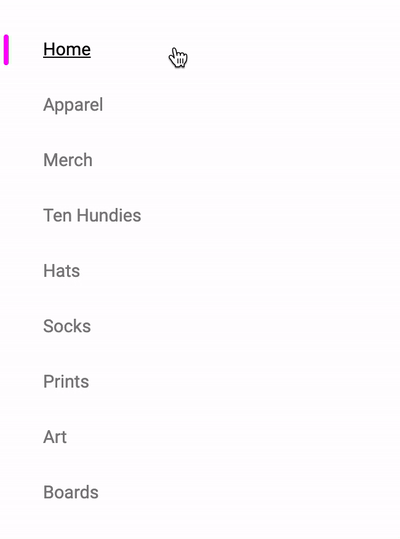
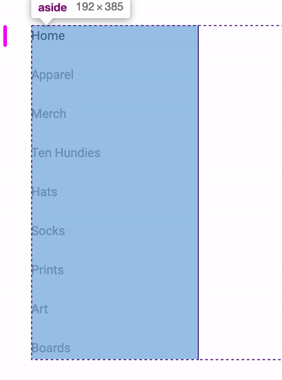

<figure style="text-align:center; margin: 4rem 0;">
  
</figure>

This component is not rocket science, but I went through a refactor on it that **I felt was important**. First version used CSS Grid, was succinct, and **done in 30 seconds.. but had a massive issue**.

<br><br>

**HTML**
```html
<aside>
  <nav>
    <a href="#" selected>Home</a>
    <a href="#">Apparel</a>
    <a href="#">Merch</a>
    <a href="#">Ten Hundies</a>
    <a href="#">Hats</a>
    <a href="#">Socks</a>
    <a href="#">Prints</a>
    <a href="#">Art</a>
    <a href="#">Boards</a>
  </nav>
</aside>
```

<br>

**CSS**
```css
aside > nav {
  display: grid;
  grid-auto-flow: row;
  gap: 1.25rem;
}
```

<div class="note">
  <b>CSS Grid In English:</b> Strictly rows and a healthy gap between them
</div>

<br><br>

**Glitch**
<div class="glitch-embed-wrap" style="height: 346px; width: 100%;">
  <iframe
    src="https://glitch.com/embed/#!/embed/logical-tab-order?path=index.html&previewSize=100&attributionHidden=true"
    alt="logical-tab-order on Glitch"
    style="height: 100%; width: 100%; border: 0;">
  </iframe>
</div>

<br><br>

Inspecting with the Chrome devtools shows **this beauty**:

<figure style="text-align:center; margin: 4rem 0;">
  
</figure>

## Pros 👍
1. Soooo prettttyyyyyy
1. Minimal, precise
1. Fits perfect
1. (so why don't I marry it right?) lol

## Cons 👎
1. Our **links can be clicked anywhere** in that blue highlight
1. **Invisible interactive areas**
1. **Extrinsic**, our content isn't the primary driver of layout/space

<br><br>

Those cons are no small issue in my opinion. This is where many of you may stop reading and or caring, but I want to **implore you to take heed and care of moments like this**. It's not ok to have an invisible area be a click handler to another page. That's a great way to surprise a user and **force them to memorize a quark** about your app.

I mean, look at this, **it's not natural**!

<figure style="text-align:center; margin: 4rem 0;">
  
</figure>

<br><br><br>

## The Fix
### Flexbox to the rescue!

Yep, it's got some better controls for directionally flowing elements **while respecting their intrinsic size**. **Flexbox** is a quick way to **align** and **distribute** elements, as opposed to creating tracks for content to flow or fit within.

<br><br>

**CSS**
```css
aside > nav {
  display: flex;
  flex-direction: column;
  align-items: flex-start;

  & > a:not(:last-of-type) {
    margin-bottom: 1.25rem;
  }
}
```

<br><br>

**Glitch**
<div class="glitch-embed-wrap" style="height: 346px; width: 100%;">
  <iframe
    src="https://glitch.com/embed/#!/embed/logical-tab-order?path=index.html&previewSize=100&attributionHidden=true"
    alt="logical-tab-order on Glitch"
    style="height: 100%; width: 100%; border: 0;">
  </iframe>
</div>

<br><br>

Inspecting with the Chrome devtools shows **this update**:

<figure style="text-align:center; margin: 4rem 0;">
  
</figure>

## Pros 👍
1. **Matches** users interaction **expectations**
1. **No invisible** interactive areas
1. **Intrinsic**, text length is driving interactive area

## Cons 👎
1. No `gap`
  (**note:** [gap is coming to flex box!](https://developer.mozilla.org/en-US/docs/Web/CSS/gap))


<br><br><br><br>


## Responsive Final Touches
A big vertical sidebar isn't very useful on **mobile where we're pretty much in 1 column only territory**. My favorite trick for sidebars like this, is to **flip them** to horizontal sidebars and let them flow out of the viewport but **be scrollable**!

**TODO: gif**
<figure style="text-align:center; margin: 4rem 0;">
  
</figure>

**CSS**
```css
@media (width < 768px) {
  flex-direction: row;

  & > a:not(:last-of-type) {
    margin-right: 1.25rem;
  }
}
```

<div class="note">Flexbox makes that <b>too easy with flex-direction</b>!</div>

<br><br>

We break at 768px which is where we'll be breaking most of our layout into single column through this guide.

> There's other little things in the code to study if you're interested, like the selected indicator and how I made that responsive as well.

Pop this open and **give it a whirl** in your browser.

<br><br><br>

**Final Glitch**
<div class="glitch-embed-wrap" style="height: 346px; width: 100%;">
  <iframe
    src="https://glitch.com/embed/#!/embed/logical-tab-order?path=index.html&previewSize=100&attributionHidden=true"
    alt="logical-tab-order on Glitch"
    style="height: 100%; width: 100%; border: 0;">
  </iframe>
</div>

<br><br><br><br>

# Conclusion
In our excitement to use Grid, we ended up initially making something that was **easy to author, but produced some akward interactions**. A swift refactor to **flexbox resolved our issues**, and this component's micro layout is ready.
