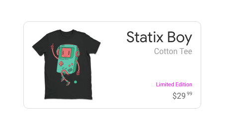
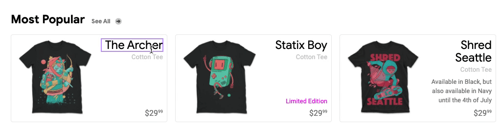
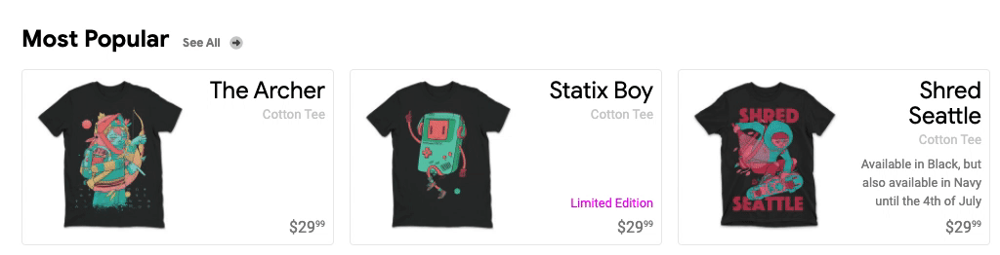

Chip Card Layout

<figure style="text-align:center; margin: 4rem 0;">
  
</figure>

In that tiny little card, we've got **2 layouts**! Flexbox and Grid are each doing their best work.

This ends up being one of our best examples of intrinsic layout and web design. There's large **variability** in content, in terms of content **length** and **presence**. There are many "optional" elements in that layout, which is something I'd have grabbed javascript and a rich template engine to handle before.. but now, I can articulate a constraint system and **let CSS do all the work**.

<br>

##### First
# The Outer Grid
This layout is for the relationship between the image and the details. We can safely assume there will always be an image and some details, making grid a great candidate here.

**HTML**
```html
<figure>
  
  <figcaption>...</figcaption>
</figure>
```

<br>

**CSS**
```css
figure {
  display: grid;
  grid-auto-flow: column;
  gap: .5rem;
}
```

<div class="note">
  <b>CSS Grid In English:</b> Grid of columns with a half rem gap. In this case it'll create 2 columns for the 2 children and make sure there's a little space between them.
</div>

<figure style="text-align:center; margin: 4rem 0;">
  
</figure>

**Seeing patterns** in CSS Grids yet!? Gives us some great **flow control** right?
- Direction
- Gap

<br><br><br><br>

##### Second
# The Inner Flexable Layout
There were a few ways to achieve this layout with CSS. **I need it to be resilient though**, it needs to survive content variance. Check out what I came up with.

**HTML** for caption
```html
<figcaption>
  <h4>Statix Boy</h4>
  <small>Cotton Tee</small>
  <p></p>
  <span>Limited Edition</span>
  <data money>$29<sup>99</sup></data>
</figcaption>
```

<br>

**CSS**
```css
figcaption {
  display: flex;
  flex-direction: column;
  text-align: right;

  & p {
    flex: 2;
    display: inline-flex;
    align-items: center;
  }
}
```

<figure style="text-align:center; margin: 4rem 0;">
  
</figure>

**How's this working!?**
1. **Force** the elements to behave like block level elements, resulting in **rows**
1. Hug the **text** to the **right** of their container with text align
1. No gap, which is ok though, we needed **unique spacing's** for children in this layout
1. The **paragraph** tag is **pushy**

<br><br>

**Glitch**
<div class="glitch-embed-wrap" style="height: 346px; width: 100%;">
  <iframe
    src="https://glitch.com/embed/#!/embed/logical-tab-order?path=index.html&previewSize=100&attributionHidden=true"
    alt="logical-tab-order on Glitch"
    style="height: 100%; width: 100%; border: 0;">
  </iframe>
</div>

<br><br>

# Incoming Chaos!
Intrinsic design wouldn't be showing off it's muscles if there wasn't some chaos to show **just how resilient it can be**. So let's throw some **wild titles** at it, **delete elements** as if they never came from the database, and just **put these chips to the test.**

<figure style="text-align:center; margin: 4rem 0;">
  
  <figcaption><a href="https://github.com/GoogleChromeLabs/ProjectVisBug" target="_blank">VisBug<a> used to chaos test</figcaption>
</figure>

**Resiliency notes:**
1. When the height changes in 1 chip card, **all the others grow to match**
1. Title length **doesn't matter** now
1. Presence of product type, title, or limited edition **don't matter**
1. Only the price is required, which is a reasonable product requirement
1. Our render template for this card needs to do 1 special thing, create a description paragraph even if there's no description. So our card has 1 strict limit, which is pretty harmless and not user facing.

<br><br>

Resilience here in this chip card **benefits the managers of the products** in addition to your front end workload. It's very common for a backend CMS to inflict limits on the content based on what the front end is capable of rendering. This is super unfair, and **what we've just built get's to remove all the limits.**

<br><br>

## Learning Moment!
So, this isn't the first strategy I took, **I had a failed attempt** at using `justify-content: space-between` which required **more wrapping elements** to achieve the layout then I liked. I settled on the above solution, which only needed **1 element**, because the others needed multiple.

You could call it a cheat, and I might agree, but I felt the **tradeoffs were worth it**. Besides, spacer nodes aren't all that rare, but I do agree we should avoid leveraging empty elements for our layouts.


## Responsive Final Touches
None needed! It's a micro layout that's already a single column stack.

<br><br><br><br>

##### Chaos Averted!
# Conclusion
Well, we threw some pretty typical chaos at these chips, and they **survived**! That pushy paragraph with some flex power sure works well. We can delete items from this list, we can delete items within the items, etc, and all is good. This is what we want, **resilient**, **content centric layouts**. Even if one of the other chips is really tall, they're all uniform and layout healthy.

**This is stuff in the past that was super tough to do!**


In the next section we'll be laying out another card that comes with it's own type of content variability. It'll be similar learning as this guide, but from a different angle and for a different type of presentation.
