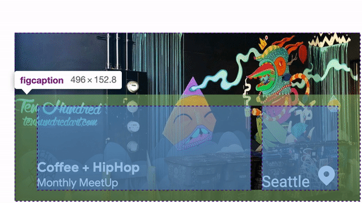

## TODO: refactor

<figure style="text-align:center; margin: 4rem 0;">
  
</figure>


The layout of these featured mural cards are **hiding some fun & tricky grid tasks**:

1. Height **temptations**
1. **Optional/variable content**
1. **Flexible relationships** between
  - city and description of the mural
  - height of one mural card to the other
  - height of the mural cards to the deal card (not shown in comp)

<br><br>

Historically, I'd accomplish this layout with an absolute positioned caption element over an image element, which works great, but immediately goes from **intrinsic** to **extrinsic**. The flow model of an absolutely positioned element is pretty tedious, and needs a lot of hand holding to look as expected. Good news is, **we can achieve this layout without any absolutely positioned elements.**

<br><br>

**Why avoid absolute positioned elements?**
- The card will never be smaller than it's content; **content respectful**
- **Length** of content **or presence** of content **doesn't matter**
- We can **still animate** the caption as we would have with an absolute positioned element
- It's **less code**
- **More resilient**
- In **flow**

<br><br>

**HTML**
```html
<figure class="mural-card" style="background-image: url(...)">
  <figcaption>...</figcaption>
</figure>
```

<br>

**CSS**
```css
.mural-card {
  display: flex;
  align-items: flex-end;
}
```

> **CSS Grid In English:** This card is a grid of 1 column and 1 row and all direct children should stack in that space.

<figure style="text-align:center; margin: 4rem 0;">
  
</figure>


We **achieve an absolute positionless layout** by **leveraging grid's slotted layout** syntax. We're **placing** each element into the **same grid cell**, which stacks them **using DOM source order** to determine which is **on top** of which. That takes care of the layering.

**BUT**, there's 1 part of this grid we can't control **without subgrid**, a shared width of the city columns between mural cards. Here, I've updated the card titles and cities to show what I mean.

<figure style="text-align:center; margin: 4rem 0;">
  
</figure>


Since we're intrinsicly sizing the city column cell, **they can be different** between each other. Notice the top card's first column width **vs** the second card's first column width. With **subgrid**, we could **share the max of those intrinsic columns** between the 2 mural cards here, so that the width of them are uniform. Be excited for subgrid, look at the control we'll get! 🤩


### Intrinsic Caption Layout

This layout needs to **deal with content variability** just like some of the other's that have content coming from a CMS or data model. Checkout the gif under the code, it can take a beating!


**This layout should:**

- still work if content items are missing
- never have text or icons pop out of the container
- still work if content titles are super long
- etc, these requirements should look familiar by now 😉


Grid makes swift work of these requirements. **Uniquely** to this layout, **flexbox was not needed**. **Gap**, **distribution** and **alignment** do all the work ❤️


**HTML**

```html
<figcaption>
  <h3>
    Coffee + HipHop
    <small>Monthly MeetUp</small>
  </h3>
  <p>
    Seattle
    <svg xmlns="http://www.w3.org/2000/svg" viewBox="0 0 24 24" class="icon-location-pin">
      <path d="M5.64 16.36a9 9 0 1 1 12.72 0l-5.65 5.66a1 1 0 0 1-1.42 0l-5.65-5.66zM12 13a3 3 0 1 0 0-6 3 3 0 0 0 0 6z"/>
      <path d="M12 1a9 9 0 0 1 6.36 15.36l-5.65 5.66a1 1 0 0 1-.71.3V13a3 3 0 0 0 0-6V1z"/>
    </svg>
  </p>
</figcaption>
```


**CSS**

```css
figcaption {
  flex: 1;

  display: grid;
  grid-template-columns: 1fr auto;
  align-items: flex-end;
  gap: 1rem;

  & > h3 {
    display: grid;
    gap: 0.25rem;
  }

  & > p {
    grid-column: 2;
    justify-self: flex-end;
    width: max-content;

    display: inline-grid;
    gap: 0.5rem;
    grid-auto-flow: column;
    align-items: flex-end;
  }
}
```

> **CSS Grid In English:** I want a grid of 2 columns, where the first column fills remaining space and the 2nd is the width of it's content. Align the caption itself to the bottom of the grid container, and align the caption children to the bottom. Put a healthy `1rem` gap between the columns.
>
> The city and icon container `<p>` is also a grid of columns with a gap between the icon and the city, all aligned to the baseline of the text. The `<p>` should also align itself to the end of the cell it's assigned to and never be longer than the width of own intrinsic width. I love it when I find a good use for baseline alignment 💀🤘


# Incoming Chaos!

<figure style="text-align:center; margin: 4rem 0;">
  
</figure>


## Responsive Final Touches

**None needed**, it's content outward!

**A parent grid is orchestrating the responsive areas**, and our intrinsic layout is resilient enough to handle it. **Another win for intrinsic** layout.


<figure style="text-align:center; margin: 4rem 0;">
  
</figure>


# Conclusion


