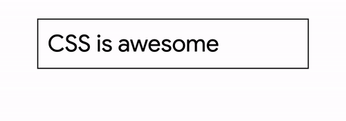

# Summary
We built **macro layouts**, we built **micro layouts**, we **chaos** tested, we **mobilized**, we **strategized** and we **conquered**. We found some **organic harmonies between flexbox and grid**. We **refactored** extrinsic layouts to intrinsic ones. We found **meaningful** use cases for extrinsic **heights**. Ultimately we really dug into some day to day, practical layout work and learned a ton of great stuff along the way.

<br><br>


<br><br>

**Final Glitch**
<div class="glitch-embed-wrap" style="height: 70vh; width: 80vw;">
  <iframe
    src="https://glitch.com/embed/#!/embed/logical-tab-order?path=index.html&previewSize=100&attributionHidden=true"
    alt="logical-tab-order on Glitch"
    style="height: 100%; width: 100%; border: 0;">
  </iframe>
</div>

<figure style="text-align:center; margin: 4rem 0;">
  
  <figcaption>All layouts revealed through devtools in 1 gif 🤓</figcaption>
</figure>

<br><br>

##### Recap of each layout

# Macro Layouts
We laid down some layout code for our **outer most grids first** and created **CSS variables for layouts to share values** for consistency. CSS Grid was able to do the entire macro layout with a slotted layout strategy, but we refactored and were able to achieve the same layout with 2 smaller grids. We gained an easier browser fallback scenario and less code to modify in a media query.

<br><br>

### Top Level Grid

```css
body {
  display: grid;
  gap: 2rem;
  grid-auto-flow: row;
}
```

<div class="note">just flow and spacing</div>

<figure style="text-align:center; margin: 1rem 0;">
  
</figure>

<br><br>

### Main Level Grid

```css
main {
  display: grid;
  grid-template-columns: var(--sidebar-width) 1fr;
  margin: 0 var(--body-rails);

  @media (width < 768px) {
    grid-template-columns: 1fr;
    margin: 0 0 0 1rem;

    & > aside {
      overflow-x: auto;
    }
  }
}
```

<div class="note">used only 2 columns, used margin to simulate shared column with nav</div>

<figure style="text-align:center; margin: 0;">
  
</figure>

<br><br><br><br>

# Micro Layouts

Turns out **the majority of our layout work is spent in micro layouts**! They even end up being some of the more complex tasks.

<br>

### Nav Layout

```css
nav {
  height: var(--body-rails);
  display: grid;
  grid-auto-flow: column;
  align-items: center;
  grid-template-columns:
    var(--body-rails)
    minmax(min-content, var(--sidebar-width))
    minmax(min-content, var(--search-width))
    1fr
    var(--body-rails);

  & > :matches(:first-child, :last-child) {
    justify-self: center;
  }

  @media (width >= 500px) {
    .search > button {
      display: none;
    }
  }

  @media (width <= 500px) {
    .search {
      justify-self: flex-end;

      & > :matches(svg, input) {
        display: none;
      }
    }
  }
}
```

<div class="note">Flat HTML structuring let us use 1 grid for the whole navbar</div>

<figure style="text-align:center; margin: 1rem 0;">
  
</figure>

<br><br>

### Sidebar Layout

```css
aside > nav {
  display: flex;
  flex-direction: column;
  align-items: flex-start;

  & > a:not(:last-of-type) {
    margin-bottom: 1.25rem;
  }

  @media (width < 768px) {
    flex-direction: row;

    & > a:not(:last-of-type) {
      margin-right: 1.25rem;
    }
  }
}
```

<div class="note">Intrinsic interactive areas with easy flexbox direction pivot on mobile</div>

<figure style="text-align:center; margin: 1rem 0;">
  
</figure>

<br><br>

### Grouped ListView

```css
article {
  display: grid;
  gap: 5rem;
}
```

<div class="note">A grid of grids, a list of lists: 2 dimensional array layout</div>

<figure style="text-align:center; margin: 1rem 0;">
  
</figure>

<br><br>

### Chips Layout

```css
chips {
  display: grid;
  grid-auto-columns: 20rem;
  grid-auto-flow: column;
  gap: 1rem;
}
```

<div class="note">Auto height, fixed width, scroll snapping grid</div>

<figure style="text-align:center; margin: 1rem 0;">
  
</figure>

<br><br>

### Hero Products List(s)

```css
hero-products-list {
  display: grid;
  gap: 1rem;
  grid-auto-flow: column;
  grid-auto-columns: 20rem;
  grid-template-rows: 20rem;
}
```

<div class="note">Extrinsic equally spaced and equally sized squares</div>

<figure style="text-align:center; margin: 1rem 0;">
  
</figure>

<br><br>

### Hero Featured

```css
hero-featured {
  display: grid;
  gap: 1rem;
  grid-template-columns: 1fr 2fr;
  grid-template-rows: 1fr 1fr;
  grid-template-areas:
    "card mural1"
    "card mural2";

  & > .mural-card:first-of-type { grid-area: mural1; }
  & > .mural-card:last-of-type  { grid-area: mural2; }

  @media (width < 768px) {
    grid-template-columns: 1fr;
    grid-template-rows: auto;
    grid-template-areas:
      'card'
      'mural1'
      'mural2';

    padding-right: 1rem;
  }
}
```

<div class="note">Slotted grid with auto and equal heights</div>

<figure style="text-align:center; margin: 1rem 0;">
  
</figure>

<br><br>

### Chip

```css
figure {
  display: grid;
  grid-auto-flow: column;
  gap: 0.5rem;
}
```

<div class="note">Grid on the outside</div>

<figure style="text-align:center; margin: 1rem 0;">
  
</figure>

<br><br>

### Chip Caption

```css
figcaption {
  display: flex;
  flex-direction: column;
  text-align: right;

  & p {
    flex: 2;
    display: inline-flex;
    align-items: center;
  }
}
```

<div class="note">Flex on the inside</div>

<figure style="text-align:center; margin: 1rem 0;">
  
</figure>

<br><br>

### Featured Card

```css
deal-card {
  grid-area: card;
  display: flex;
  flex-direction: column;
  justify-content: space-between;

  & > div:first-child {
    display: grid;
    gap: 1rem;
    grid-template-columns: auto 1fr;
    padding: 1rem;
  }
}
```

<div class="note">Grid and Flexbox combo **again**!</div>

<figure style="text-align:center; margin: 1rem 0;">
  
</figure>

<br><br>

### Mural Grid

```css
.mural-card {
  display: grid;

  & > figcaption {
    display: grid;
    grid-template-columns: 1fr auto;
    align-items: flex-end;
    align-self: flex-end;
    gap: 1rem;
    padding: 1rem 2rem;
  }

  & p {
    display: inline-grid;
    gap: 0.5rem;
    grid-auto-flow: column;
    align-items: baseline;
  }
}
```

<div class="note">Grid FTW</div>

<figure style="text-align:center; margin: 1rem 0;">
  
</figure>

<br><br>


# Conclusion

**I hope this article helps you grok intrinsic layout**. It's definitely a bit more tricky to learn at first, but with **patience** and **play**, I think you'll find it has big payoffs. Let's respect out content, prepare for change, and ultimately **create resilient front end layouts** that can stand the test of time and variability.

## Learn More
**TODO: fill this learn more area out with more links!**

Intrinsic has a few synonyms or alternative implecations and meanings I want to share quickly too, since I think they can really help you shape a mental model of what we're going for:
1. [Intrinsic web design](https://twitter.com/jensimmons/status/980980521848127488?lang=en)
1. [Content centric/outward layout](http://bradfrost.com/blog/post/7-habits-of-highly-effective-media-queries/)
1. [Resilient CSS](https://www.smashingmagazine.com/2017/03/resilient-web-design/)
1. Courteous CSS: okay, this one's mine 🤓

<br><br>


### One last layout!
**CSS**

```css
.retort {
  display: grid;
  grid-template-columns: minmax(min-content, 1fr);
  border: 2px solid hsl(0,0%,10%);
  padding: 1rem;
}
```

<figure style="text-align:center; margin: 1rem 0;">
  
</figure>
