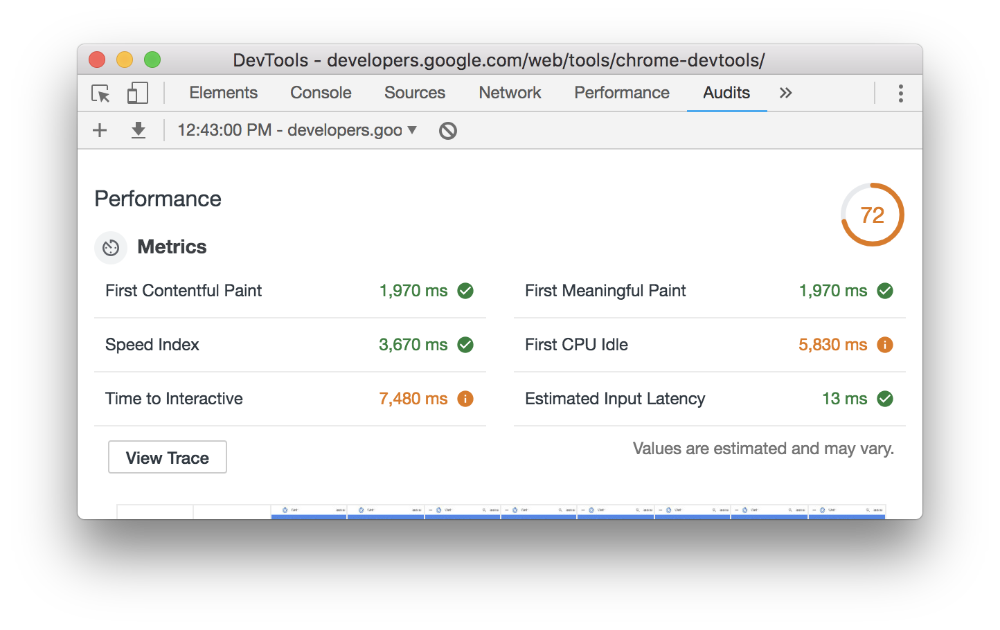
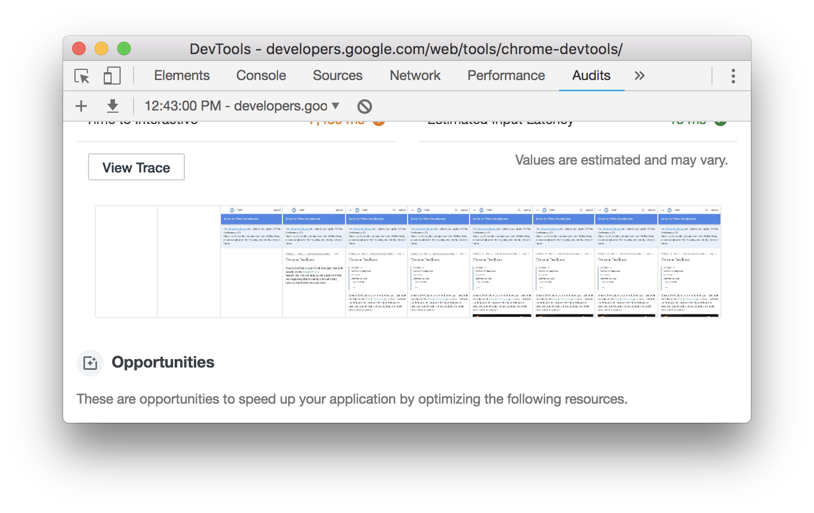
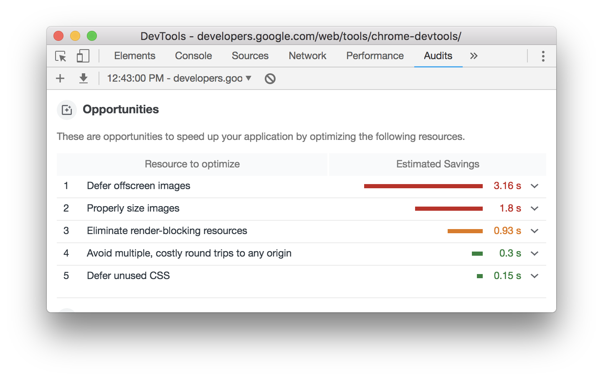
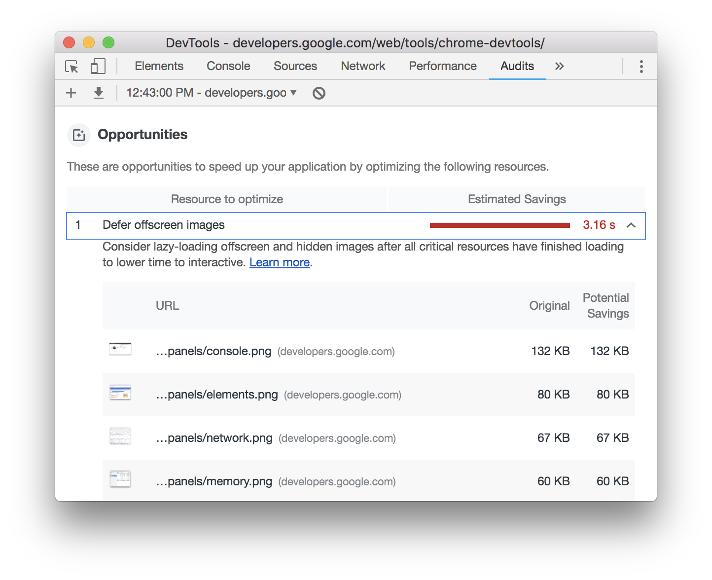

# Discover performance opportunities with Lighthouse

[Lighthouse](https://developers.google.com/web/tools/lighthouse/) is a tool that
helps you measure and find ways to improve a page's performance. Here's the
general workflow for how you use Lighthouse:

1. You tell Lighthouse what page to audit.
1. Lighthouse loads that page and records how long the page takes to hit
    various performance milestones. These milestones are called **metrics**.  
1. Lighthouse gives you a report on how the page did. The report provides a
    score for each metric and a list of **opportunities** which, if you implement
    them, should make the page load faster.

Your mission is to improve your metrics scores over time, or at least make sure
that they don't get worse. There's no way to work on metrics directly, though.
Instead, you follow the opportunities that Lighthouse provides. Working on those
opportunities tends to improve your metrics scores.

## Run Lighthouse from your profile page

Run Lighthouse from your [web.dev profile](./profile.md) page:

1. Provide any URL, and Lighthouse runs a series of audits generating a report of how well the page did.

1. Review the audits report to identify areas in which your page can be improved.

1. For each audit, you’ll find guidance and immediate steps you can take to improve your scores.

## Run Lighthouse from Chrome DevTools

Chrome DevTools is the set of web developer tools that are built directly into
the Google Chrome browser. You don't have to download anything to get DevTools.
If you have Chrome, then you have DevTools.

1. In Chrome, go to the page that you want to audit.
1. Press Control+Shift+J or Command+Option+J (Mac) to open DevTools.

Click the **Audits** tab. If you don't see this tab, click the &raquo; symbol
and then select **Audits** from the list. Lighthouse is the
engine that powers the **Audits** panel. That's why you see an image of a
lighthouse.

1. Make sure the **Mobile** radio button is selected. When Lighthouse
    audits your page, it will simulate a mobile device's viewport and user
    agent string.
1. Make sure the **Performance** checkbox is enabled. You can enable or
    disable the rest of the checkboxes in the **Audits** section. If you enable
    them, then you'll see a bunch of opportunities on ways to improve those
    other aspects of your page.
1. Make sure the **Simulated Fast 3G, 4x CPU Slowdown** radio button is
    selected. Lighthouse doesn't actually throttle your network or CPU while it
    loads the page. Instead, it looks at how long the page took to load under
    normal conditions, and then it estimates how long it would have taken on a
    fast 3G network with a CPU that is 4 times less powerful than your machine's.
1. Make sure that the **Clear Storage** checkbox is enabled. This option
    forces Lighthouse to go to the network for every page resource, which is
    how first-time visitors experience the page.
1. Click **Run Audits**. After 5 to 10 seconds, Lighthouse shows you a report.

You can set the configuration options to whatever makes the most sense for
your needs. If you don't understand them, the ones mentioned here are good
defaults. If you can get your page fast with these options, then your page will
be fast for everyone. The important thing is to stay consistent with the options
across audits.

For example, if you run some audits with **Simulated Fast 3G**, **4x CPU Slowdown
throttling enabled** and then other times you run audits with throttling
disabled, your metrics scores will be significantly lower when you have
throttling enabled. You might spend a lot of time trying to figure out why your
page is so much slower now, when in reality the only thing that changed was your
configuration.

### Understand your report

The top-right of your report lists your overall performance score. 100 is a
perfect score. Below the overall score are the metrics scores.
[Lighthouse v3 Scoring Guide](https://developers.google.com/web/tools/lighthouse/v3/scoring)
explains how each metric score contributes to the overall score.

Hover over a metric to learn more about it. Click **Learn more** to read
documentation about it.

Below your metrics scores you see screenshots of how the page looked while it
loaded.

Below the screenshots you see opportunities for improving the page's
performance.

Click an opportunity to learn more about it.

## Next steps

Try using Lighthouse to audit your page, either from your profile page or from Chrome DevTools. Implement one of the
opportunities, and then audit your page again to see how the change affected
your report. Your metrics scores should ideally be a little better, and
Lighthouse should no longer be flagging that opportunity as something to work
on.

Running Lighthouse yourself is great for spot-checking issues, but ultimately you'll want to setup continuous monitoring to make sure your site stays healthy. To get a daily Lighthouse report that highlights performance opportunities, add your site to the your [profile](../profile.html).
