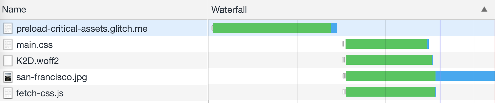
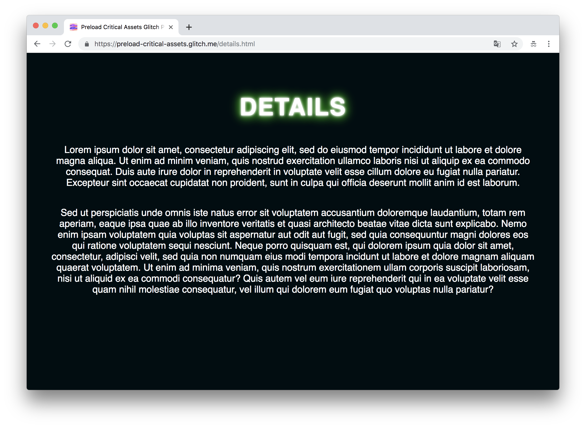
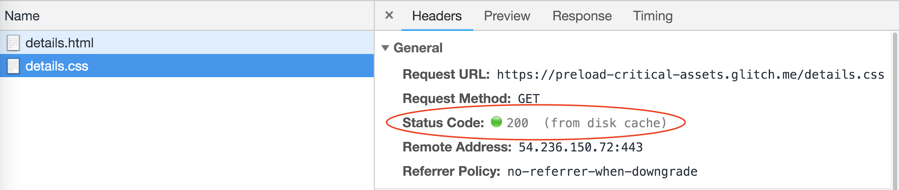
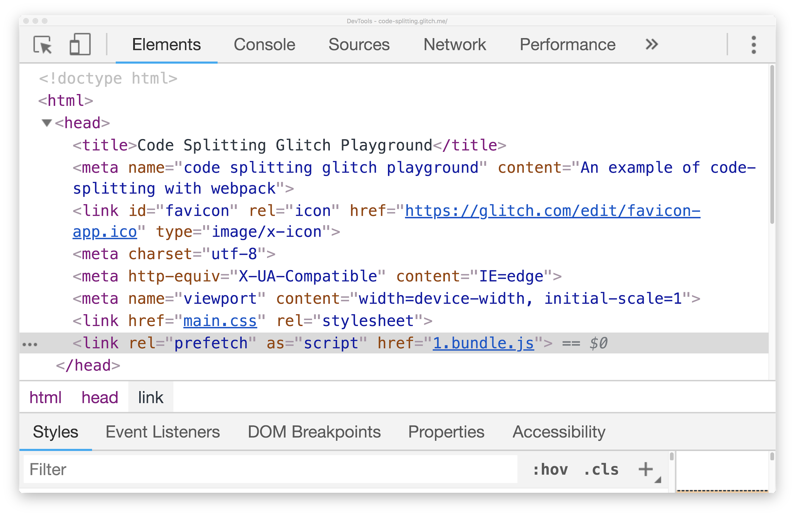
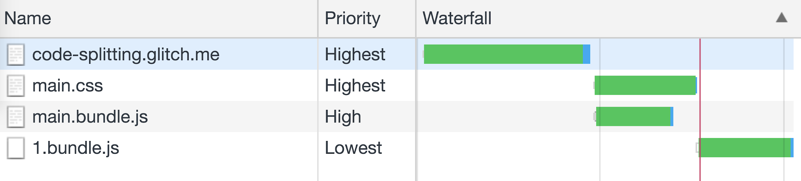

# Preload critical assets to improve loading speed

In this codelab, improve the performance of the following web page by preloading
and prefetching a few resources:

## Measure

First measure how the website performs before adding any optimizations (see also
Discover performance opportunities with Lighthouse):

1. Click on the Show Live button to boot up the app.

1. Open DevTools by pressing CMD + OPTION + i / CTRL + SHIFT + i.
1. Click on the **Audits** panel.
1. Select the **Performance** checkbox.
1. Click **Run Audits** to generate a report.

Lighthouse shows the following failed audit for a resource that is fetched
late:

Open the **Network** panel in DevTools and take a look at all the resources that
are fetched.

The main.css file is not fetched by using a Link element (<link>) in the HTML
document, but there is a separate JavaScript file, fetch-css.js, that attaches
the Link element to the DOM after the window.onLoad event. This means that this
file is only fetched after the browser finishes parsing and executing the JS
file.  Similarly, a web font (K2D.woff2) specified within main.css is only
fetched once the CSS file has finished downloading.

The **critical request chain** represents the order of resources that are
prioritized and fetched by the browser. For this web page, it currently looks
like this:

├─┬ **/** (initial HTML file)  
  └── **fetch-css.js**  
    └── **main.css**  
      └── **K2D.woff2**

Since the CSS file is on the third level of the request chain, Lighthouse has
identified it as a late-discovered resource. 

## Preload critical resources

The main.css file is a critical asset that's needed immediately as soon as the
page is loaded. For important files like this resource that are fetched late in
your application, use a link preload tag** **to inform the browser to download
it sooner. Add the Link element for this application at the head of the
document:

    <head>
     <!-- ... -->
     <link rel="preload" href="main.css" as="style">
    </head>

The as** **attribute is used to identify which type of resource is being
fetched, and as="style" is used to preload stylesheet files. 

Reload the application and take a look at the **Network** panel in DevTools.

Notice how the browser fetches the CSS file before the JavaScript file that is
responsible for fetching it has even been retrieved. With preload, the browser
knows to make a preemptive fetch for the resource with the assumption that it is
critical for the web page.

_Note: If this was a real production app, it would make more sense to just place
a <link> element in index.html to fetch the CSS file instead of using JavaScript
to append it. Browsers already know to fetch a CSS file defined at the head of
an HTML document with a high priority and as soon as possible. However, preload
is used in this codelab instead to show the best course of action for files that
are fetched late in the request chain (for a large application this can happen
quite often)._

If not used correctly, preload can harm performance by making unnecessary
requests for resources that aren't used. In this application, `details.css` is
another CSS file located at the root of the project but is used for a separate
/details route. To show an example of how preload can be used incorrectly, add a
preload hint for this resource as well.

    <head>
     <!-- ... -->
     <link rel="preload" href="main.css" as="style">
     <link rel="preload" href="details.css" as="style">
    </head>

When the application is loaded, a request is made to retrieve details.css even
though it is not being used within the web page. 

Chrome displays a warning in the **Console** panel when a preloaded resource is
not used by the page within a few seconds after it has loaded.

Use this warning as an indicator to identify if you have any preloaded resources
that are not being used immediately by your web page. You can now remove the
unnecessary preload link for this page.

    <head>
     <!-- ... -->
     <link rel="preload" href="main.css" as="style">
     <link rel="preload" href="details.css" as="style">
    </head>

Stylesheet files aren't the only type of asset that can be preloaded. In this
application, a web font (K2D) is defined using the
[@font-face](https://developers.google.com/web/fundamentals/performance/optimizing-content-efficiency/webfont-optimization#defining_a_font_family_with_font-face)
rule in main.css and is the last resource fetched by the browser. Since this
font file is used for the page header, add a preload tag to fetch it even
sooner.

    <head>
     <!-- ... -->
     <link rel="preload" href="main.css" as="style">
     <link rel="preload" href="fonts/K2D.woff2" as="font" crossorigin>
    </head>

For this resource, **font** is used as a value for the **as** attribute instead.

Reloading the application will show that the font is now fetched earlier.

For a list of all the types of resources that can be fetched along with the
correct values that should be used for this attribute, refer to the
[MDN article on Preloading](https://developer.mozilla.org/en-US/docs/Web/HTML/Preloading_content#What_types_of_content_can_be_preloaded).

## Prefetch future resources

Preload is a hint to tell the browser to load an important resource as soon as
possible for the current page. **Prefetch** is another browser hint that can be
used to make a request for an asset used for a different navigation route but at
a lower priority than other important assets needed for the current page.

In this website, clicking the image will take you to a separate `details/`
route.

A separate CSS file, `details.css`, contains all the styles needed for this
simple page. Add a link element to `index.html` to prefetch this resource.

    <head>
     <!-- ... -->
     <link rel="prefetch" href="details.css">
    </head>

To understand how this file is requested, open the **Network** panel in DevTools
and uncheck the **Disable cache **option.

Reload the application and notice how a very low priority request is made for
`details.css` after all the other files have been fetched.

Click the image to navigate to the details page. Since there is a link element
is used in `details.html` to fetch `details.css`, a request is made for the
resource as expected.

However, clicking the name of the resource within the Network panel to view its
details will show that `details.css` is retrieved from the browser's disk
cache.

By taking advantage of browser idle time, prefetch makes an early request for a
resource needed for a different page. This speeds up future navigation requests
by allowing the browser to cache the asset sooner and serve it from the cache
when needed.

## Preloading and prefetching with webpack

The
[code splitting guide](https://docs.google.com/document/d/1ZyxGwXstpWjP--u2J2ITbL0b4-dQy0t9ykkjjXV7Dqo/edit)
explored the use of dynamic imports to split a bundle into multiple chunks. To
refresh your memory, this was demonstrated with a simple example of an
application that dynamically imports a module from [Lodash](https://lodash.com/)
when a form is submitted.

Access the complete Glitch example
[here](https://glitch.com/edit/#!/code-splitting).

The following block of code, which lives in `src/index.js,` is responsible for
dynamically importing the method when the button is clicked.

    form.addEventListener("submit", e => {
     e.preventDefault()
     import('lodash.sortby')
       .then(module => module.default)
       .then(sortInput())
       .catch(err => { alert(err) });
    });

Using dynamic imports to split a bundle will improve page loading times by
reducing its size. Version 4.6.0 of webpack provides support to preload or
prefetch chunks that are imported dynamically. Using this application as an
example, the `lodash` method can be prefetched at browser idle time; when a user
presses the button, there is no delay for the resource to be fetched.

Use a **magic comment** with a dynamic import to prefetch a particular chunk.
Here is how it looks like with this particular application.

    form.addEventListener("submit", e => {
     e.preventDefault()
     import(/* webpackPrefetch: true */ 'lodash.sortby')
       .then(module => module.default)
       .then(sortInput())
       .catch(err => { alert(err) });
    });

Once the application is reloaded, webpack will inject a prefetch tag for the
resource into the head of the document. This can be seen in the **Elements**
panel in DevTools.

Observing the requests in the **Network** panel will show that this chunk is
fetched with a low priority after all other resources have been requested.

Just as it supports prefetching, webpack also provides support for preloading
chunks that are dynamically imported.

    import(/* webpackPreload: true */ 'module')
## Conclusion

    With this codelab, you should have a solid understanding of how preloading or prefetching certain assets can improve the user experience of your site. It is important to mention that these techniques should not be applied to all resources and using them incorrectly can harm performance. The best results will be noticed by only preloading or prefetching selectively. 

To summarize:

+  Use **preload** for resources that are discovered late but are
    critical to the current page.
+  Use **prefetch** for resources that will be needed for a future
    navigation route or user action.

Not all browsers currently support both preload and prefetch. This means that
not all users of your application may experience the performance improvements.

+  [Browser support - Preload](https://caniuse.com/#feat=link-rel-preload)
+  [Browser support - Prefetch](https://caniuse.com/#feat=link-rel-prefetch)

If you would like more information about specific aspects of how preloading and
prefetching can affect your web page, see these articles:

+  [Preload, Prefetch and Priorities in Chrome](https://medium.com/reloading/preload-prefetch-and-priorities-in-chrome-776165961bbf)
+  [<link rel="prefetch/preload"> in webpack](https://medium.com/webpack/link-rel-prefetch-preload-in-webpack-51a52358f84c)

> 
