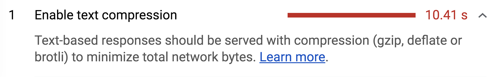

# Reduce network payloads using text compression

There are two useful techniques that can be used to improve the performance of
your web page:

+  Minification
+  Data compression

Incorporating both of these techniques will reduce payload sizes and in turn
improve page load times.

## Measure

Lighthouse displays a failed audit if it detects any CSS or JS resources on your
page that can be minified.

Lighthouse: Minify CSS and JavaScript audits

It also audits for any uncompressed assets.

Lighthouse: Enable text compression

## Minification

**Minification** is the process of removing whitespace and any code that is not
necessary to create a smaller but perfectly valid code file.
[UglifyJS](https://github.com/mishoo/UglifyJS2) is a popular JavaScript
minification tool and [webpack](https://webpack.js.org/) v4 includes a plugin
for this library by default to create minified build files.

+  If you're using webpack v4 or greater, you should be good to go
    without doing any additional work. 👍
+  If you are using an older version of webpack, install and include
    `UglifyjsWebpackPlugin` into your webpack configuration settings. Follow
    the
    [documentation](https://webpack.js.org/plugins/uglifyjs-webpack-plugin/) to
    learn how. 
+  If you are not using a module bundler, use `UglifyJS` as a CLI tool or
    include it directly as a dependency to your application. The project
    [documentation](https://github.com/mishoo/UglifyJS2) provides instructions.

## Data compression

**Compression** is the process of modifying data using a compression algorithm.
[Gzip](https://www.youtube.com/watch?v=whGwm0Lky2s&feature=youtu.be&t=14m11s) is
the most widely used compression format for server and client interactions.
[Brotli](https://opensource.googleblog.com/2015/09/introducing-brotli-new-compression.html)
is a newer compression algorithm which can provide even better compression
results than Gzip.

---

**Note:** Compressing files can significantly improve the performance of a
webpage, but you may very rarely need to do this yourself. Many hosting
platforms, CDNs and reverse proxy servers either encode assets with compression
by default or allow you to easily configure them. Read the documentation for the
tool that you are using to see if compression is already supported before
attempting to roll out your own solution.

---

There are two different ways to compress files sent to a browser:

+  Dynamically
+  Statically

Both approaches have their own advantages and disadvantages which is covered in
the next section. Use whichever works best for your application.

## Dynamic compression 

This process involves compressing assets on-the-fly as they get requested by the
browser. This can be simpler than compressing files manually or with a build
process, but can cause delays if high compression levels are used.

[Express](https://expressjs.com/) is a popular web framework for Node and
provides a [compression](https://github.com/expressjs/compression) middleware
library. Use it to compress any asset as it gets requested. Here is an example
of an entire server file that uses it correctly:

    var express = require('express');
    var compression = require('compression');

    var app = express();

    app.use(compression());

    app.use(express.static('public'));

    var listener = app.listen(process.env.PORT, function() {
     console.log('Your app is listening on port ' + listener.address().port);
    });

This will compress your assets using gzip. If your web server supports it,
consider using a separate module like
`[shrink-ray](https://github.com/aickin/shrink-ray#readme)` to compress via
Brotli to achieve better compression ratios.

## Static compression

Static compression  involves compressing and saving assets ahead of time. This
can make the build process take longer, especially if high compression levels
are used, but ensures that no delays happen when the browser fetches the
compressed resource.

If you web server supports Brotli, use a plugin like
[BrotliWebpackPlugin](https://github.com/mynameiswhm/brotli-webpack-plugin) with
webpack to compress your assets as part of your build step. Otherwise, use
[CompressionPlugin](https://github.com/webpack-contrib/compression-webpack-plugin)
to compress your assets with gzip. It can be included just like any other plugin
in the webpack configurations file:

    module.exports = {
     //...
     plugins: [
       //...
       new CompressionPlugin()
     ]
    }

Once compressed files are part of the build folder, create a route in your
server to handle all JS endpoints to serve the compressed files. Here is an
example of how this can be done with Node and Express for gzipped assets.

    var express = require('express');
    var app = express();

    app.get('*.js', (req, res, next) => {
     req.url = req.url + '.gz';
     res.set('Content-Encoding', 'gzip');
     next();
    });

app.use(express.static('public'));

## Next Steps

For more details and to see how compression works with a real-life application,
refer to the associated [codelab](https://example.com) for this guide.
