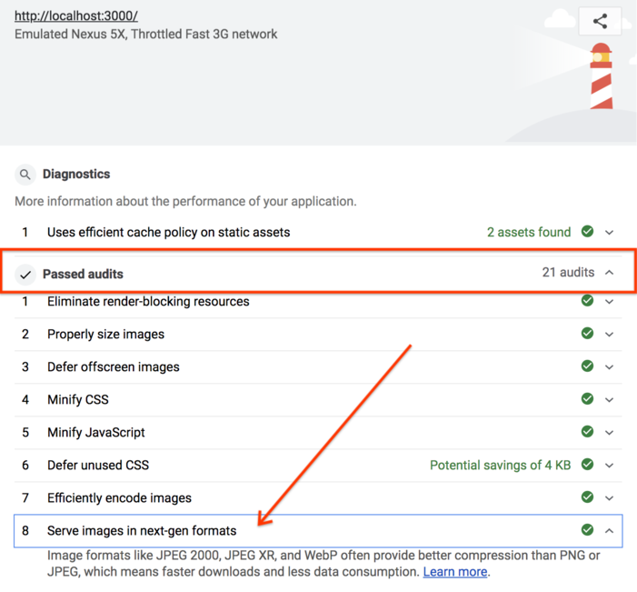

# Creating WebP Images with the Command Line

The webp <a href="https://developers.google.com/speed/webp/docs/precompiled" target="_blank">command line tool</a> has already been installed for you, so you're all set to get started. This tool converts JPG, PNG, and TIFF images to WebP.

## 1. Convert images to WebP

---
1. Click the "Edit" button.


2.  Click the "Status" button.


3.  Then click the "Console" button.


4. Type the following command:

```shell
cwebp -q 50 images/flower1.jpg -o images/flower1.webp
```

This command converts, at a quality of `50` (`0` is the worst; `100` is the best), the `images/flower1.jpg` file and saves it as `images/flower1.webp`.

<div class="aside note">
Are you wondering why you type `cwebp` instead of `webp`? WebP has two separate commands for encoding and decoding WebP images. `cwebp` encodes images to WebP, while `dwebp` decodes images from WebP.
</div>

After doing this, you should see something like this in the console:

```shell
Saving file 'images/flower1.webp'
File:      images/flower1.jpg
Dimension: 504 x 378
Output:    29538 bytes Y-U-V-All-PSNR 34.57 36.57 36.12   35.09 dB
           (1.24 bpp)
block count:  intra4:        750  (97.66%)
              intra16:        18  (2.34%)
              skipped:         0  (0.00%)
bytes used:  header:            116  (0.4%)
             mode-partition:   4014  (13.6%)
 Residuals bytes  |segment 1|segment 2|segment 3|segment 4|  total
    macroblocks:  |      22%|      26%|      36%|      17%|     768
      quantizer:  |      52 |      42 |      33 |      24 |
   filter level:  |      16 |       9 |       6 |      26 |
```

You've just successfully converted the image to WebP.

However, running the `cwebp` command one image at a time like this would take a long time to convert many images. If you need to do this, you can use a script instead.

- Run this script in the console (don't forget the backticks):

```shell
`for file in images/*; do cwebp -q 50 "$file" -o "${file%.*}.webp"; done`
```

This script converts, at a quality of `50`, all the files in the `images/` directory, and saves them as a new file (same filename, but with a `.webp` file extension) in the same directory.

### ✔︎ Check-in

You should now have 6 files in your `images/` directory:

```shell
flower1.jpg
flower1.webp
flower2.jpg
flower2.webp
flower3.png
flower3.webp
```

Next, update this Glitch to serve WebP images to browsers that support it.

## 2. Add WebP images using the `<picture>` tag

The `<picture>` tag allows you to serve WebP to newer browsers while maintaining support for older browsers.

---
1.  In `index.html` replace `` with the following HTML:

```html
<picture>
  <source type="image/webp" srcset="images/flower1.webp">
  <source type="image/jpeg" srcset="images/flower1.jpg">
  
</picture>
```

2. Next, replace the `` tags for `flower2.jpg` and `flower3.png` with `<picture>` tags:

### ✔︎ Check-in

Once completed, the `<picture>` tags in `index.html` should look like this:

```html
<picture>
  <source type="image/webp" srcset="images/flower1.webp">
  <source type="image/jpeg" srcset="images/flower1.jpg">
  
</picture>
<picture>
  <source type="image/webp" srcset="images/flower2.webp">
  <source type="image/jpeg" srcset="images/flower2.jpg">
  
</picture>
<picture>
  <source type="image/webp" srcset="images/flower3.webp">
  <source type="image/png" srcset="images/flower3.png">
  
</picture>
```

Next, use Lighthouse to verify you've correctly implemented WebP images on the site.

## 3. Verify WebP usage with Lighthouse

Lighthouse's "Serve images in next-gen formats" performance audit can let you know if all the images on your site are using next-gen formats like WebP.

- Click on the "Show Live" button to view the live version of the your Glitch.

- Run the Lighthouse performance audit (Lighthouse > Options > Performance) on the live version of your Glitch and verify that the "Serve images in next-gen formats" audit was passed.



Success! You are now serving WebP images on your site.
