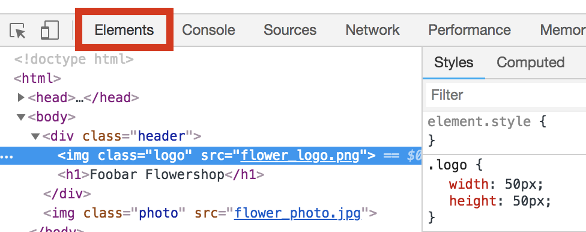
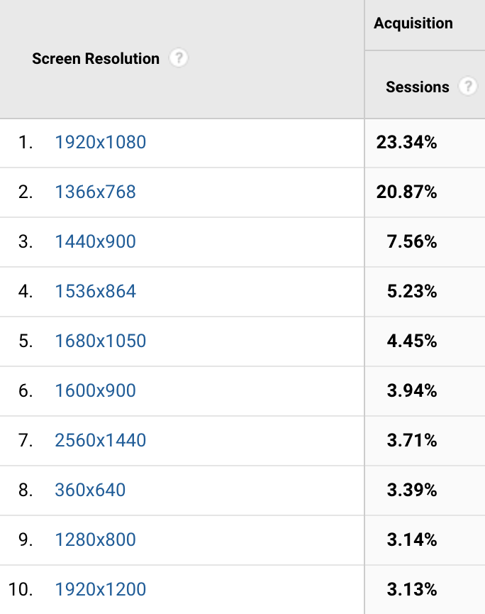

## 1. Run Lighthouse

This Glitch is small enough that its images could be inspected by hand. However for
most websites, using a tool like Lighthouse to automate this is essential.

- Click on the "Show Live" button to view the live version of this Glitch.

- Run the Lighthouse performance audit (Lighthouse > Options > Performance) and
look for the results of the "Properly Size Images" audit.

The Lighthouse audit shows that both of this page's images need to be resized.

## 2. Fix flower_logo.png

Let's start at the top of the page and fix the logo image.

- Inspect `flower_logo.png` in the DevTools Elements panel.

This is the CSS for `flower_logo.png`:

    .logo {
        width: 50px;
        height: 50px;
    }

The CSS width of this image is 50 pixels, so `flower_logo.png` should be resized
to match.

- Use [ImageMagick](https://www.imagemagick.org) to resize the image to 50x50.
(ImageMagick is a CLI tool for image editing.)

$ `convert flower_logo.png -resize 50x50 flower_logo.png`

## 3. Fix flower_photo.jpg

Next, let's fix the photo on this page.

1. Inspect `flower_photo.jpg` in the DevTools elements panel.

This is the CSS for `flower_photo.jpg`:

    .photo {
        width: 50vw;
        margin: 30px auto;
        border: 1px solid black;
    }

`50vw` sets the CSS width of `flower_photo.jpg` to "half the width of
the browser."  
([1vw](https://developer.mozilla.org/en-US/docs/Learn/CSS/Introduction_to_CSS/Values_and_units)
is equal to 1% the width of the browser).

The ideal size for this image would depend on the device it is being viewed on,
so you should resize it to a size that works well for most of your users. You
can check your analytics data to learn which screen resolutions are common
amongst your users:

This data indicates that 95%+ of the visitors to this site use screen resolutions
1920 pixels wide or less.

Using this information we can calculate how wide the image should be:  
(1920 pixels wide) * (50% of browser width) = 960 pixels

On resolutions greater than 1920 pixels wide, the image will be stretched to
cover the area. The resized image is still fairly large, so the effects of this
should not be very noticeable.

1. Use [ImageMagick](https://www.imagemagick.org) to resize the image to 960
pixels wide.

$ `convert flower_photo.jpg -resize 960x flower_photo.jpg`

(Note: `960x` is not a typo - it specifies a width, but not a height. The image
height will be scaled in proportion to the width. This is a handy trick for when
you only care about an image's dimensions in one direction.)

## 4. Re-Run Lighthouse

1. Re-run the Lighthouse Performance audit to verify that you have successfully
re-sized the images.

… And it fails! Why is that?

Lighthouse runs its tests on a Nexus 5x. The Nexus 5x has a 1080 x 1920 screen.
For the Nexus 5x, the optimal size of `flower_photo.jpg` would be 460 pixels
wide (1080 pixels * . 5). This is much smaller than our resized image.

Should you resize the image to be even smaller? Probably. However, the answer to
this isn't always clear-cut. 

The trade-off here is between image quality on high-resolution devices and
performance. It's easy to overestimate how closely users will be inspecting
images (and therefore you should probably make them smaller) - but there are
certainly use cases where image quality is more important.

The good news is that you can bypass this tradeoff altogether by using
responsive images to serve multiple images sizes. You can learn more about this
in the [Responsive Images guide](/path/fast/serve-responsive-image).
