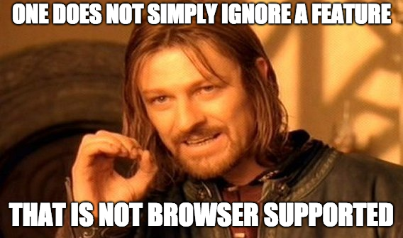

# Serve modern code to modern browsers for faster page loads

Building websites that work well on all major browsers is a core tenet of an
open web ecosystem. However, this means additional work of ensuring that all of
the code you write is supported in each browser that you plan to target. If you
want to use new JavaScript language features, you will need to transpile these
features to backwards-compatible formats for browsers that do not yet support
them.

[Babel](https://babeljs.io/docs/en) is the most widely used tool to compile code
that contains newer syntax into code that different browsers and environments
(such as Node) can understand. This guide assumes you are using Babel, so you
will need to follow the [setup instructions](https://babeljs.io/setup) to
include it into your application if you haven't already.

To use Babel to only transpile what is required byneeded for your users, you
will need to:

1. Identify which browsers you want to target.
1. Use @babel/preset-env with appropriate browser targets.
1. Use `
    

If you use a module bundler like [webpack](https://webpack.js.org/), you can set
different targets in your configurations for two separate versions of your
application:

+  A version that works in would work in newer browsers that support
    modules and whichthat includes a module that is largely untranspiled but
    has a smaller file size
+  A version that includes a larger, compiled script that would work in any
    legacy browser

Philip Walton explains this in further detail in his article,
[Deploying ES2015+ Code in Production Today](https://philipwalton.com/articles/deploying-es2015-code-in-production-today/).

## Next Steps

Now that you have a better understanding of how Babel can be used to only
compile code for browsers that you are targeting, head on over to the associated
[codelab](https://docs.google.com/document/d/1mg1SZj5HFKhaAzQfsuMfw3pTA7nH8F4qyMxf3dfqJ_g/edit#heading=h.owjpdw50s587)
for this guide to see all of this in practice with a real example.
