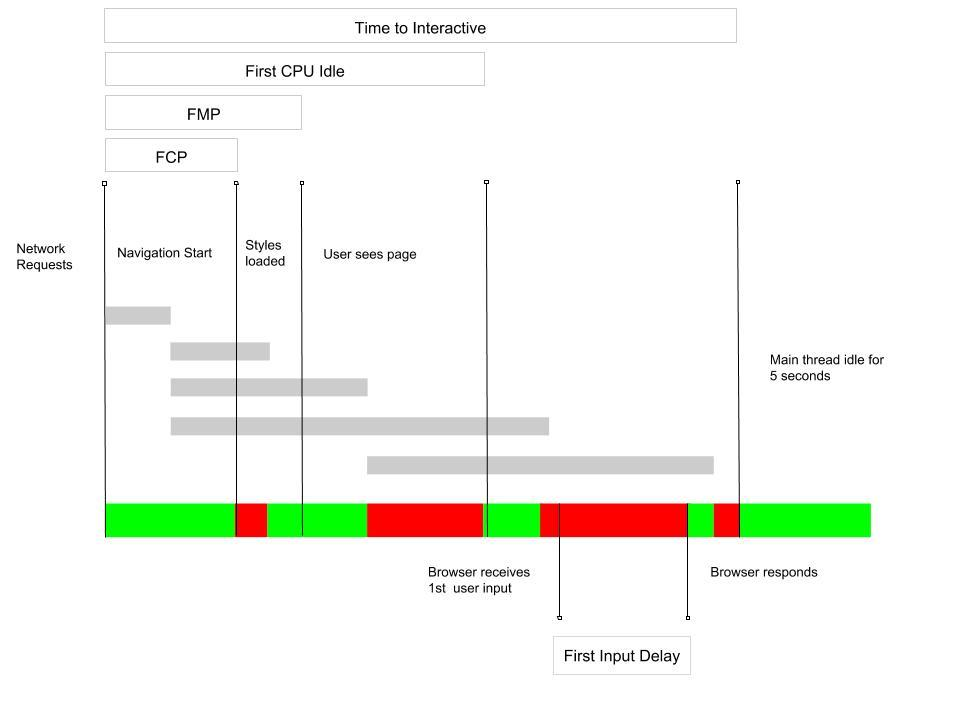

# Understand key performance metrics

Performance has a complicated reputation. Most developers agree it's important
but also challenging. There needs to be a balance between the work put into it
and the rewards for doing so.

What performance truly comes down to is how your users perceive speed when they
interact with your site. Can they see content quickly? When they click a button,
do they grow frustrated waiting for the browser to respond?

Take a look at the following image. It's a visual representation of the time it
takes for a user to see content and interact with your page. Each key
performance metric marks a different stage in page load and user interaction:

_Image greatly ‘inspired' by Philip Walton's
[First Input Delay](https://developers.google.com/web/updates/2018/05/first-input-delay)_.  
As you learn about each metric individually, remember they share one common
goal: users can see your content and interact with it as fast as possible.

## First Contentful Paint (FCP)

The first key metric after a user requests to navigate to the page is First
Contentful Paint (FCP). FCP marks the point, immediately after navigation, when
the browser renders the first bit of content from the DOM. This is an important
milestone for users because it provides feedback that the page is actually
loading.

## First Meaningful Paint (FMP)

First Meaningful Paint (FMP) identifies the time at which the user feels that
the primary content of the page is visible:

+  Main page layout complete.
+  Web fonts loaded.

## Speed Index

Speed Index is a metric that shows how quickly the contents of a page are
visibly populated. The lower the score, the better. It's similar to First
Meaningful Paint, as it pertains to visibility of content on a page, but
measured in a different way (see
[Speed Index](https://sites.google.com/a/webpagetest.org/docs/using-webpagetest/metrics/speed-index)).

## First CPU Idle

First CPU Idle is the first opportunity after the user sees the page for them to
be able to minimally interact:

+  _Most_, but maybe not all, UI elements on the screen are interactive.
+  The page responds, _on average_, to most user input in a reasonable
    amount of time.

Code may still be downloading, so that interaction isn't necessarily instant,
but they can at least start to engage. 

## Time to Interactive (TTI)

Time to Interactive measures when the browser's main thread has been idle for
more than 5 seconds and is capable of responding quickly to user input.
"Interactive" is defined as the point where:

+  The page has displayed useful content, measured with First Contentful
    Paint.
+  Event handlers are registered for most visible page elements.
+  The main thread is idle for at least 5 seconds. 

## First Input Delay (FID)

First Input Delay (FID) measures the time from when a user first interacts with
your site to the time when the browser is actually able to respond to that
interaction. If the main thread is busy, the user is forced to wait, and that
wait time is known as FID.

## Different ways to measure

One key distinction that you should be aware of is the difference between
measuring in a simulated environment, the lab, versus measuring real users in
the field. Measuring in the lab is an important part of your developer workflow.
Measuring in the field is about measuring your site's performance with real
users. 

### Measuring in the lab

Tools like Lighthouse and webpagetest.org simulate performance. They are easy to
use. Put in your URL, run the tests, and the reports call out clearly where your
problem spots are. Lighthouse reports on all key metrics described in this
guide. Learn more at Discover performance opportunities with Lighthouse.

### Measuring in the field

One way of testing your site in the field is to generate a Chrome Experience
Report. The Chrome Experience Report captures use experience metrics for how
real-world Chrome users experience sites on the web. Learn more at _Use Chrome
UX report to look at performance in the field_.

### Measuring real users in real time

There's no substitute for testing your site's performance as users interact with
your site in real time. Many of these key performance metrics can be tracked in
real time through JavaScript APIs and using Google Analytics. Learn more at
_Measure page load times using Real User Monitoring (RUM) & User Timing_.

## Optimize your content & code

To make your site faster, you need to optimize your content and your code:

+  Minimize the resources that must download or execute before the page
    can load.
+  Minimize the size of each resource. 
+  Cache static resources for repeat visits.

The remainder of this Fast learning path shows you in simple to follow steps how
to optimize your images, JavaScript, and fonts. The Reliable learning path shows
you how to limit the dependency on the network. Keep working through the
tutorials, re-test along the way, and see these key metrics improve. 
