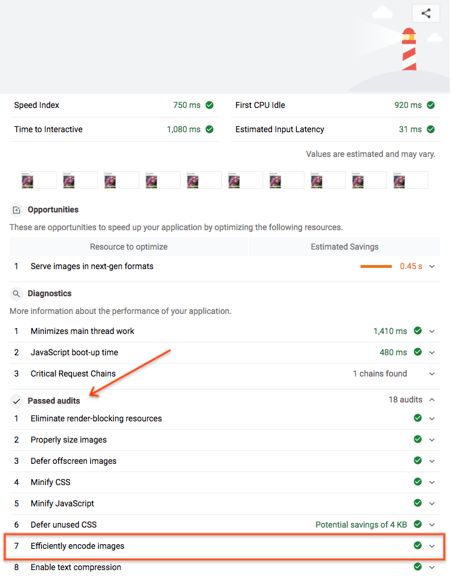

The Imagemin <a href="https://github.com/imagemin/imagemin-cli" target="_blank">CLI</a> allows you to use Imagemin from the command line to compress your images.

(Don't like the command line? There's also a desktop <a href="https://github.com/imagemin/imagemin-app" target="_blank">app</a> for OS X, Linux, and Mac.)

## Try it out

---

## 1. Install Imagemin

☞ Click the "Logs" button.


☞ Then, click the "Console" button.


☞ Lastly, type these commands:

```shell
$ enable-npm
$ npm install --save-dev imagemin-cli
```

You've now installed the Imagemin CLI.

## 2. Compress images

```shell
$ imagemin images/* --out-dir=images
```

This command compresses the images in the `/images` directory and saves them to same directory (i.e. it overwrites the original files).

## 3. Verify results with Lighthouse

Lighthouse's "Efficiently encode images" performance audit can let you know if the JPG images on your page are optimally compressed.

Click on the "Show Live" button to view the live version of the your Glitch.


Run the Lighthouse performance audit (Lighthouse > Options > Performance) on the live version of your Glitch and verify that the "Efficiently encode images" audit was passed.



Success! You have used the Imagemin CLI to compress the images on the page.

---

## Extra Credit

Want to learn more about using the Imagemin CLI? You can run `$imagemin --help` to see other ways of using the CLI.

## 3. Run Grunt

---

☞ Run Grunt to compress your images:

```shell
$ grunt
```

When Grunt completes you should see a message like this in the terminal:

```shell
Minified 6 images (saved 80.2 kB - 8%)
```

A 8% improvement in file size is better than nothing - however, we can improve upon this by using different compression settings. Let's customize our Imagemin configuration to yield bigger file size savings.