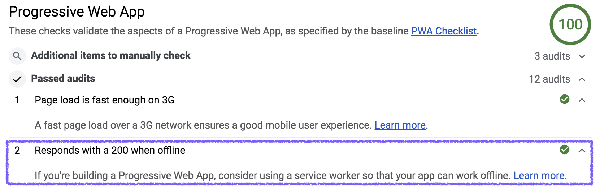

# What is network reliability and how do you measure it?

The modern web is enjoyed by a wide swath of people, using a range of different
devices and types of network connections. Your creations can reach users all
across the world, but delivering a _reliable_ experience on the web for all of
your users can be challenging. It can be a challenge just understand what
reliability means.

## Reliable while offline

One way of thinking about reliability is whether your web app will work without
a network connection. This is a type of reliability that users take for granted
with "native apps," installed on a mobile device from an app store. When you see
an icon for a native app, you expect to be able to tap on it and open up some
sort of experience, regardless of whether you're currently connected to the
Internet.

Until recently, it's been a challenge to build web applications that are
reliable without a network connection.

## Reliably fast

Another way of thinking about reliability is whether your users can rely on your
web app loading at a fast enough speed when they have a network connection that
might be less than ideal. Will returning users have the same experience
interacting with your web app when they're on a cellular connection as they do
when they're on wi-fi? And what about users who have a high-latency, or
"[lie-fi](https://developers.google.com/web/fundamentals/performance/poor-connectivity/#lie-fi)"
connection—will your web app be reliably fast even in those scenarios?

It's not enough to  be fast under the best circumstances. Your users will view
your web app's performance through the lens of how it behaves in all network
conditions.

## Reliabile is achievable

The good news is that the modern web platform provides technologies—like
[service workers](https://developer.mozilla.org/en-US/docs/Web/API/Service_Worker_API),
and the
[Cache Storage API](https://developer.mozilla.org/en-US/docs/Web/API/CacheStorage)—that
can serve as the building blocks for creating reliable web applications. They
allow you to write code which sits in between your web app and the network. In
many cases, you can bypass the network entirely, and instead use previously
cached content to fulfill your web app's requests. 

## Your guiding light: "Responds with a 200 OK while offline"

Once you start building out a service worker and serving content from caches,
it's hard to know if you're doing it effectively. How do you know that the
service worker you implement really does help your web app avoid the network?
How do you prevent a small change to your caching strategy from breaking your
carefully crafted offline experience?

[Lighthouse](https://developers.google.com/web/tools/lighthouse/) provides one
specific test that is of particular interest when building a reliable web app:
"[Responds with a 200 OK while offline](https://developers.google.com/web/tools/lighthouse/audits/http-200-when-offline)":

**Note:** The actual interface may differ depending on which version of Lighthouse
you're running.

What's actually being tested here? It boils down to simulating a loss of network
connectivity within your browser, followed by an attempt to load whichever URL
on your site is being audited. This tests one aspect of building a reliable
site—being _reliable while offline_—using a controlled, repeatable sequence of
actions.

## It's a journey

If you're just starting out, then there's a very good chance that you'll get
back a negative result for the "Responds with a 200 while offline" check. That's
okay!  Unless you're using a customized starter project, web applications don't
have that type of reliability by default. The next few guides will introduce the
techniques you need to identify what your web app is loading, and teach you how
to use the tools to make that loading experience reliable.

Throughout that process, you're encouraged to keep re-running the Lighthouse
audits. They serve as a guiding light throughout your journey towardsfrom
starting with a new web application, and ending with a reliable progressive web
app.
