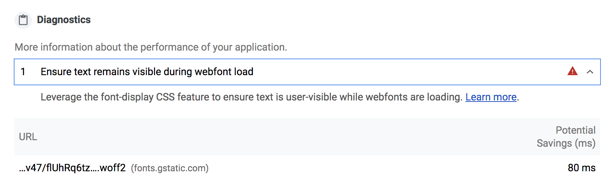

# Ensure text remains visible during webfont loads

Fonts are often large files that take awhile to load.
Some browsers hide text until the font loads causing the "flash of invisible text".
Lighthouse specifically checks that you've included `font-fact: swap` in your `@font-face` styles
and reports in the Diagnostics section any font URLs missing this attribute: 

## Easist way to avoid showing invisible text

The easiest way to avoid showing invisible text while custom fonts load,
is to show a system font while waiting.
By including `font-display: swap` in your `@font-face` style,
you can fix this problem in most modern browsers.

The [font-display API](https://developer.mozilla.org/en-US/docs/Web/CSS/@font-face/font-display)
specifies the font display strategy. 
`swap` tells the browser that text using this font should be displayed immediately using a system font.
Once the custom font is ready, the system font is swapped out (see [Avoid invisible text during loading](/fast/avoid-invisible-text)).

        @font-face {
            font-family: 'Pacifico';
            font-style: normal;
            font-weight: 400;
            src: local('Pacifico Regular'), local('Pacifico-Regular'), url(https://fonts.gstatic.com/s/pacifico/v12/FwZY7-Qmy14u9lezJ-6H6MmBp0u-.woff2) format('woff2');
            font-display: swap;
        }

## Browser support

It's worth mentiong that not all major browsers support `font-display: swap`,
so you may need to do a bit more work to fix the invisible text problem.
Follow the [Avoid flast of invisible text codelab](/fast/avoid-invisible-text/codelab-avoid-invisible-text)
to learn how to avoid this invisible text across all browsers.

## More information

* [Controlling font performance with font displays](https://developers.google.com/web/updates/2016/02/font-display)