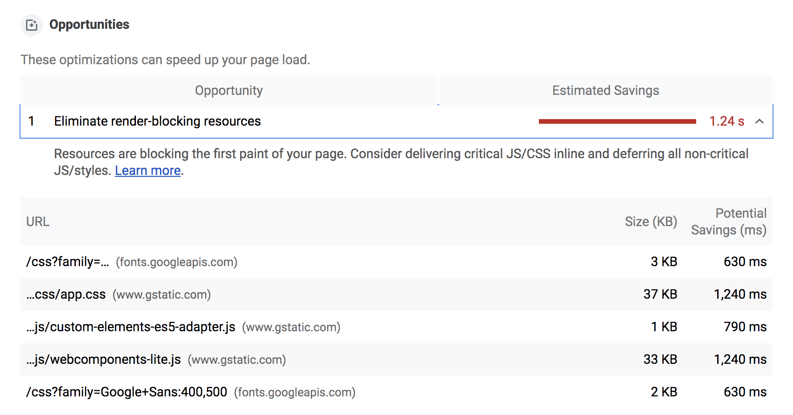
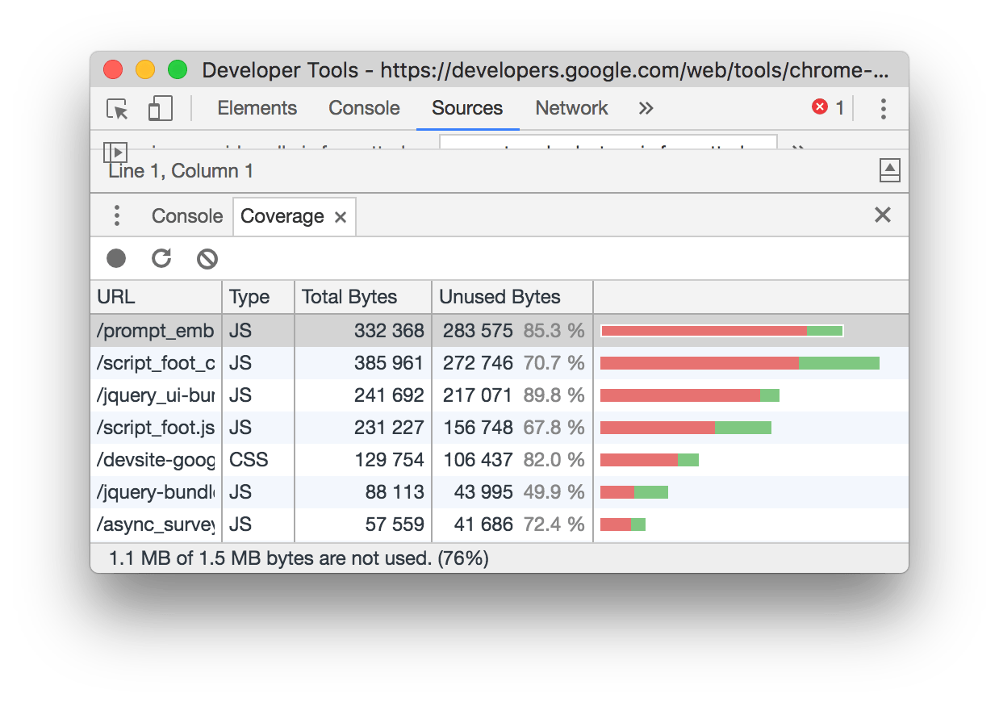

# Eliminate render-blocking resources

The Opportunities section of your Lighthouse report lists all URLs
blocking the first paint of your page.
The goal is to reduce the impact of these render-blocking URLs
by inlining critical resources, deferring non-critical resources,
and removing anything unused.

## Which URLs get flagged as render-blocking resources?

Lighthouse flags three types of render-blocking URLs: scripts, stylesheets, and HTML
imports.

A `<script>` tag that:

* Is in the `<head>` of the document.
* Does not have a `defer` attribute.
* Does not have an `async` attribute.

A `<link rel="stylesheet">` tag that:

* Does not have a `disabled` attribute. When this attribute is present,
  the browser does not download the stylesheet.
* Does not have a `media` attribute that matches the user's device.

A `<link rel="import">` tag that:

* Does not have an `async` attribute.

## How to identify critical resources

The first step to reducing the impact of render-blocking resources,
is to identify what's critical, and what's not.
Use the [Coverage tab](https://developers.google.com/web/updates/2017/04/devtools-release-notes#coverage)
in Chrome DevTools to identify non-critical CSS and JS.
When you load or run a page, the tab tells you how much code was used,
versus how much was loaded:

You can reduce the size of your pages by only shipping the code and styles
that you need. Click on a URL to inspect that file in the Sources panel.
Styles in CSS files and code in JavaScript files are marked in two colors:

* **Green (critical):** Styles that are required for first paint; code that's critical to the page's core functionality.
* **Red (non-critical):** Styles that apply to content not immediately visible; code not being used in page's core functionality.

## How to eliminate render-blocking scripts

Once you've identified critical code,
move that code from the render-blocking URL to an inline `script` tag in your HTML page.
When the page loads, it will have what it needs to handle the page's core functionality.

If there's code in a render-blocking URL that's not critical,
you can keep it in the URL,
and then mark the URL with `async` or `defer` attributes
(see also [Adding Interactivity with JavaScript](https://developers.google.com/web/fundamentals/performance/critical-rendering-path/adding-interactivity-with-javascript)).

Code that isn't being used at all should be removed (see [Remove unused code](/fast/remove-unused-code)).

## How to eliminate render-blocking stylesheets

Similar to inlining code in a `<script>` tag,
inline critical styles required for the first paint
inside a `<style>` block at the `head` of the HTML page.
Then load the rest of the styles asynchronously using the `preload` link
(see [Defer unused CSS](/fast/defer-non-critical-css)).

Consider automating the process of extracting and inlining "Above the Fold" CSS
using the [Critical tool](https://github.com/addyosmani/critical/blob/master/README.md).

Another approach to eliminating render-blocking styles is
to split up those styles into different files, organized by media query.
Then add a media attribute to each stylesheet link.
When loading a page,
the browser only blocks the first paint to retrieve the stylesheets that match the user's device
(see [Render-Blocking CSS](https://developers.google.com/web/fundamentals/performance/critical-rendering-path/render-blocking-css)).

## How to eliminate render-blocking imports

For non-critical HTML imports, mark them with the `async` attribute. As a
general rule, `async` should be used with HTML imports as much as possible.

`<link rel="import" href="myfile.html" async>`

## More information

* [Reduce JavaScript payloads with codesplitting](fast/reduce-javascript-payloads-with-code-splitting)
* [Remove unused code codelab](/fast/remove-unused-code/codelab-remove-unused-code)

* [JavaScript Start-up Optimization](https://developers.google.com/web/fundamentals/performance/optimizing-content-efficiency/javascript-startup-optimization/)

