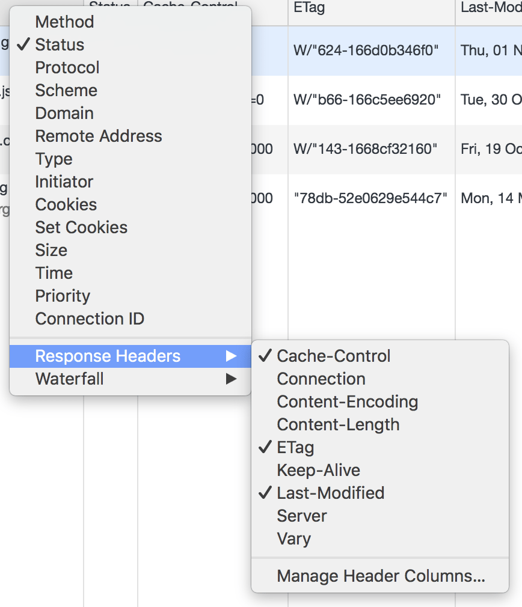

This codelab shows you how to change the HTTP caching headers returned by a
Node.js-based web server, running the [Express](https://expressjs.com/) serving
framework. It will also show how to confirm that the caching behavior you expect
is actually being applied, using the Network panel in Chrome's DevTools.

<div class="aside note">
While the specific instructions are tailored towards Express, the general
principles about choosing the correct caching headers apply to any web server
environment.
</div>

## Get familiar with the sample project

These are the key files you will be working with in the sample project:

+  `server.js` contains the Node.js code that serves the web app's
    content. It uses [Express](https://expressjs.com/) to handle HTTP requests
    and responses. In particular, `express.static()` is used to serve all of
    the local files in the public directory, so the `serve-static`
    [documentation](https://expressjs.com/en/resources/middleware/serve-static.html)
    will come in handy.
+  `public/index.html` is the web app's HTML. Like most HTML files, it does not
    contain any versioning information as part of its URL.
+  `public/app.15261a07.js` and `public/style.391484cf.css` are the web app's JavaScript
    and CSS assets. These files each contain a hash in their URLs,
    corresponding to their contents. The `index.html` is responsible for keeping
    track of which specific versioned URL to load.

<div class="aside note">
In the "real world", the process of assigning hashes and updating HTML
files to include references to the latest versioned URL would be handled by a
build tool, like 
<a href="https://webpack.js.org/guides/caching/#output-filenames">webpack</a>. 
For the purposes of this codelab, assume that the hashes were generated as part of a
build process that already took place.
</div>

## Configure caching headers for our HTML

When responding to requests for URLs that don't contain versioning info, make
sure you add `Cache-Control: no-cache` to your response messages. Along with
that, setting one of two additional response headers is recommended: either
[`Last-Modified`](https://developer.mozilla.org/en-US/docs/Web/HTTP/Headers/Last-Modified)
or [`ETag`](https://developer.mozilla.org/en-US/docs/Web/HTTP/Headers/ETag). The
`index.html` falls into this category. You can break this down into two steps.

First, the `Last-Modified` and `ETag` headers are controlled by the
[`etag`](https://expressjs.com/en/resources/middleware/serve-static.html#etag)
and
[`lastModified`](https://expressjs.com/en/resources/middleware/serve-static.html#lastmodified)
configuration options. Both of these options actually default to `true` for all
HTTP responses, so in this current setup, you don't _have_ to opt-in to get that
behavior. But you can be explicit in your configuration anyway.

Second, you need to be able to add in the `Cache-Control: no-cache` header, but
only for your HTML documents (`index.html`, in this case). The easiest way to
conditionally set this header is to write a custom
[`setHeaders function`](https://expressjs.com/en/resources/middleware/serve-static.html#setheaders),
and within that, check to see if the incoming request is for an HTML document.

- Click the **Remix This** button to make the project editable.

<web-screenshot type="remix"></web-screenshot>

The static serving configuration in `server.js` starts out as this:

```
app.use(express.static('public'));
```

- Make the changes described above, and you should end up with something that
looks like:

```
app.use(express.static('public', {
  etag: true, // Just being explicit about the default.
  lastModified: true,  // Just being explicit about the default.
  setHeaders: (res, path) => {
    if (path.endsWith('.html')) {
      // All of the project's HTML files end in .html
      res.setHeader('Cache-Control', 'no-cache');
    }
  },
}));
```

## Configure caching headers for the versioned URLs

When responding to requests for URLs that contain
"[fingerprint](https://en.wikipedia.org/wiki/Fingerprint_(computing))" or
versioning information, and whose contents are never meant to change, add
`Cache-Control: max-age=31536000` to your responses. The `app.15261a07.js` and
`style.391484cf.css` fall into this category.

Building off the
[`setHeaders function`](https://expressjs.com/en/resources/middleware/serve-static.html#setheaders)
used in the last step, you can add in additional logic to check whether a given
request is for a versioned URL, and if so, add the `Cache-Control:
max-age=31536000` header.

The most robust way of doing this is to use a
[regular expression](https://developer.mozilla.org/en-US/docs/Web/JavaScript/Guide/Regular_Expressions)
to see whether the asset being requested matches a specific pattern that you
know the hashes fall into. In the case of this sample project, it's always eight
characters from the set of digits 0–9 and the lowercase letters a–f (i.e.
[hexadecimal](https://en.wikipedia.org/wiki/Hexadecimal) characters). The hash
is always separated by a `.` character on either side.

A regular expression that
[matches those general rules](https://jex.im/regulex/#!flags=&re=%5C.%5B0-9a-f%5D%7B8%7D%5C.)
can be expressed as `new RegExp('\\.[0-9a-f]{8}\\.')`.

<div class="aside note">
It helps to be as specific as possible when coming up with these rules,
to protect against future problems. A more general match, such as checking for
the <code>.js</code> or <code>.css</code> file extension, could end up being a problem down the road
if you end up adding in additional, unversioned JavaScript or CSS assets to your
project.
</div>

- Modify the `setHeaders` function so it looks like this:

```
app.use(express.static('public', {
  etag: true, // Just being explicit about the default.
  lastModified: true,  // Just being explicit about the default.
  setHeaders: (res, path) => {
    const hashRegExp = new RegExp('\\.[0-9a-f]{8}\\.');

    if (path.endsWith('.html')) {
      // All of the project's HTML files end in .html
      res.setHeader('Cache-Control', 'no-cache');
    } else if (hashRegExp.test(path)) {
      // If the RegExp matched, then we have a versioned URL.
      res.setHeader('Cache-Control', 'max-age=31536000');
    }
  },
}));
```

## Confirm the new behavior using DevTools

<div class="aside note">
You can get familiar with the Network panel in Chrome's DevTools by
working through <a href="/reliable/identify-resources-via-network-panel/codelab-explore-network-panel">this codelab</a>.
</div>

With the modifications to the static file server in place, you can check to make
sure that the right headers are being set by previewing the live app with the DevTools Network panel open.

- Click the **Show Live** button to preview the app.

<web-screenshot type="show-live"></web-screenshot>

- Customize the columns that are
displayed in the Network panel to include the information that is most relevant, by right-clicking in
the column header:



Here, the columns to pay attention to are `Name`, `Status`, `Cache-Control`,
`ETag`, and `Last-Modified`.

- With the DevTools open to the Network panel, refresh the page.

After the page has loaded, you should see entries in the Network panel that look
like the following:


The first row is for the HTML document that you navigated to. This is properly
served with `Cache-Control: no-cache`. The HTTP response status for that request
is a [`304`](https://developer.mozilla.org/en-US/docs/Web/HTTP/Status/304). This
means that the browser knew not to use the cached HTML immediately, but instead
made an HTTP request to the web server, using the `Last-Modified` and `ETag`
information to see if there was any update to the HTML that it already had in
its cache. The HTTP 304 response indicates that there is not updated HTML.

<div class="aside note">
<code>Cache-Control: no-cache</code> doesn't mean "never used the cached copy". It
means "always check with the server first, and use the cached copy if there's a
HTTP 304 response."
</div>

The next two rows are for the versioned JavaScript and CSS assets. You should
see them served with `Cache-Control: max-age=31536000`, and the HTTP status for
each is [`200`](https://developer.mozilla.org/en-US/docs/Web/HTTP/Status/200).
Because of the configuration used, there is no actual request being made to the
Node.js server, and clicking on the entry will show you additional detail,
including that the response came "(from disk cache)".


The actual values for the ETag and Last-Modified columns don't matter much. The
important thing is to confirm that they're being set.

## Summing things up

Having gone through the steps in this codelab, you're now familiar with how to
configure the HTTP response headers in a Node.js-based web server using Express,
for optimal use of the HTTP cache. You also have the steps you need to confirm
that the expected caching behavior is being used, via the Network panel in
Chrome's DevTools.
