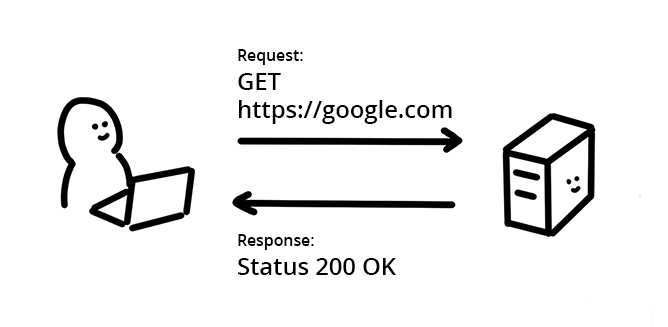

# Share cross-origin resources safely

The browser's same-origin policy blocks reading a resource from a different
origin. This mechanism stops a malicious site from reading another site's data,
but it also prevents legitimate uses. What if you wanted to get weather data
from another country? 

In a modern web application, an application often wants to get resources from a
different origin. For example, you want to retrieve JSON data from a different
domain or load images from another site into a `<canvas>` element.

In other words, there are **public resources** that should be available for
anyone to read, but the same-origin policy blocks that. Developers have used
work-arounds such as
[JSONP](https://stackoverflow.com/questions/2067472/what-is-jsonp-all-about),
but **Cross-Origin Resource Sharing (CORS)** fixes this in a standard way.

Enabling **CORS** lets the server tells the browser it's permitted to use an additional origin.

# How does a resource request work on the web?

A browser and a server can exchange data over the network using the
**H**yper**t**ext **T**ransfer **P**rotocol (HTTP). HTTP defines the
communication rules between the requester and the responder, including what
information is needed to get a resource.



The HTTP header is used to negotiate the type of message exchange between the
client and the server and is used to determine access.  Both the browser's
request and the server's response message are divided into two parts: header and
body:

<table  class="responsive">
<tbody>
    <tr>
        <td>header</td>
        <td>
            Information about the message such as type of the message or encoding of the message. A header can include a <a href="https://en.wikipedia.org/wiki/List_of_HTTP_header_fields">variety of information</a> expressed as key-value pairs. The request header and response header contain different information.<br>
            <br>
            (Note that headers can't actually have comments)<br>
            <br>
            <strong>Sample Request header</strong>
<pre>Accept: text/html
Cookie: Version=1</pre>
Above is equivalent to saying "I want to receive HTML in response. Here is cookie I have"

<strong>Sample Response header</strong>
<pre>Content-Encoding: gzip
Cache-Control: no-cache </pre>
Above is same as saying "Data is encoded with gzip. Do not cache this please"

<tr>
    <td>Body</td>
    <td>
        The message itself. This could be plain text, an image binary, JSON, HTML,etc.
    </td>
    </tr>
</tbody>
</table>


## How does CORS work?

Remember, the same-origin policy tells the browser to block cross-origin
requests. When you want to get a public resource or other server on different origin, the resource providing server needs to tell the browser "This origin where request is coming from can access my resource". The browser remembers that and allow cross-origin resource shearing.

### Step 1: client (browser) request
When the browser is making cross-origin request, the browser adds an `Origin` header with
the current origin (scheme, host, and port). 

### Step 2: server response
On the server side, 
When a server sees this header, and
wants to allow access, it needs to add an `Access-Control-Allow-Origin`  header to
the response specifying the requesting origin (or `*` to allow any origin.) 


### Step 3: browser receives response  


The browser sees this response, and allows the response data to come through.


## Share credentials with CORS

CORS is normally used for "anonymous requests" — ones where the request doesn't
identify the requestor. This is for privacy reasons. If you want to send
cookies when using CORS (which could identify the sender), you need to add
additional headers to the request and the server will do the same for the
response header.

### Request

Add  `credentials: 'include'` to the fetch options like below. This will include
the cookie with the request.

```  
fetch('http://example.com', {  
  mode: 'cors',  
  **credentials: 'include'**  
})  
```

### Response 

``Access-Control-Allow-Origin`` must be set to a specific origin (no wildcard
using `*`) and must set ``Access-Control-Allow-Credentials`` to ``true``.

```  
app.get('/allow-cors', function(request, response) {  
**  response.set('Access-Control-Allow-Origin', 'http://example.com');**  
**  response.set(Access-Control-Allow-Credentials', true);**  
  response.sendFile(__dirname + '/message.json');  
});  
`  
```

## Preflight request for complex HTTP call

If a web app needs a complex HTTP request, the browser adds a  **preflight
request** to the front of the request chain.

The CORS specification defines a **complex request** as 

+  A request that use methods other than GET, POST, or HEAD
+  A request that includes headers other than `Accept`, `Accept-Language` or
     `Content-Language`
+  A request that has a Content-Type header other than
    `application/x-www-form-urlencoded`, `multipart/form-data`, or `text/plain`

Browsers create a preflight request if it is needed. It's an OPTIONS request 
like below and is  sent before the actual request message.

    OPTIONS /data HTTP/1.1
    Origin: http://example.com
    Access-Control-Request-Method: DELETE

On the server side, an application needs to respond to the preflight request
with information about the methods the application accepts from this origin.   
   
`HTTP/1.1 200 OK`

    Access-Control-Allow-Origin: http://example.com
    Access-Control-Allow-Methods: GET,DELETE,HEAD,OPTIONS

The server response can also include an `Access-Control-Max-Age` header to
specify the duration to cache preflight results so the client does not need to
make a preflight request every it they sends a complex request.
