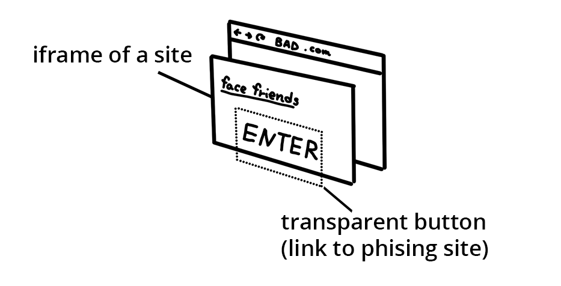

# Same Origin Policy

The same-origin policy is a browser security feature that restricts cross-origin
interactions by documents and scripts.

A browser can load and display resources from multiple sites. You might have
multiple tabs open at the same time, or a site could embed multiple iframes from
different sites. If there is no restriction on interactions between those
resources, and if a script is compromised by an attacker, the script could
expose everything on a user's browser.

The same-origin policy prevents this from happening by blocking read access to
resources loaded from a different origin. "But wait", you say. "I load images
and scripts from other origins _all the time_." Browsers allow a few tags to embed resources from different origin. This is mostly historical artifacts and could expose your site to vulnerabilities such as [clickjacking using iframes](#how-to-prevent-clickjacking). You can restrict the origins for these
tags using a [Content Security Policy](https://developers.google.com/web/fundamentals/security/csp/).

## What is considered "same-origin"?  
An origin is defined by the scheme (also known as the  protocol, for example
HTTP or HTTPS), port (if it is specified), and host. When all three are the same
for two URLs, it is considered same-origin. For example.
"http://www.example.com/foo" is same-origin as "http://www.example.com/bar" but
not "**https**://www.example.com/baz" (the scheme is different).

## What is permitted and what is blocked?

Generally, embedding a cross-origin resource is permitted, while reading a
cross-origin resource is blocked.

<table>
    <tbody>
    <tr>
        <td>iframe </td>
        <td>
            Cross-origin embed is permitted (if <code>X-Frame-Options</code> permits) but cross-origin read, such as using JavaScript to access a document in an iframe, is not permitted.
        </td>
    </tr>
    <tr>
        <td>css</td>
        <td>
            Cross-origin CSS can be embedded using a <code>link</code> tag, or <code>@import</code> in a CSS file. The correct <code>Content-Type</code> header may be required.
        </td>
    </tr>
    <tr>
        <td>form</td>
        <td>
            Cross-origin URL can be used as the <code>action</code> attribute value of a form element. A web application can write form data to a cross-origin destination.
        </td>
    </tr>
    <tr>
        <td>img</td>
        <td>
            Embedding cross-origin images is permitted. However, reading cross-origin images is blocked (such as loading a cross-origin image into a <code>canvas</code> element using JavaScript).
        </td>
    </tr>
    <tr>
        <td>media</td>
        <td>
            Cross-origin video and audio can be embedded using <code>video</code> and <code>audio</code> elements.
        </td>
    </tr>
    <tr>
        <td>script</td>
        <td>
            Cross-origin script can be embedded; however, access to certain APIs might be blocked, such as cross-origin fetch requests.
        </td>
    </tr>
    </tbody>
</table>

### How to prevent Clickjacking

<figure class="attempt-right">
  
  <figcaption>
    Figure: Clickjacking mechanism illustrated in 3 separate layers (base site, iframed site, transparent button).
  </figcaption>
</figure>

An attack called "clickjacking" embeds a site in an `iframe` and overlays transparent buttons which link to a different destination. Users are tricked into thinking they are accessing your application while sending data to attackers. 

To block other sites from embedding your site in an iframe, add a content security policy with [`frame-ancestors` directive](https://developer.mozilla.org/en-US/docs/Web/HTTP/Headers/Content-Security-Policy/frame-ancestors) to the HTTP headers.

Alternatively, you can add `X-Frame-Options` to the HTTP headers see [MDN](https://developer.mozilla.org/en-US/docs/Web/HTTP/Headers/X-Frame-Options) for list of options.

## Wrap up
Hopefully you feel a little relieved that browsers work hard to be a gatekeeper
of security on the web. Even though browsers try to be safe by blocking access
to resources, sometimes you want to access cross-origin resources in your applications. In the next guide, learn about Cross-Origin Resource Sharing
(CORS) and how to tell the browser that loading of cross-origin resources is
allowed from trusted sources.
