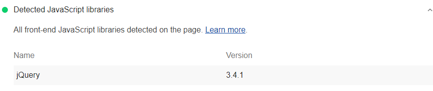

A brief explanation of why the audit matters. Try to keep it to 2–3 sentences.

## How the Lighthouse [shorthand name] audit fails

[Lighthouse](https://developers.google.com/web/tools/lighthouse/)
flags [pages that do the thing the audit checks for]:

<!--
  Screenshot should be of the lighthouse-cli UI. It should only include the
  audit content, from the pixel below the top border to the pixel above the
  bottom border. The width should match that of the top and bottom borders.
-->

<figure class="w-figure">
  
</figure>

Brief explanation of the audit. It may include various elements as needed:
- What the audit checks for
- What the audit _doesn't_ check for
- Any non-obvious details that will be relevant to most developers
- Examples and/or non-examples of failing code

<!--
  Use the appropriate scoring include for the audit collection you're working in.
  Scoring includes can be found in /src/site/_includes/content
-->


## How to [fix the problem]

Brief explanation of the most common way(s) to fix the issue causing the audit
to fail. Explanation should include:
- Code sample(s) when appropriate
- Links to further information if a full understanding of the issue requires
  more text than is appropriate for a post focused on resolving a failed audit

When a fix involves multiple steps, provide a codelab instead of sample code.

## Resources
<!--
  Include all links from the post that are immediately relevant to the audit,
  along with any further reading that may be useful. The source code for the
  audit always comes first. If there are no links other than the source code,
  present it as a paragraph rather than an unordered list.
-->
- <a href="https://github.com/GoogleChrome/lighthouse/blob/master/lighthouse-core/audits/…/audit-name.js" rel="noopener">Source code for **Audit name** audit</a>
- [Link to another resource](#)
