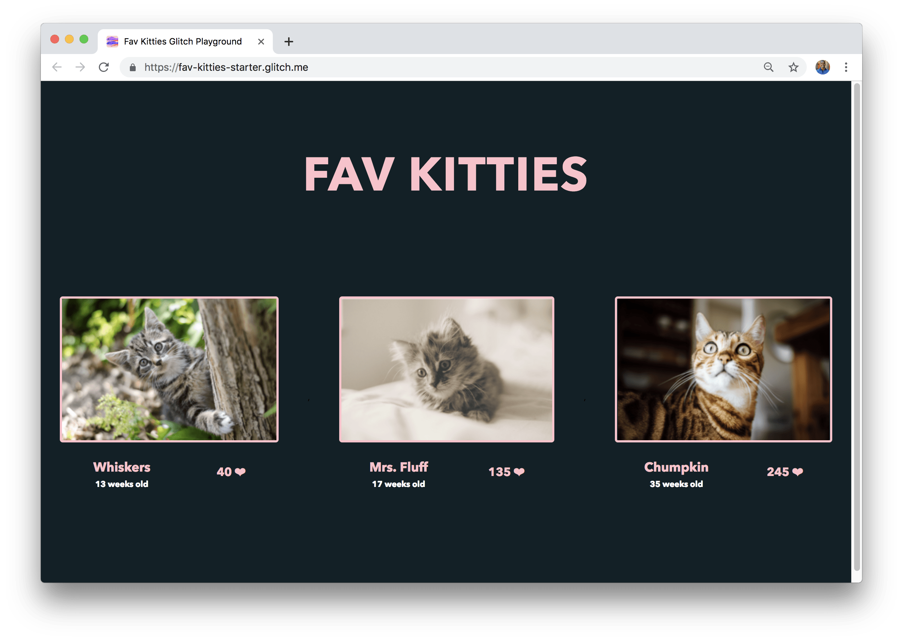
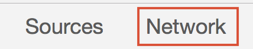
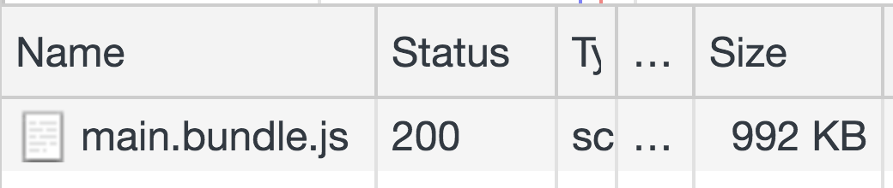
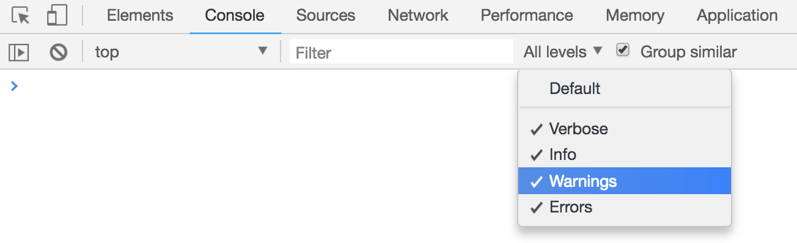
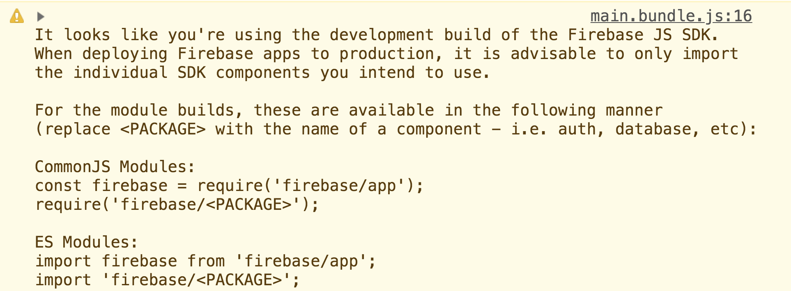
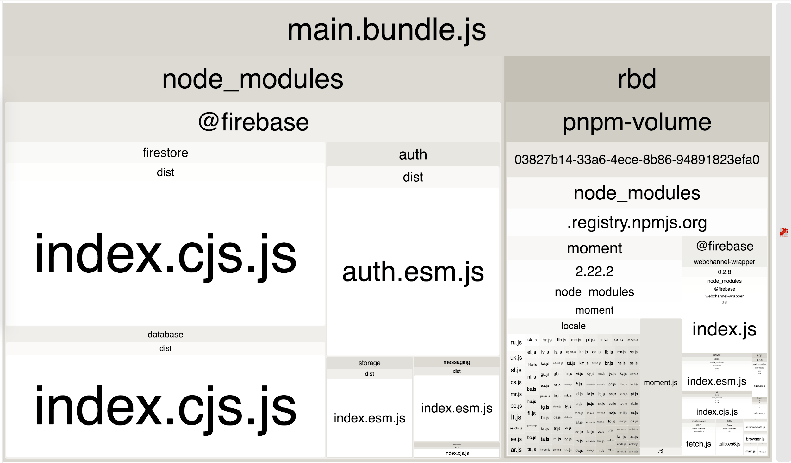
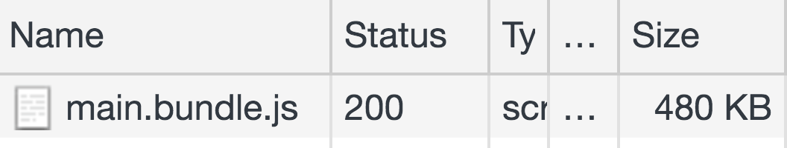
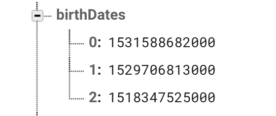
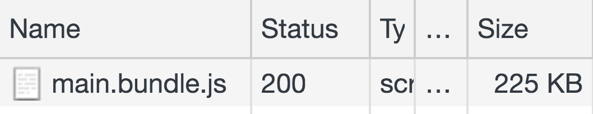

<!-- If your codelab uses Chrome DevTools, keep the following include.
If not, omit it. -->


In this codelab, you'll improve the performance of a web app by
removing any unused and unneeded dependencies.



## Measure


Since webpack is used in this application, any changes made to the code will
trigger a new build which can take a few seconds. Once it completes, you
should see your changes reflected in the application.


It's always a good idea to first measure how well a website performs before
adding optimizations.

- To preview the site, mouse over the editor, press the **App** button, then the
  **Show** button.

Go ahead and click on your favorite kitten! Firebase's
[Realtime Database](https://firebase.google.com/products/realtime-database/) is
used in this application which is why the score updates in real-time and is
synchronized with every other person using the application. 🐈

- Open the DevTools by pressing `CMD + OPTION + i` / `CTRL + SHIFT + i`.
- Click on the **Network** tab.



Make sure `Disable Cache` is checked and reload the app.



Almost 1 MB worth of JavaScript is being shipped to load this simple application!

Take a look at the project warnings in DevTools.

- Click on the **Console** tab.
- Make sure that `Warnings` is enabled in the levels dropdown next to the
  `Filter` input.



- Take a look at the displayed warning.



Firebase, which is one of the libraries used in this application, is being a
good samaritan by providing a warning to let developers know to not import its
entire package but only the components that are used. In other words, there are
unused libraries that can be removed in this application to make it load
faster.

There are also instances when a particular library is used, but where there may be
a simpler alternative. The concept of removing **unneeded libraries** is
explored later in this tutorial.

## Analyzing the bundle

There are two main dependencies in the application:

- [Firebase](https://firebase.google.com/): a platform that provides a number of
  useful services for iOS, Android or web applications. Here its [Realtime
  Database](https://firebase.google.com/products/realtime-database/) is used to
  store and sync the information for each kitten in real time.
- [Moment.js](https://momentjs.com/): a utility library that makes it easier to
  handle dates in JavaScript. The birth date of each kitten is stored in the
  Firebase database, and `moment` is used to calculate its age in weeks.

How can just two dependencies contribute to a bundle size of almost 1 MB? Well,
one of the reasons is that any dependency can in turn have their own
dependencies, so there are a lot more than just two if every depth/branch of the
dependency "tree" is considered. It's easy for an application to become large
relatively quickly if many dependencies are included.

Analyze the bundler to get a better idea of what is going. There are a number of
different community-built tools that can help do this, such as
[`webpack-bundle-analyzer`](https://www.npmjs.com/package/webpack-bundle-analyzer).

The package for this tool is already included in the app as a `devDependency`.

```js
"devDependencies": {
  //...
  "webpack-bundle-analyzer": "^2.13.1"
},
```

This means that it can be used directly in the webpack configuration file.
Import it at the very beginning of `webpack.config.js`:

```js/3
const path = require("path");

//...
const BundleAnalyzerPlugin = require("webpack-bundle-analyzer")
  .BundleAnalyzerPlugin;
```

Now add it as a plugin at the very end of the file within the `plugins` array:

```js/4
module.exports = {
  //...
  plugins: [
    //...
    new BundleAnalyzerPlugin()
  ]
};
```

When the application reloads, you should see a visualization of the entire
bundle instead of the app itself.



Not as cute as seeing some kittens 🐱, but incredibly helpful nonetheless.
Hovering over any of the packages shows its size represented in three
different ways:

<div class="w-table-wrapper">
  <table>
    <thead>
      <tr>
        <th><strong>Stat size</strong></th>
        <th>Size before any minification or compression.</th>
      </tr>
    </thead>
    <tbody>
      <tr>
        <td><strong>Parsed size</strong></td>
        <td>
          Size of actual package within the bundle after it has been compiled.
          Version 4 of webpack (which is used in this application) minifies the
          compiled files automatically which is why this is smaller than the stat
          size.
        </td>
      </tr>
      <tr>
        <td><strong>Gzipped size</strong></td>
        <td>
          Size of package after it has been compressed with gzip encoding. This
          topic is covered in a separate guide.
        </td>
      </tr>
    </tbody>
  </table>
</div>

With the webpack-bundle-analyzer tool, it is easier to identify unused or
unneeded packages that make up a large percentage of the bundle.

## Removing unused packages

The visualization shows that the `firebase` package consists of a _lot_ more
than just a database. It includes additional packages such as:

- `firestore`
- `auth`
- `storage`
- `messaging`
- `functions`

These are all amazing services provided by Firebase (and refer to the
[documentation](https://firebase.google.com/docs/web/setup#use_firebase_services)
to learn more), but none of them are being used in the application, so there's
no reason to have them all imported.

Revert the changes in `webpack.config.js` to see the application again:

- Remove `BundleAnalyzerPlugin` in the list of plugins:

```js//2
plugins: [
  //...
  new BundleAnalyzerPlugin()
];
```

- And now remove the unused import from the top of the file:

```js//3
const path = require("path");

//...
const BundleAnalyzerPlugin = require('webpack-bundle-analyzer').BundleAnalyzerPlugin;
```

The application should load normally now. Modify `src/index.js` to update the
Firebase imports.

```js/1-2/0
import firebase from 'firebase';
import firebase from 'firebase/app';
import 'firebase/database';
```

Now when the app reloads, the DevTools warning does not show. Opening the
DevTools **Network** panel also shows a _nice_ reduction in bundle size:



More than half the bundle size was removed. Firebase provides many different
services and gives developers the option to only include those that are actually
needed. In this application, only `firebase/database` was used to store and sync
all of the data. The `firebase/app` import, which sets up the API surface for
each of the different services, is always required.

Many other popular libraries, such as `lodash`, also allow developers to
selectively import different parts of their packages. Without doing much work,
updating library imports in an application to only include what is being used
can result in significant performance improvements.

Although the bundle size has been reduced by quite a bit, there's still more
work to do! 😈

## Removing unneeded packages

Unlike Firebase, importing parts of the `moment` library cannot be done as
easily, but maybe it can be removed entirely?

The birthday of each cute kitten is stored in **Unix** format (milliseconds) in
the Firebase database.



This is a timestamp of a particular date and time represented by the number of
milliseconds that have elapsed since January 1, 1970 00:00 UTC. If the current
date and time can be calculated in the same format, a small function to find the
age of each kitten in weeks can probably be constructed.

Like always, try not to copy and paste as you follow along here. Begin by
removing `moment` from the imports in `src/index.js`.

```js//2
import firebase from 'firebase/app';
import 'firebase/database';
import * as moment from 'moment';
```

There is a Firebase event listener that handles value changes in our database:

```js
favoritesRef.on("value", (snapshot) => { ... })
```

Above this, add a small function to calculate the number of weeks from a
given date:

```js
const ageInWeeks = birthDate => {
  const WEEK_IN_MILLISECONDS = 1000 * 60 * 60 * 24 * 7;
  const diff = Math.abs((new Date).getTime() - birthDate);
  return Math.floor(diff / WEEK_IN_MILLISECONDS);
}
```

In this function, the difference in milliseconds between the current date and
time `(new Date).getTime()` and the birth date (the `birthDate` argument, already
in milliseconds) is calculated and divided by the number of milliseconds in a
single week.

Finally, all instances of `moment` can be removed in the event listener by
leveraging this function instead:

<pre>
favoritesRef.on("value", (snapshot) => {
  const { kitties, favorites, names, birthDates } = snapshot.val();
  favoritesScores = favorites;

  kittiesList.innerHTML = kitties.map((kittiePic, index) => {
    <s>const birthday = moment(birthDates[index]);</s>

    return `
      &lt;li&gt;
        &lt;img src=${kittiePic} onclick=&quot;favKittie(${index})&quot;&gt;
        &lt;div class=&quot;extra&quot;&gt;
          &lt;div class=&quot;details&quot;&gt;
            &lt;p class=&quot;name&quot;&gt;${names[index]}&lt;/p&gt;
            <s>&lt;p class=&quot;age&quot;&gt;${moment().diff(birthday, 'weeks')} weeks old&lt;/p&gt;</s>
            <strong>&lt;p class=&quot;age&quot;&gt;${ageInWeeks(birthDates[index])} weeks old&lt;/p&gt;</strong>
          &lt;/div&gt;
          &lt;p class=&quot;score&quot;&gt;${favorites[index]} ❤&lt;/p&gt;
        &lt;/div&gt;
      &lt;/li&gt;
    `})
});
</pre>

Now reload the application and take a look at the **Network** panel once more.



The size of our bundle was reduced by more than half again!

## Conclusion

With this codelab, you should have a decent understanding of how to analyze a
particular bundle and why it can be so useful to remove unused or unneeded
packages. Before you begin optimizing an application with this technique, **it's
important to know that this can be significantly more complex in larger
applications**.

With regards to **removing unused libraries**, try to find out which parts of a
bundle are being used and which parts are not. For a mysterious looking
package that looks like it is not being used anywhere, take a step back and check
which top-level dependencies might need it. Try to find a way to possibly
decouple them from each other.

When it comes to **removing unneeded libraries**, things can be a little more
complicated. It's important to work closely with your team and see if there is
potential to simplify parts of the codebase. Removing `moment` in this
application may look like it would be the right thing to do every time, but what
if there were time zones and different locales that needed to be handled? Or
what if there were more complicated date manipulations? Things can get very
tricky when manipulating and parsing dates/times, and libraries like `moment`
and [`date-fns`](https://date-fns.org/) simplify this significantly.

**Everything is a tradeoff, and it's important to gauge whether it's even worth
the complexity and effort to roll out a custom solution instead of relying on a
third-party library.**
