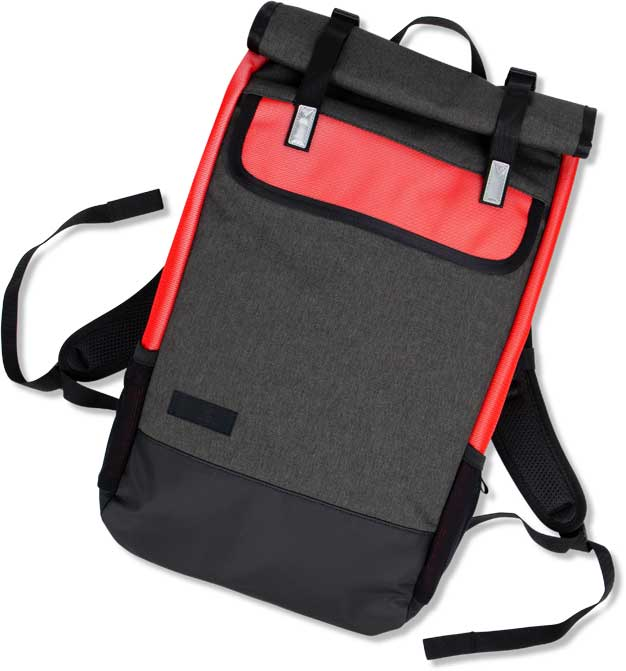
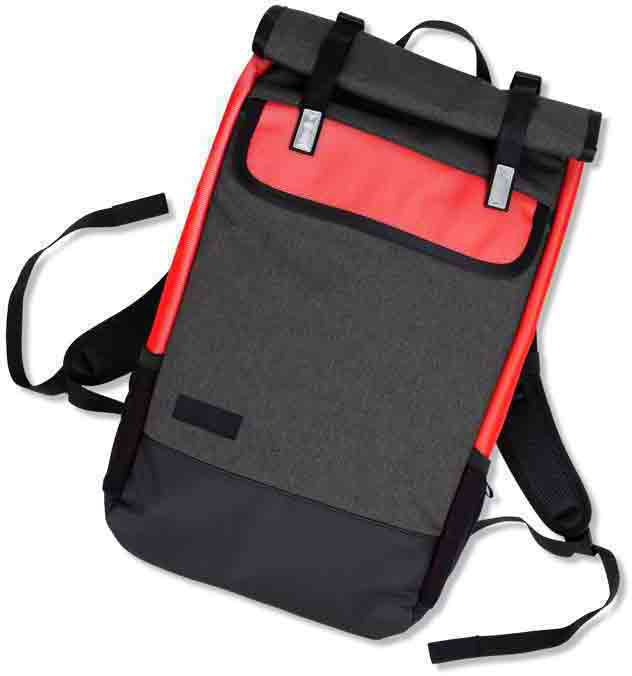
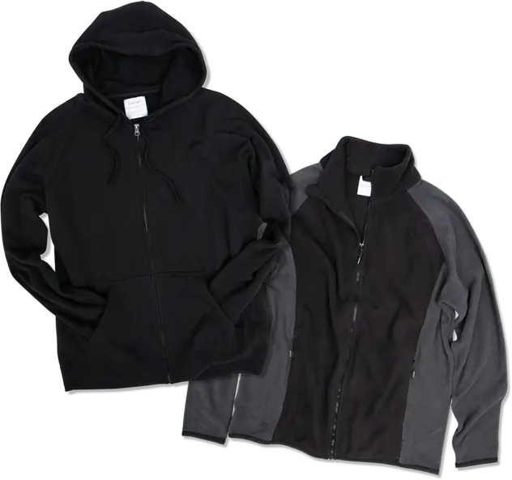
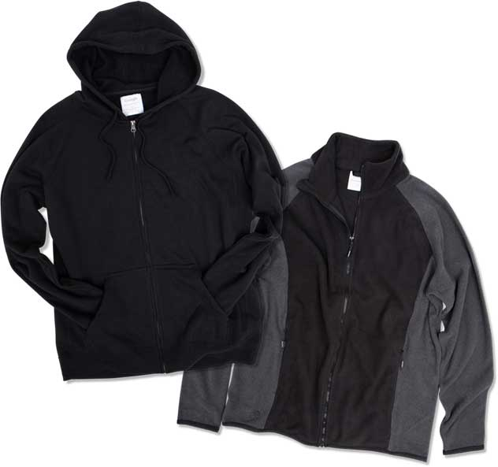
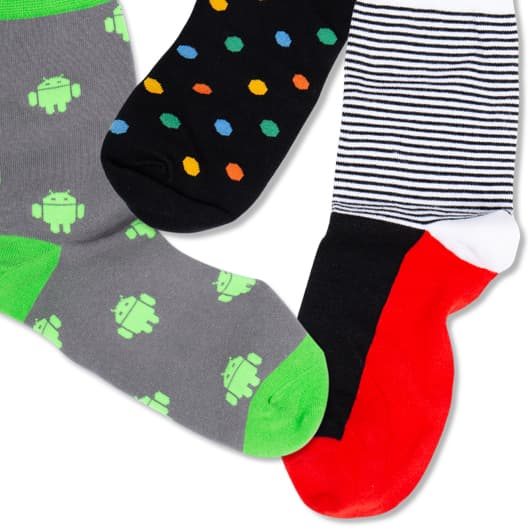
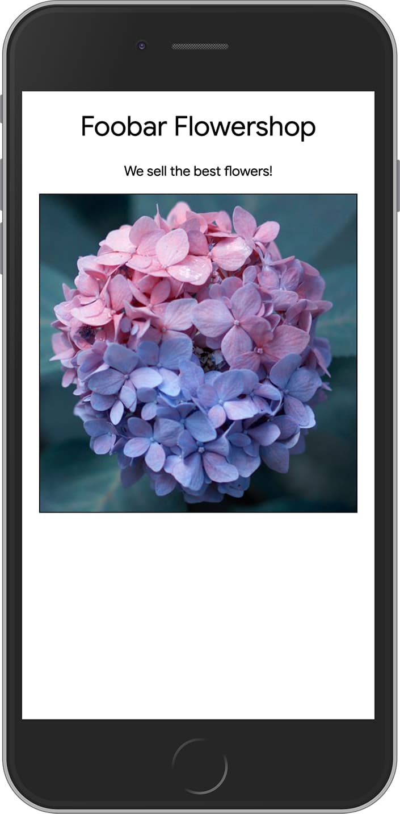

Images are crucial for e-commerce.

People can't touch or feel products online — they can only look at pictures.

How can you efficiently deliver images that drive engagement and conversion
across a variety of devices, platforms and connectivity?


In this guide you'll find out what makes e-commerce different when it comes
to images.

You can learn more about general image optimization techniques at
[web.dev/fast](/fast).



## Create with care

Images are at the core of branding, marketing and sales, and are likely to
attract the attention of executives, consultants and other non-technical staff.

You need to get images right from the start:

+   **Get to know your image supply chain**

    Meet your stakeholders. Make friends with your designers, marketers and
    non-technical executives. Make it clear that your number one priority is to
    maintain image quality. Explain techniques to deliver the smallest possible
    file sizes without compromising the brand. Explain how image efficiency can
    improve website performance, and
    [provide stats](https://www.akamai.com/uk/en/about/news/press/2017-press/akamai-releases-spring-2017-state-of-online-retail-performance-report.jsp)
    that demonstrate the impact of website performance on acquisition and
    conversion rates.
    <br><br>

+   **Maintain quality from start to finish**

    Images will never work well online if they're not created carefully. Take
    care with photography. It's cheaper to get good photos than try to fix them
    later. Keep product images consistent in size, style, lighting, camera
    angle and crop. Product images are how online customers get to know your
    product! You need to get them right.
    <br><br>

+   **Get organized**

    Even a small number of products can require a large number of images.
    [Digital Asset Management](https://en.wikipedia.org/wiki/Digital_asset_management)
    need not be complex: you simply need to ensure that you can find images
    easily, and not lose originals. This is crucial for maintaining quality.
    <br><br>

+   **Work from original high resolution assets**

    Second or third generation product images look dull. Make sure to keep
    original assets and use them for optimizing, resizing or creating different
    image crops.
    <br><br>

<a href="backpack-first-generation.jpg"></a>
<a href="backpack-resaved.jpg"></a>

The righthand image is blurry and missing texture: It's been resaved from a JPEG. Tap or click the images to see them full size.


## Balance quality and file size

There's a basic conflict for e-commerce:

+   You must maintain quality. Images are how people connect with
    products. Images are the first contact your potential customers have with
    your products. Image quality is crucial for discovery and conversion —
    product photos are not just decoration.
+   Your site must work well on a variety of devices, platforms and
    connectivity scenarios.
    [Performance is critical to e-commerce success](https://www.akamai.com/uk/en/about/news/press/2017-press/akamai-releases-spring-2017-state-of-online-retail-performance-report.jsp),
    and images must not get in the way.

So how do you strike the right balance?

### Hero images: give them individual attention

You're likely to have a few especially important images that feature on your
homepage or elsewhere. You need to especially careful to optimize these while
maintaining quality.

+   **Use WebP with a JPEG fallback for product photos (not PNG!)** These
    formats give you the [best compression and
    highest quality](/serve-images-webp) for continuous tone
    (raster) images such as photographs. WebP images are around
    [25% smaller than JPEGs](https://developers.google.com/speed/webp/docs/webp_study)
    of the same quality.

    [WebP is supported by Chrome, Firefox and other browsers.](https://caniuse.com/#feat=webp)
    You can easily [code for a JPEG fallback](/serve-images-webp) or use
    an image service such as [Cloudinary](https://cloudinary.com/) or
    [Thumbor](https://github.com/thumbor/thumbor) that automatically delivers
    WebP or JPEG depending on browser capability — without changing the file
    extension. You can easily produce both WebP and JPEG versions of product
    photos using [image automation in your build
    workflow](/serve-images-webp), via [image
    services](https://images.guide/#image-processing-cdns), or with a tool such
    as [Squoosh](https://squoosh.app/).

+   **Use PNG or SVG for
    [vector images](https://developers.google.com/web/fundamentals/performance/optimizing-content-efficiency/image-optimization)**
    such as solid color logos and product diagrams. PNG can give better
    results than JPEG for vector images, but if you have SVGs available, use
    them! SVG is [supported by all modern
    browsers](https://caniuse.com/#search=SVG), and provides the
    [smallest file sizes and infinite scalability](https://developers.google.com/web/fundamentals/design-and-ux/responsive/images#replace_complex_icons_with_svg).
    You can also use inline SVGs for social sharing icons, logos, and UI
    elements such as shopping trolley and search icons. (See the demo
    [here](https://codepen.io/samdutton/pen/ZjZgNP).)

+   **Don't use PNG simply for transparency to display a product against a
    background.** PNG is a very inefficient format for photographic images. For transparency, use WebP
    instead, with high quality JPEG (layering the product on the background) as
    a fallback.

+   **Use free image compression tools such as [Squoosh](https://squoosh.app/)**
    to individually optimize especially important images. Every product photo
    is different, and they won't all respond to optimization in the same way.
    Some images may work well saved at lower quality, others not.

    <br>

    The three images below are saved as PNG, transparent WebP, and as a JPEG
    with a white background. They look almost identical, even at larger sizes.

    Hover over each image to see which is which, or tap/click to open.

    <br>

    <a href="hoodies.png"></a>
    <a href="hoodies.webp"></a>
    <a href="hoodies.jpg"></a>

    <br>

    The images below look identical, but the file size of one is 87% smaller than the other.

    Can you tell which is which? Hover over each image to see the file size, or tap/click to open.

    <br>

    <a href="socks-unoptimized.jpg"></a>
    <a href="socks-unoptimized.jpg"></a>

    <br>

## Scale image creation and delivery

You may have thousands (or millions) of images for display in product listings
and search results. They must be continually created, encoded and delivered in a variety of sizes and formats for different devices and contexts.

How can you reliably scale image production and delivery without compromising
quality?

There are two main options:

+   **Use an image service**

    Image creation and delivery can be automated using a commercial CDN service like
    [Cloudinary](https://cloudinary.com/), or an open source equivalent such as
    [Thumbor](https://github.com/thumbor/thumbor) that you install and run
    yourself.

    You upload your high resolution images, and the image service delivers
    different image formats and sizes depending on the image's URL parameters.
    With [this example](https://res.cloudinary.com/pieshop/f_auto,dpr_auto,q_auto:eco/w_500/GGOEGDHJ087399.png) try changing the _w_ value or the file extension.
    Check the format delivered using your browser DevTools.

    Image services also have more advanced features such as the ability to
    automate 'smart cropping' for different image sizes and automatically
    deliver WebP images to browsers that support the format instead of JPEGs —
    without changing the file extension.

    <br>

+   **Incorporate image processing in your website build process**

    As part of your build process, you add steps to resize and compress images.
    To find out more, see the guide at
    [web.dev/use-imagemin-to-compress-images](/use-imagemin-to-compress-images).

## What's good enough?

Whether for homepage hero images or product thumbnails, you need to maintain
efficient delivery and consistent quality.

+   Don't serve images with pixel dimensions larger than they need to be.
     Provide images of different widths and use `srcset` to enable the browser
     to choose the smallest image that's right for the display size.

    ``` html
    
      ```

    Find out more in our guide at
    [web.dev/fast/serve-responsive-images](https://web.dev/fast/serve-responsive-images).

    You can see this in action below — resize the viewport, do a hard reload
    and check the choice of files in your browser's DevTools.

    

    <br>

+   Remember that customers may be browsing on mobile devices with
    high-DPI screens, and that purchase decisions may be made zooming in on an
    image on a desktop machine. As well as testing your site on low-end mobile
    devices, try it out on large and high quality displays. Be especially
    careful of zoomable images (see below).

+   Consider using art direction for product images, providing different
    crops for different display sizes. Take a look at the examples
    [here](https://simpl.info/pictureart/) and
    [here](http://udacity.github.io/responsive-images/examples/3-08/pictureArtDirection/),
    and try out our codelab: [web.dev/fast/serve-responsive-images/codelab-art-direction](https://web.dev/fast/serve-responsive-images/codelab-art-direction).

    The wide image below can work well on a wide viewport, but the square image
    crop is far more striking on a phone. You can enable zoom to
    scroll the entire image on mobile if necessary.

    <a href="art-direction-wide.jpg"></a>
    <a href="art-direction-square.jpg"></a>

+   You might also want to consider using generic placeholder images or
    low-resolution alternatives while images are loading (known as LQIP).
    There are [many techniques for LQIP](https://cloudinary.com/blog/low_quality_image_placeholders_lqip_explained),
    but also [many trade-offs](https://www.robinosborne.co.uk/2018/01/05/image-placeholders-do-it-right-or-dont-do-it-at-all-please/).


**Be careful with background images!**

Background images are a common bottleneck for e-commerce sites.

They have large file sizes because the quality must be good, and pixel
dimensions must be adequate for large display sizes.

Avoid background images where possible, or replace them with repeatable
textures.

If you have no choice but to use photos as background images, make sure to
optimize them heavily using the hero image techniques described above.



## Don't load images until you need to!

E-commerce sites need careful strategies to avoid unnecessary image loading.
Efficient loading improves site speed and reduces server load. Home pages may
have a number of images not seen on first load — likewise for search results,
product listings and carousels. You don't want to load product images that your
customers may never even see!

The answer is to use lazy loading: techniques to load images just in time.

There are several ways to do this:

+   The
    [IntersectionObserver API](https://developer.mozilla.org/en-US/docs/Web/API/Intersection_Observer_API):
    see [simpl.info/lazy](https://simpl.info/lazy/) for an example. (Watch the
    Network panel from your browser DevTools as you scroll the page.)

+   JavaScript libraries such as
    [lazyload](https://github.com/verlok/lazyload),
    [lozad](http://apoorv.pro/lozad.js/) and
    [lazysizes](https://github.com/aFarkas/lazysizes): these use the
    IntersectionObserver with fallbacks.

Find out more from our guide
[web.dev/fast/use-lazysizes-to-lazyload-images](https://web.dev/fast/use-lazysizes-to-lazyload-images).


Several other features to optimize image delivery are coming to the web:
+   [Priority Hints](https://wicg.github.io/priority-hints/) adds the
    `importance` attribute, which can be used as a signal to the browser the
    priority of a resource such as an image.
+   The [`img decoding`](https://bugs.chromium.org/p/chromium/issues/detail?id=772470)
    attribute will enable you to specify whether decoding is done
    synchronously (blocking other rendering) or asynchronously.



## Consider all your customers

A considerable proportion of your customers will have impaired vision.
Code images with accessibility in mind:

+   Add a meaningful, descriptive, specific `alt` attribute to every
    `img` element. This doesn't need to be difficult. You're likely to have
    short product descriptions in your product database, and you can automate
    the process of using these for `alt` attributes. Find out more about
    writing good alt text from
    [webaim.org/techniques/alttext](https://webaim.org/techniques/alttext/).
+   Make sure to provide text alternatives to graphical page elements such
    as shopping carts and search icons.

Learn how to improve accessibility from our guides at
[web.dev/accessible](/accessible).

## Make image browsing a pleasure

Images are crucial for customer acquisition, engagement and conversion.
You want your customers to love spending time on your site.
There are two particular features that help customers get closer to products:

+   **Product zoom**

    It's important to enable customers to get a high quality close-up view of
    products. (The [pinch-zoom](https://github.com/GoogleChromeLabs/pinch-zoom)
    web component does this extremely well.) Don't just add a magnifying
    function that simply increases the display size of a small image! You need
    to provide high quality images with larger pixel dimensions, that display
    well at larger sizes. Customers will probably accept a short delay while a
    larger image loads. It can also be worth adding close-up images.

    <br>

+   **Image carousels and 'more images'**

    There are [many different ways to implement product carousels](https://www.hongkiat.com/blog/image-carousels-tips/)
    and [mixed opinions](https://vwo.com/blog/image-slider-alternatives/) about
    their value. Whatever you do, make sure to use lazy loading (see above) to
    ensure you don't load offscreen images until you need to.

## Optimize for search

+   Remember that people may navigate to your site via image search, so
    your images need to stand out on their own. Images need to work well away
    from the context of your website.
+   Images and SEO: find out more from
    [Google image best practices](https://support.google.com/webmasters/answer/114016),
    and use analytics to check what your customers search for.

## Test, analyse, monitor, fix — repeat

Make sure to include image performance testing in your workflow:

+   Use browser tools to manually check for bloated images: view the
    Network panel and order by size. You can also use
    [Lighthouse](https://developers.google.com/web/tools/lighthouse/) and other
    tools to warn of large image files.
+   Monitor your site for load performance glitches, for example by using
    the
    [Google Analytics site speed](https://support.google.com/analytics/answer/1205784?hl=en)
    feature.
+   Monitor payload sizes. You can use the [Lighthouse
    API](https://developers.google.com/web/tools/lighthouse/) to continually
    report on performance and warn for problems.
+   Compare the performance of your site against competitors using tools
    such as [Test My
    Site](https://www.thinkwithgoogle.com/intl/en-gb/feature/testmysite) and
    the
    [Chrome User Experience Report](https://developers.google.com/web/tools/chrome-user-experience-report/).
+   Consider adding warnings to your build process, for example if
    developers attempt to commit oversized files.
+   Sounds obvious, but if you're monitoring image usage on your live site,
    make sure to test category and product pages — not just the home page!

## Next steps

+   [web.dev/fast](/fast#optimize-your-images) has a
    range of guides and codelabs to help you optimize your images.
+   Our codelab
    [Optimize images for e-commerce](https://docs.google.com/document/d/1m7xWYKf7gJ4IeLkKKc7FfhFtk0vZi0BM2nxJhzDPwHU/edit#heading=h.cgvdu9aeouaf)
    [TODO: web.dev link] shows how to create beautiful images for online
    stores: for homepage hero images, search listings and product pages.
