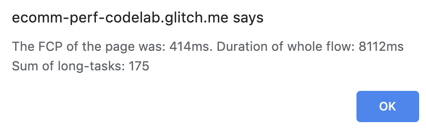

## Glitch repos
+   Starter: [https://glitch.com/~ecomm-perf-codelab-starter](https://glitch.com/~ecomm-perf-codelab-starter)
+   Final: [https://glitch.com/~ecomm-perf-codelab](https://glitch.com/~ecomm-perf-codelab)

## Get familiar with the sample project

When you open the sample project in Glitch you'll find a very simple (and poorly designed) e-commerce funnel from landing page, through product listing and product page to basket and checkout.
There are other files to be aware of:

+   **labtest.html**: Used to trigger the lab test workflow.
+   **perfoverlay.js**: Where you'll add field test code.
+   **server.js**: Deliver files to users via an [Express](https://expressjs.com/) server.

## Get started

Click **Remix to Edit** to create your own copy of the project.
Click the **App** button to start on the homepage of your e-commerce shop. Click through the flow  to see the different stages from landing to checkout.
You'll learn how to measure first load performance and time-to-action from landing page to checkout in a lab test (through [Puppeteer](https://github.com/GoogleChrome/puppeteer/blob/master/docs/api.md)) and field test.

## Measure page load speed

Measuring page load speed and page flow performance is a good task for the headless Chrome Node API [Puppeteer](https://github.com/GoogleChrome/puppeteer/blob/master/docs/api.md). Via the API you can easily automate everything in Chrome, and even control most Chrome DevTools functionality.
To get started, open `server.js`, and find the handler for the `labtest.json` request:

```js
app.get('/labtest.json'…
```

This is where you'll find code to start Puppeteer, and where your lab test code will go.
Open a new tab and navigate to `labtest.html`. Click the button to trigger the response handler. For now it will just give you a simple message, stating that nothing is measured yet.
Now you'll add in some simple Puppeteer code to open your e-commerce shop homepage, and start measuring:
Replace the comment `TODO: add labtest via puppeteer` with these lines:

```js
await page.goto('https://ecomm-perf-codelab.glitch.me/index.html', { waitUntil: 'networkidle2'});
const fcp = await page.evaluate('window.performance.getEntriesByName(\"first-contentful-paint\")[0].startTime');
```

This loads the given URL in puppeteer until there are no more than two network requests for at least 500ms (['networkidle2'](https://github.com/GoogleChrome/puppeteer/blob/master/docs/api.md#pagegotourl-options)), and then retrieves the FCP metric via injected JavaScript.
You can now return the FCP in the response text. The new code will look like this:


Now reload `labtest.html` and click the button. You should see the time taken to [First Contentful Paint](https://developers.google.com/web/tools/lighthouse/audits/first-contentful-paint) (FCP) of the first load in a window alert. If you feel that the FCP is still quite fast, this is because you haven't throttled the network and CPU yet. Insert this before the two lines you just added:

```js
//throttle network and CPU
const client = await page.target().createCDPSession();
await client.send('Network.enable');
await client.send('Network.emulateNetworkConditions', {
  'offline': false,
  'downloadThroughput': 1.5 * 1024 * 1024 / 8,
  'uploadThroughput': 750 * 1024 / 8,
  'latency': 40
});
await client.send('Emulation.setCPUThrottlingRate', { rate: 4 });
```

Now the FCP shown in the alert should have considerably worsened. You can add many additional metrics with Pupeteeer. See [Test website performance with Puppeteer](https://michaljanaszek.com/blog/test-website-performance-with-puppeteer) for more detail.

## Measure page flow performance

It's particularly important on e-commerce sites to go beyond measuring individual page performance in isolation. You also need to understand the time it takes a user to go through a complete page flow, for example from landing to checkout. In order to measure all the other pages of the funnel:

```js
await page.goto('https://ecomm-perf-codelab.glitch.me/index.html', { waitUntil: 'networkidle2'});
await page.goto('https://ecomm-perf-codelab.glitch.me/product_list.html', { waitUntil: 'networkidle2'});
await page.goto('https://ecomm-perf-codelab.glitch.me/product.html', { waitUntil: 'networkidle2'});
await page.goto('https://ecomm-perf-codelab.glitch.me/basket.html', { waitUntil: 'networkidle2'});
await page.goto('https://ecomm-perf-codelab.glitch.me/checkout.html', { waitUntil: 'networkidle2'});
```

You can add in a time measurement before and after via `performance.now()`, and then adapt the output message for the complete time through the flow. Your code will now look like this:


And the output should look like this:


Instead of measuring the sum of the full page loads, you can also sum up FCP if you like, or whatever else you consider most meaningful.
Now you'll inject JavaScript into the pages loaded via Puppeteer to extract the sum of [long tasks](https://developer.mozilla.org/en-US/docs/Web/API/Long_Tasks_API): tasks that take 50 milliseconds or more. Define a function to be executed for new documents to measure long tasks and track them on a global variable:

```js
page.evaluateOnNewDocument(function() {
  window.sumLongTasks = 0;
  const observer = new PerformanceObserver((list) => {
    for (const entry of list.getEntries()) {
      window.sumLongTasks += entry.duration;
    }
  });
  observer.observe({entryTypes: ['longtask']});
});
```

The value gathered can then after page load be retrieved like this:

```js
await page.evaluate(function() {return window.sumLongTasks;});
```

Now we can also sum these up across the whole flow, and again output it to the page:



You can see and try the complete code in the [final Glitch project](https://glitch.com/~ecomm-perf-codelab) if you're interested.
This section showed you how easy it is to launch Puppeteer, throttle it down as needed, load pages, inject JavaScript and measure performance.
We strongly recommend that you build measurement scripts like this for your most relevant time-to-actions and funnel flows, and execute and monitor regularly.

## Build the field test

While lab data is always helpful, you need to collect the same metrics from real usage, and potentially also make the data visible to stakeholders and decision makers.
In your project, open the empty file  `perfoverlay.js`. You'll start by creating a new [PerformanceObserver](https://developers.google.com/web/updates/2016/06/performance-observer) and tell it what to measure. For simplicity you'll stick to the same metrics you collected in the lab test, but you can easily extend this for your own projects. For now you'll listen for FCP, long tasks and load events. Add the following code to the empty file `perfoverlay.js`:

```js
const observer = new PerformanceObserver((list) => {
  for (const entry of list.getEntries()) {
    if (entry.name === 'first-contentful-paint') {
      console.log(`FCP starts after ${entry.startTime}ms`);
    }
    if (entry.entryType === 'longtask') {
	    console.log(`LongTask took ${entry.duration} ms`);
    }
    if (entry.entryType === 'navigation') {
	    console.log(`Load event after ${entry.loadEventStart}ms`);
    }
  }
});
observer.observe({entryTypes: ['longtask', 'paint', 'navigation']});
```

Now reload the output page, and click around in the funnel. You will see on the console data for  relevant metrics and events. You could now record these values with your analytics platform for further analysis, but you also wanted to measure page flow performance. You can save the metrics to `localStorage`, and then sum up across page loads, to see the relevant time-to-action live. Add this at the beginning of `perfoverlay.js`.

```js
let perfData;
const fromStorage = localStorage.getItem('perfData');
if (fromStorage) {
  perfData = JSON.parse(fromStorage);
}

if (!perfData) {
  perfData = {
    'sumFCP': 0,
    'sumLongTasks': 0,
    'sumLoad': 0,
    'steps': 0
  };
}
perfData.steps++;
```

Now you  adapt the observer code to sum these values when they happen, and save the data to `localStorage`:

```js
const observer = new PerformanceObserver((list) => {
  for (const entry of list.getEntries()) {
    if (entry.name === 'first-contentful-paint') {
	    perfData.sumFCP += entry.startTime;
    }
    if (entry.entryType === 'longtask') {
      perfData.sumLongTasks += entry.duration;
    }
    if (entry.entryType === 'navigation') {
      perfData.sumLoad += entry.loadEventStart;
    }
    localStorage.setItem('perfData', JSON.stringify(perfData));
  }
});
observer.observe({entryTypes: ['longtask', 'paint', 'navigation']});
```

If you click now through the funnel from landing to checkout, you can see in LocalStorage the metrics counting up:


This data  could be shared with your  analytics platform (e.g. via [Google Analytics user timings](https://developers.google.com/analytics/devguides/collection/analyticsjs/user-timings)), once the final action (such as payment) has been completed.
You can display current metrics in an overlay: see the complete code in the [final Glitch project](https://glitch.com/~ecomm-perf-codelab). The output will then look like this:


You could configure the  setup of your e-commerce site to show a performance overlay on development and staging servers by default, or even hide it and only bring it up on [device shake](http://qnimate.com/detect-shake-using-javascript/) or similar.
Either way—you now know how to use  `PerformanceObserver` to measure landing page performance, as well as flows and time-to-actions in the field for real users.
