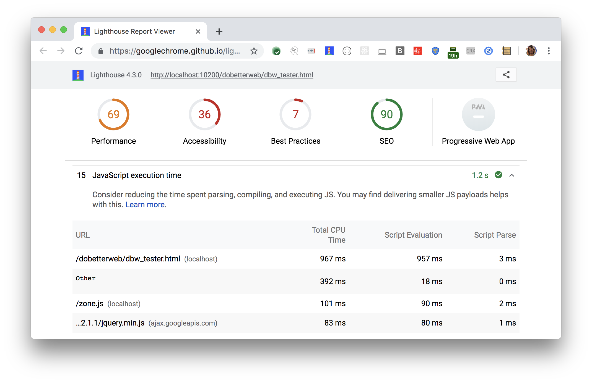

Consider reducing the time spent parsing, compiling, and executing JS.
Lighthouse reports the time spent executing JavaScript files during page load
in the Diagnostics section: 

<figure class="w-figure">
  
  <figcaption class="w-figcaption">
    Fig. 1 — Reduce JavaScript execution time
  </figcaption>
</figure>

## More information

- [Reduce JavaScript execution time audit source](https://github.com/GoogleChrome/lighthouse/blob/master/lighthouse-core/audits/bootup-time.js)