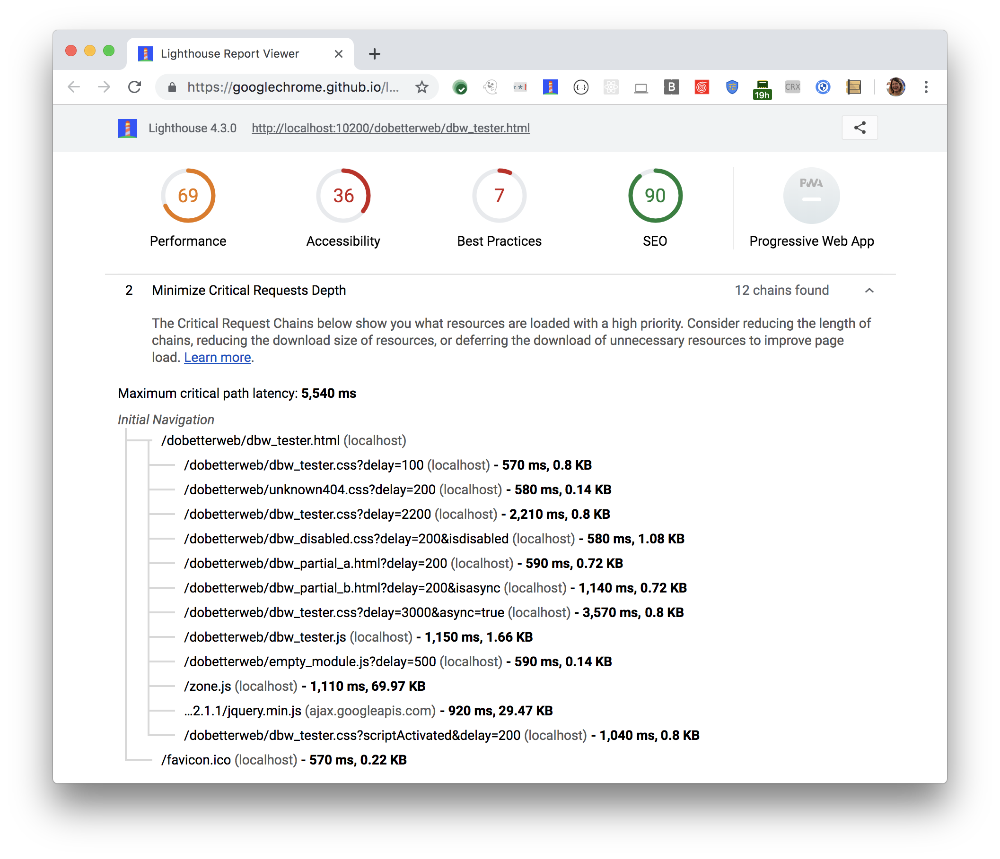

Critical request chains are series of dependent network requests important for page rendering.
Minimize critical requests depth by reducing the length of chains, the download size or resources,
or deferring the download of unnecessary resources to improve page load.
Lighthouse reports the critical requests loaded with a high priority in the Diagnostics section: 

<figure class="w-figure">
  
  <figcaption class="w-figcaption">
    Fig. 1 — Minimize critical requests depth
  </figcaption>
</figure>

## More information

- [Minimize critical requests depth audit source](https://github.com/GoogleChrome/lighthouse/blob/master/lighthouse-core/audits/critical-request-chains.js)