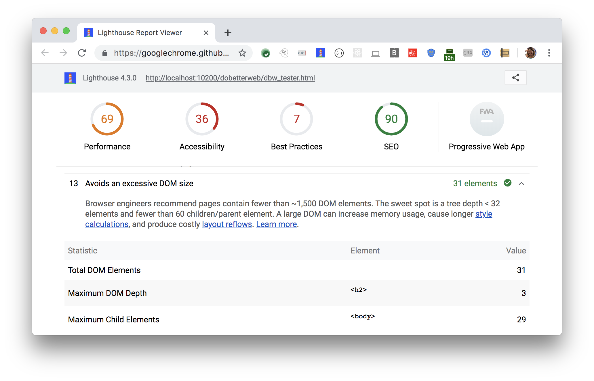

A large DOM can increase memory usage,
cause longer [style calculations](https://developers.google.com/web/fundamentals/performance/rendering/reduce-the-scope-and-complexity-of-style-calculations?utm_source=lighthouse&utm_medium=cli),
and produce costly [layout reflows](https://developers.google.com/speed/docs/insights/browser-reflow?utm_source=lighthouse&utm_medium=cli). 
Lighthouse reports the total DOM elements for a page, it's maximum child elements,
and it's maximum DOM depth in the Diagnostics section:
<figure class="w-figure">
  
  <figcaption class="w-figcaption">
    Fig. 1 — Avoids an excessive DOM size
  </figcaption>
</figure>

## Recommendations

Browser engineers recommend pages contain fewer than 1500 DOM elements.
The sweet spot is a tree depth < 32 elements and fewer than 60 children/parent element.

## More information

- [Avoids an excessive DOM size audit source](https://github.com/GoogleChrome/lighthouse/blob/master/lighthouse-core/audits/dobetterweb/dom-size.js)