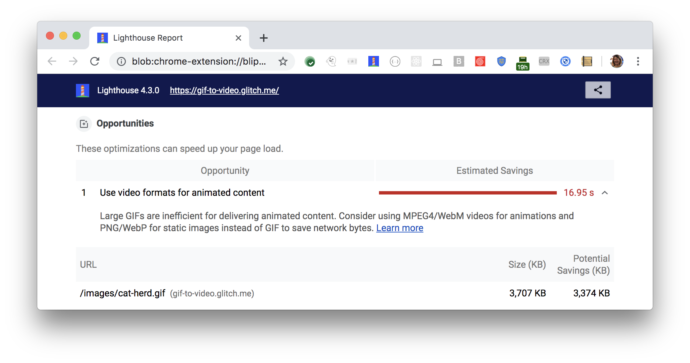

The Opportunities section of your Lighthouse report lists
all animated GIFs, along with estimated savings in seconds
achieved by converting these GIFs to video:

<figure class="w-figure">
  
  <figcaption class="w-figcaption">
    Fig. 1 — Use video formats for animated content
  </figcaption>
</figure>

## More information

- [Use video formats for animated content audit source](https://github.com/GoogleChrome/lighthouse/blob/master/lighthouse-core/audits/byte-efficiency/efficient-animated-content.js)