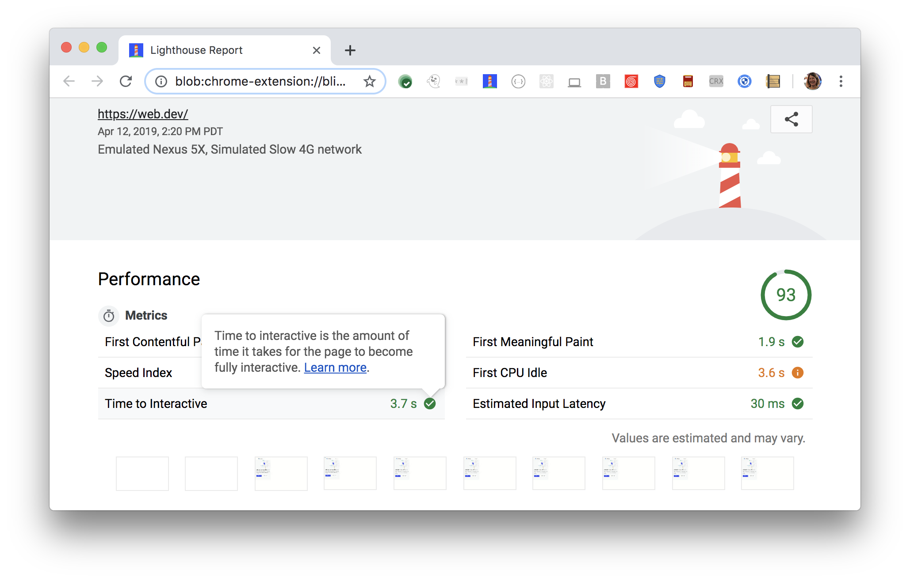

Time to Interactive (TTI) is one of six metrics tracked in the performance section of the Lighthouse report.
Each of these metrics captures some aspect of page load speed.
The Lighthouse reports displays the Time to Interactive period in seconds:

<figure class="w-figure">
  
  <figcaption class="w-figcaption">
    Fig. 1 — Time to Interactive
  </figcaption>
</figure>

## What does TTI measure

The Time to Interactive (TTI) metric measures how long it takes a page to become fully interactive.
"Interactive" is defined as the point where:

- The page has displayed useful content, which is measured with
[First Contentful Paint](/performance-audits/first-contentful-paint).
- Event handlers are registered for most visible page elements.
- The page responds to user interactions within 5 seconds.

Some sites optimize content visibility at the expense of interactivity.
This can create a frustrating user experience.
The site appears to be ready, but when the user tries to interact with it, nothing happens.

See the [Time to Interactive Definition](https://github.com/WICG/time-to-interactive#definition)
for more details on how exactly TTI is calculated. 

## How Lighthouse determines your TTI score

In order to be able to calculate your overall performance score,
Lighthouse assigns each performance metric an individual score between 0 - 100.
The TTI score, in it's simplest terms,
is based on a comparison between how fast your TTI is,
compared to [TTI metrics of real website performance data on 
HTTParchive](https://httparchive.org/reports/loading-speed#ttci).

For example,
sites performing in the top 99 percentile render Time to Interactive in about 2.2 seconds.
If your website's TTI is 2.2 seconds,
your TTI is 99.
This table helps explain how to interpret your TTI score:

  <table>
    <thead>
      <tr>
        <th>TTI metric (in seconds)</th>
        <th>Color-coding</th>
        <th>TTI score (HTTParchive %-tile)</th>
      </tr>
    </thead>
    <tbody>
      <tr>
        <td>0 - 5.2 seconds</td>
        <td>Green (fast)</td> 
        <td>75 - 100</td>
      </tr>
      <tr>
        <td>5.3 - 7.3 seconds</td>
        <td>Orange (average)</td> 
        <td>50 - 74</td>
      </tr>
      <tr>
        <td>Over 7.3 seconds</td>
        <td>Red (slow)</td> 
        <td>0 - 49</td>
      </tr>
    </tbody>
    <caption>Table 1 — TTI metric compared to TTI score</caption>
  </table>

## How your TTI score impacts overall performance score

The overall Lighthouse performance score is a weighted-average of the performance metrics,
including TTI, as well as,
[First Contentful Paint](/performance-audits/first-contentful-paint),
[First Meaningful Paint](/performance-audits/first-meaningful-paint),
[First CPU Idle](/performance-audits/first-cpu-idle),
and [Speed Index](/performance-audits/speed-index).

Heavier-weighted metrics have a larger impact on the overall performance score.
TTI is weighted 5;
it has the largest impact on the overall performance score
(see [Scoring Details](https://docs.google.com/spreadsheets/d/1Cxzhy5ecqJCucdf1M0iOzM8mIxNc7mmx107o5nj38Eo/edit#gid=0) for specifics).
Try also the [Scoring Calculator](https://docs.google.com/spreadsheets/d/1Cxzhy5ecqJCucdf1M0iOzM8mIxNc7mmx107o5nj38Eo/edit#gid=283330180) to get a better sense of how Lighthouse scoring works.

## How to improve your performance score

To improve your TTI score,
speed up your page load,
and defer or remove unnecessary JavaScript work that occurs during page load.

The most effective way to speed up page load
is to fix the load opportunities highlighted in your Lighthouse report.
The more significant the opportunity,
the greater impact it will have in speeding up page load,
and improving your overall performance score:

<figure class="w-figure">
  
  <figcaption class="w-figcaption">
    Fig. 2 — Opportunities section
  </figcaption>
</figure>

To defer or remove unnecessary JavaScript work,
look for opportunities to [Optimize your JavaScript](https://web.dev/fast#topic-Optimize-your-JavaScript).
In particular,
consider [reducing JavaScript payloads with code splitting](https://web.dev/fast/reduce-javascript-payloads-with-code-splitting),
and [applying the PRPL pattern](https://web.dev/fast/apply-instant-loading-with-prpl).

These two Diagnostic audits provide additional opportunities
to reduce JavaScript work:

- [Minimize main-thread work](/performance-audits/mainthread-work-breakdown)
- [JavaScript execution time](/performance-audits/bootup-time)

Learn more about these potential savings from the [Performance audits landing page](/performance-audits).

## Tracking TTI in the real world

To measure when TTI actually occurs on your users' devices,
see [Tracking TTI](https://developers.google.com/web/fundamentals/performance/user-centric-performance-metrics#tracking_tti).
This section describes how to programmatically access TTI data and submit it to Google Analytics.

TTI can be difficult to track in the wild.
Consider [tracking First Input Delay](https://developers.google.com/web/updates/2018/05/first-input-delay),
instead.

## More information

- [Time to Interactive audit source](https://github.com/GoogleChrome/lighthouse/blob/master/lighthouse-core/audits/metrics/interactive.js)
- [Lighthouse v3 Scoring Guide](https://developers.google.com/web/tools/lighthouse/v3/scoring)
- [Reduce JavaScript payloads with code-splitting codelab](https://web.dev/fast/reduce-javascript-payloads-with-code-splitting/codelab-code-splitting)
- [JavaScript Start-up Optimization](https://developers.google.com/web/fundamentals/performance/optimizing-content-efficiency/javascript-startup-optimization/)
- [Reduce JavaScript Payloads with Tree Shaking](https://developers.google.com/web/fundamentals/performance/optimizing-javascript/tree-shaking/)

